# 静态页面解析
# 动态页面解析
# Ajax 异步加载请求
# JavaScript 混淆加密深入


# 1. 静态页面解析
- 互联网一部分网页都是静态页面,比如常见的论坛，51job，sht论坛等
- 具体静态页面请求解析参考爬虫开发项目和TZKT里面的项目
- 静态请求页面特征：
    - 查看网页源码，网页中显示的内容直接在源码中都可以找到
    - 检查里面的elements里面有所有内容（此处动态页面的elements也是有完整的内容）
    - 使用Chrome的network查看，请求列表中的第一个网址，就是请求的网址
    - 查看response里面也有所有的静态页面内容 
    - 静态页面解析直接通过Chrome或者Firefox的查看elements和选择页面的元素
    - 进行定位解析
    - 网址和页面内容都有一定的规律

# 2. JavaScript 动态页面解析
- 动态页面，请求一个网址，返回的页面内容是通过另外一个js请求渲染生成的
- 无法直接找到请求的真实地址和源码内容，需要进行分析才能找出真实地址和响应内容

- 哔哩哔哩JavaScript动态请求分析：
- 参考图片放在003文件夹中
- 动态请求页面特征：
    - 源码中并没有页面中的内容，network的第一个网址也不是返回页面内容的真实网址  
    - 以哔哩-鬼畜-鬼畜调教为例：[https://www.bilibili.com/v/kichiku/guide/?spm_id_from=333.5.b_7375626e6176.2#/all/default/0/1/]
    - 查看网页源码,里面并没有我们看见浏览器页面中的内容，比如源码搜索页面中的8848没有结果，参考图片004
    - network查看，第一个网址并不是返回页面的真实地址，第一个网址的response里面搜索8848也没有结果，参考图片005
    - 页面和Elements中都可以查看找8848，参考图片006
    
- 如何寻找页面响应的真实地址和响应内容：
    # 1. 查找响应真实地址
    - 方法1：Chrome的search工具
    - 使用开发工具栏右上角里面的search,相当与全局搜索(搜索有代表性的英文或者数字，不要搜汉字，汉字有些会是其它编码)
    - 比如搜索8848，哔哩网页内容更新很快，就在我写这个时候，8848已经被刷新到第2页中了，参考图片007
    - 此时有3个结果，我们在name网址列表中ctrl+f搜索首单词region和newlist
    - 左边结果中选择region结果下面的第二行可以选中网址列表中的网址，然后查看response，
    - 点击response左下角的{}格式化json内容，我们可以先拉动一下可以发现内容很少，可能不是响应内容
    - 搜索8848,只有一个结果，并且不是页面中的8848，参考图片008
    - 同样，搜索newlist，只有一个网址对应，查看响应内容，8848里面正好3个结果，和页面内容相同参考图片009
    - newlist就是js渲染返回响应内容的真实地址
    
    - 方法2：
    - Chrome不断请求的新页面地址是放在url列表最下面的
    - 可以多请求几页，打开过滤器filter,Preserve log勾选上代表发送新的请求时候不清楚前面请求的记录
    - 上面filter过滤选择JS(请求的是一个JavaScript文件)即可，观察下面网址变化，也可以找出规律，每切换一个页面会多一个newlist请求
    - 并且可以发现里面的网址参数都是有规律变化，只有一个pn=x在变化，即页面，查看图片010
    - 通过查看请求的url列表也可以找到真实的页面响应地址
    
    # 2. 查看响应内容
    - 查看响应内容：
        - newlist中的就是json格式的响应内容
        - 查看newlist的headers:
        - requests headers里面的：https://www.bilibili.com/v/kichiku/guide/?spm_id_from=333.6.b_7375626e6176.2
        - url是最原始的地址，但是和浏览器url栏中还是不同，复制进去打开就还是该页面
        - response headers里面可以看到响应内容是json格式：Content-Type: application/json; charset=utf-8
        - General中可以看到接近真实的地址：Request URL: https://api.bilibili.com/x/web-interface/newlist?callback=jqueryCallback_bili_4722156102796&rid=22&type=0&pn=2&ps=20&jsonp=jsonp&_=1568290229435
        - 上面url地址直接打开是错误的,里面有callback参数后面还有json参数，删除的时候前后的的&符号要删掉
        - 删掉callback回调方法才是真实网址，保留后面的参数，最后的json部分可以不删，为了简洁都删了
        - 真正的JS渲染得到页面的网址：
            https://api.bilibili.com/x/web-interface/newlist?&rid=22&type=0&pn=2&ps=20
            - 打开该网址，响应页面的json字符串就显示出来了，查看图片011
            - 先安装Chrome的格式化json字符串插件，参考网址：https://blog.csdn.net/wust_lh/article/details/87189044
            - 安装软件和说明放在hello world 的software中，安装插件后打开json直接就格式化了，查看012
    
    - 我们可以观察网址，pn=2就是第二页，可以修改这个数字，就可以得到不同页面的响应内容json数据
    - 我们可以换几个栏目，查看newlist地址的规律
        - 先看鬼畜各个栏目：
        - 鬼畜下的鬼畜调教： https://api.bilibili.com/x/web-interface/newlist?&rid=22&type=0&pn=1&ps=20
        - 鬼畜下的音MAD:    https://api.bilibili.com/x/web-interface/newlist?rid=26&type=0&pn=1&ps=20
        - 鬼畜下的人力:：   https://api.bilibili.com/x/web-interface/newlist?rid=126&type=0&pn=1&ps=20
        - 只有rid不同，rid当前鬼畜下的各个分类
        
        - 再看手机栏目：
        - 手机平板：https://api.bilibili.com/x/web-interface/newlist?rid=95&type=0&pn=1&ps=20
        - 电脑装机：https://api.bilibili.com/x/web-interface/newlist?rid=189&type=0&pn=1&ps=20
        
        - 通过以上规律发现所有栏目，就是rid的数字不同而已，其它都相同，ps type可能是一些请求服务器使用的参数不用管
        
    # 3. 分析响应内容
    - 分析json内容 
    - archives里面有20个，正是1个页面的20个视频，下面也有size为20，参考图片013
    - 展开一个archives就是一个视频的详细信息，标题，作者，图片链接
    - 视频的地址，我们先查看页面内容elements里面有视频连接，或者直接打开视频链接，发现每个视频链接就是里面的数字不同
        https://www.bilibili.com/video/av67403285/
        https://www.bilibili.com/video/av67408718/
    - 在json里面查找数字，发现就是json的aid对应的数字，提取出aid的值就也可以拼接得到原始网址了
    - 参考图片014和015
    
    # 4. 提取响应内容
    - 请求该真实地址
    - 下载响应的loads的json内容为python的字典格式
    - 然后使用正则re查找需要的内容，标题，作者，视频编号
   
    - 参考：016_哔哩哔哩视频爬取_请求js内容_查找视频标题编号作者等信息
    - url的rid即视频栏目，pn即栏目下的视频页码，通过修改这两个参数就可以爬取所有的视频信息

# 3. Ajax 异步请求   
- 发送 Ajax 请求到网页更新的过程可以简单分为以下 3 步：
    - 发送请求
    - 解析内容
    - 渲染网页

- javascript和ajax的关系：
    - javascript是一种在客户端执行的脚本语言。
    - ajax是基于javascript的一种技术，它主要用途是提供异步刷新（只刷新页面的一部分，而不是整个页面都刷新）。
    - 一个是语言,一个是技术,两者有本质区别.
    
    - javascript是一种在浏览器端执行的脚本语言，
    - Ajax是一种创建交互式网页应用的开发技术 ，它是利用了一系列相关的技术其中就包括javascript。
    
    - Ajax技术使用非同步的HTTP请求，在Browser和Web Server之间传递数据，
    - 使Browser只更新部分网页内容而不重新载入整个网页。

    - Ajax是使用客户端脚本与Web服务器交换数据的Web应用开发方法。
    - 这样，Web页面不用打断交互流程进行重新加裁，就可以动态地更新。
    - 使用Ajax，用户可以创建接近本地桌面应用的直接、高可用、更丰富、更动态的Web用户界面

- Ajax 有其特殊的请求类型，它叫作 xhr， 返回数据一般是json格式，具体ajax请求参考## 3.2 Ajax 异步请求分析

## 3.1 Ajax 异步请求原理
- 发送请求
    - 我们知道 JavaScript 可以实现页面的各种交互功能，Ajax 也不例外，
    - 它是由 JavaScript 实现的，实际上执行了如下代码：
```javascript
    var xmlhttp;
    if (window.XMLHttpRequest) {
        //code for IE7+, Firefox, Chrome, Opera, Safari
        xmlhttp=new XMLHttpRequest();} 
    else {//code for IE6, IE5
        xmlhttp=new ActiveXObject("Microsoft.XMLHTTP");
    }
    xmlhttp.onreadystatechange=function() {if (xmlhttp.readyState==4 && xmlhttp.status==200) {document.getElementById("myDiv").innerHTML=xmlhttp.responseText;
        }
    }
    xmlhttp.open("POST","/ajax/",true);
    xmlhttp.send();
```
- 请求执行过程：
    - JavaScript 对 Ajax 最底层的实现，这个过程实际上是新建了 XMLHttpRequest 对象，
    - 然后调用 onreadystatechange 属性设置监听，最后调用 open() 和 send() 方法向某个链接（也就是服务器）发送请求。
    - 前面我们用 Python 实现请求发送之后，可以得到响应结果，但这里请求的发送由 JavaScript 来完成。
    - 由于设置了监听，所以当服务器返回响应时，onreadystatechange 对应的方法便会被触发，
    - 我们在这个方法里面解析响应内容即可。
    
- 解析内容
    - 得到响应之后，onreadystatechange 属性对应的方法会被触发，
    - 此时利用 xmlhttp 的 responseText 属性便可取到响应内容。
    - 这类似于 Python 中利用 requests 向服务器发起请求，然后得到响应的过程。
    - 返回的内容可能是 HTML，也可能是 JSON，接下来我们只需要在方法中用 JavaScript 进一步处理即可。
    - 比如，如果返回的内容是 JSON 的话，我们便可以对它进行解析和转化。

- 渲染网页
    - JavaScript 有改变网页内容的能力，解析完响应内容之后，就可以调用 JavaScript 针对解析完的内容对网页进行下一步处理。
    - 比如，通过 document.getElementById().innerHTML 这样的操作，对某个元素内的源代码进行更改，这样网页显示的内容就改变了，
    - 这种对 Document 网页文档进行如更改、删除等操作也被称作 DOM 操作。
    - 上例中，document.getElementById("myDiv").innerHTML=xmlhttp.responseText这个操作便将 ID 为 myDiv 的节点内部的 HTML 代码更改为服务器返回的内容，
    - 这样 myDiv 元素内部便会呈现出服务器返回的新数据，网页的部分内容看上去就更新了。
    - 可以看到，发送请求、解析内容和渲染网页这 3 个步骤其实都是由 JavaScript 完成的。
    - 我们再回想微博的下拉刷新，这其实是 JavaScript 向服务器发送了一个 Ajax 请求，然后获取新的微博数据，将其解析，并将其渲染在网页中的过程。
    - 因此，真实的数据其实都是通过一次次 Ajax 请求得到的，如果想要抓取这些数据，我们需要知道这些请求到底是怎么发送的，发往哪里，发了哪些参数。
    
## 3.2 Ajax 异步加载请求分析 (微博)
- 微博网址为例：https://m.weibo.cn/u/2830678474
    - 拖动刷新的内容由 Ajax 加载，而且页面的 URL 没有变化，这时我们应该到哪里去查看这些 Ajax 请求呢？
    - Chrome或者Firefox 浏览器打开微博链接，随后在页面中点击鼠标右键，从弹出的快捷菜单中选择“检查” 选项，此时便会弹出开发者工具
    - 选择network，勾选上 Preserve Log 持续记录已经访问过的请求，filter过滤器勾选XHR，Ajax 有其特殊的请求类型，它叫作 xhr。
    - 在图中我们可以发现一个以 getIndex 开头的请求，其 Type 为 xhr，这就是一个 Ajax 请求。用鼠标点击这个请求，可以查看这个请求的详细信息。
    - 在详情中可以观察到 Request Headers、URL 和 Response Headers 等信息。Request Headers 中有一个信息为 X-Requested-With:XMLHttpRequest，这就标记了此请求是 Ajax 请求
    - 查看003文件夹中017/018图片，不停向下滚动，每次动态加载页面，就会出现一个xhr类型的请求

- Ajax 请求理解：
    - 没有Ajax时，发送请求获取响应，就需要将所有html内容一次返回，所以可以用requests进行请求，
    - 有了Ajax就是第一次请求只返回了一部分信息，如页面框架内容，而没有数据，
    - 触发了Ajax请求后，又发送了一次请求，得到json格式数据进行解析后填充到页面上。
    - 后续如果滑动时又触发了Ajax请求，来刷新页面。
    - 可以把Ajax看做是满足一定条件后自动触发的请求，其实质也是一种请求，只不过是js来发起的罢了。
    - 一般来说没有 Ajax 的话，html 会是服务端直接渲染出来，结果会在 html 里面，所以 reqeusts 直接抓。
    - 有 Ajax 一般都是后期渲染，所以最开始的 html 里面没东西，所以要分析 Ajax。
    
## 3.3 Ajax 动态请求实例 (电影展示页面)
- 演示网址：https://dynamic1.scrape.cuiqingcai.com/

- 页面分析：
    - 查看网页源码，里面并没有网页数据，只有一些js引用代码
    - 不断切换页面，network中选择查看xhr类型的请求，发现没选择一页，就会有一个xhr请求，进入请求地址里面
    - 发现就是页面的的数据，数据格式是json格式，一般ajax请求的数据格式都是json格式
    - 并且网址具有规律，只有offset的值不同，0显示第1-10条数据，10显示第11-20条数据，依次类推
    - 查看003文件夹中019图片和020案例
    - 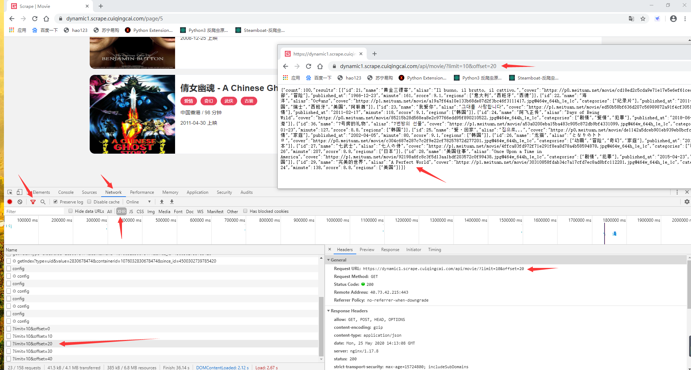
    
    
## 3.4 Ajax 接口加密参数
- 利用 Ajax 接口我们可以非常方便地完成数据的爬取。
    - 只要我们能找到 Ajax 接口的规律，就可以通过某些参数构造出对应的的请求，数据自然就能被轻松爬取到。
    - 但是，在很多情况下，Ajax 请求的接口通常会包含加密的参数，如 token、sign 等，
    - 如：https://dynamic2.scrape.cuiqingcai.com/，它的 Ajax 接口是包含一个 token 参数的，
    - 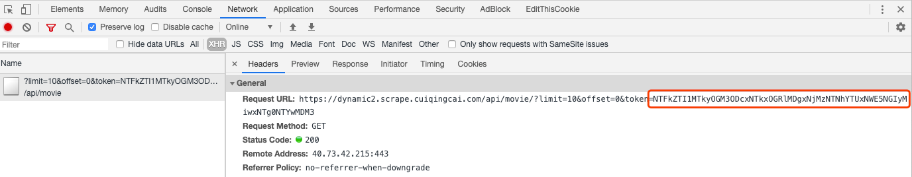

- 由于接口的请求加上了 token 参数，如果不深入分析并找到 token 的构造逻辑，我们是难以直接模拟这些 Ajax 请求的。
- 此时解决方法通常有两种：
    - 一种是深挖其中的逻辑，把其中 token 的构造逻辑完全找出来，再用 Python 复现，构造 Ajax 请求；
    - 另外一种方法就是直接通过 Selenium 模拟浏览器的方式，绕过这个过程。
    - 因为在浏览器的元素里面我们是可以看到这个数据的(只是源码没有请求以后的数据)，如果能直接把看到的数据爬取下来，当然也就能获取对应的信息了。
    - 模拟浏览器爬取,使用的工具为 Selenium，从加载后的页面元素中提取数据
 
 
## 4 JavaScript 混淆加密深入  
- 上面前三节主要讲了一些 JavaScript 动态页面加载和 Ajax 异步请求实例及原料
- 本节我们进行 JavaScript 混淆技术的深入，里面包含了一些之前提到的内容

## 4.1 JavaScript 代码混淆的原理与目的
- 目的：代码混淆后，降低代码易读性，混淆后的代码都是一些不可读的代码或者符号
    - 防止有心人调试网页代码，混淆后增加理解和调试的难度
    - 混淆后的代码在浏览器的console调试窗口运行，因为本质还是JavaScript代码
- 常用混淆方法：正则替换、代码编码、代码复杂化
- 混淆过程不是加密，混淆代码可以还原，只是不同混淆手段还原需要的时间不同
- 混淆原理：
    - 抽象语法树，JS编译器的目的是把JS代码编译为机器码，
    - 混淆器修改的就是编译过程中的语法树
    - 经过混淆器修改后本质还是JS代码，只是我们可读的代码失去了可读性
    
## 4.2 网站请求加密的情形
- 情形1：URL 地址加密
    - 某个网站的 URL 带有一些看不懂的长串加密参数，想要抓取就必须要懂得这些参数是怎么构造的，
    - 否则我们连完整的 URL 都构造不出来，更不用说爬取了。
- 情形2：Ajax 接口加密
    - 分析某个网站的 Ajax 接口的时候，可以看到接口的一些参数也是加密的，
    - 或者 Request Headers 里面也可能带有一些加密参数，如果不知道这些参数的具体构造逻辑就无法直接用程序来模拟这些 Ajax 请求。
- 情形3：JavaScript 代码混淆
    - 翻看网站的 JavaScript 源代码，可以发现很多压缩了或者看不太懂的字符，
    - 比如 JavaScript 文件名被编码，JavaScript 的文件内容被压缩成几行，
    - JavaScript 变量也被修改成单个字符或者一些十六进制的字符，
    - 导致我们不好轻易根据 JavaScript 找出某些接口的加密逻辑。
- 以上情形可以分为以下两种
    - 接口加密技术；
    - JavaScript 压缩、混淆和加密技术
    
## 4.3 接口加密技术
- 为什么有接口加密技术？
    - 网站运营商首先想到防护措施可能是对某些数据接口进行加密，
    - 比如说对某些 URL 的一些参数加上校验码或者把一些 ID 信息进行编码，
    - 使其变得难以阅读或构造；或者对某些接口请求加上一些 token、sign 等签名，
    - 这样这些请求发送到服务器时，服务器会通过客户端发来的一些请求信息以及双方约定好的秘钥等来对当前的请求进行校验，
    - 如果校验通过，才返回对应数据结果。

    - 再比如说客户端和服务端约定一种接口校验逻辑，客户端在每次请求服务端接口的时候都会附带一个 sign 参数，
    - 这个 sign 参数可能是由当前时间信息、请求的 URL、请求的数据、设备的 ID、双方约定好的秘钥经过一些加密算法构造而成的，
    - 客户端会实现这个加密算法构造 sign，然后每次请求服务器的时候附带上这个参数。
    - 服务端会根据约定好的算法和请求的数据对 sign 进行校验，如果校验通过，才返回对应的数据，否则拒绝响应。

## 4.4 接口分类    
- 数据一般都是通过服务器提供的接口来获取的，网站或 App 可以请求某个数据接口获取到对应的数据，然后再把获取的数据展示出来。
- 但有些数据是比较宝贵或私密的，这些数据肯定是需要一定层面上的保护。
- 所以不同接口的实现也就对应着不同的安全防护级别，我们这里来总结下。

- 完全开放的接口
    - 有些接口是没有设置任何防护的，谁都可以调用和访问，而且没有任何时空限制和频率限制。
    - 任何人只要知道了接口的调用方式就能无限制地调用。
    - 这种接口的安全性是非常非常低的，如果接口的调用方式一旦泄露或被抓包获取到，
    - 任何人都可以无限制地对数据进行操作或访问。此时如果接口里面包含一些重要的数据或隐私数据，就能轻易被篡改或窃取了。

- 接口参数加密
    - 为了提升接口的安全性，客户端会和服务端约定一种接口校验方式，一般来说会使用到各种加密和编码算法，
    - 如 Base64、Hex 编码，MD5、AES、DES、RSA 等加密。

    - 比如客户端和服务器双方约定一个 sign 用作接口的签名校验，
    - 其生成逻辑是客户端将 URL Path 进行 MD5 加密然后拼接上 URL 的某个参数再进行 Base64 编码，
    - 最后得到一个字符串 sign，这个 sign 会通过 Request URL 的某个参数或 Request Headers 发送给服务器。
    - 服务器接收到请求后，对 URL Path 同样进行 MD5 加密，然后拼接上 URL 的某个参数，
    - 也进行 Base64 编码得到了一个 sign，然后比对生成的 sign 和客户端发来的 sign 是否是一致的，
    - 如果是一致的，那就返回正确的结果，否则拒绝响应。这就是一个比较简单的接口参数加密的实现。
    - 如果有人想要调用这个接口的话，必须要定义好 sign 的生成逻辑，否则是无法正常调用接口的。
    - 以上就是一个基本的接口参数加密逻辑的实现。

    - 当然上面的这个实现思路比较简单，这里还可以增加一些时间戳信息增加时效性判断，或增加一些非对称加密进一步提高加密的复杂程度。
    - 但不管怎样，只要客户端和服务器约定好了加密和校验逻辑，任何形式加密算法都是可以的。

    - 这里要实现接口参数加密就需要用到一些加密算法，客户端和服务器肯定也都有对应的 SDK 实现这些加密算法，
    - 如 JavaScript 的 crypto-js，Python 的 hashlib、Crypto 等等。

    - 但还是如上文所说，如果是网页的话，客户端实现加密逻辑如果是用 JavaScript 来实现，其源代码对用户是完全可见的，
    - 如果没有对 JavaScript 做任何保护的话，是很容易弄清楚客户端加密的流程的。
    - 因此，我们需要对 JavaScript 利用压缩、混淆、加密的方式来对客户端的逻辑进行一定程度上的保护。
    
## 4.5 为什么需要 JavaScript 压缩、混淆、加密技术？
- 接口加密技术看起来的确是一个不错的解决方案，但单纯依靠它并不能很好地解决问题。为什么呢？
- 对于网页来说，其逻辑是依赖于 JavaScript 来实现的，JavaScript 有如下特点：
    - JavaScript 代码运行于客户端，也就是它必须要在用户浏览器端加载并运行。
    - JavaScript 代码是公开透明的，也就是说浏览器可以直接获取到正在运行的 JavaScript 的源码。
    - 由于这两个原因，导致 JavaScript 代码是不安全的，任何人都可以读、分析、复制、盗用，甚至篡改。
    - 所以说，对于上述情形，客户端 JavaScript 对于某些加密的实现是很容易被找到或模拟的，了解了加密逻辑后，模拟参数的构造和请求也就是轻而易举了，
    - 所以如果 JavaScript 没有做任何层面的保护的话，接口加密技术基本上对数据起不到什么防护作用。

- 如果你不想让自己的数据被轻易获取，不想他人了解 JavaScript 逻辑的实现，或者想降低被不怀好意的人甚至是黑客攻击。
- 那么你就需要用到 JavaScript 压缩、混淆和加密技术了。

- 这里压缩、混淆、加密技术简述如下。
    - 代码压缩：
        - 即去除 JavaScript 代码中的不必要的空格、换行等内容，使源码都压缩为几行内容，
        - 降低代码可读性，当然同时也能提高网站的加载速度。
    - 代码混淆：
        - 使用变量替换、字符串阵列化、控制流平坦化、多态变异、僵尸函数、调试保护等手段，
        - 使代码变得难以阅读和分析，达到最终保护的目的。
        - 但这不影响代码原有功能。是理想、实用的 JavaScript 保护方案。
    - 代码加密：
        - 可以通过某种手段将 JavaScript 代码进行加密，转成人无法阅读或者解析的代码，
        - 如将代码完全抽象化加密，如 eval 加密。
        - 另外还有更强大的加密技术，可以直接将 JavaScript 代码用 C/C++ 实现，
        - JavaScript 调用其编译后形成的文件来执行相应的功能，如 Emscripten 还有 WebAssembly。

## 4.6 JavaScript 压缩
- 这个非常简单，JavaScript 压缩即去除 JavaScript 代码中的不必要的空格、换行等内容
- 或者把一些可能公用的代码进行处理实现共享，最后输出的结果都被压缩为几行内容，
- 代码可读性变得很差，同时也能提高网站加载速度。

- 如果仅仅是去除空格换行这样的压缩方式，其实几乎是没有任何防护作用的，因为这种压缩方式仅仅是降低了代码的直接可读性。
- 如果我们有一些格式化工具可以轻松将 JavaScript 代码变得易读，比如利用 IDE、在线工具或 Chrome 浏览器都能还原格式化的代码。

- 目前主流的前端开发技术大多都会利用 Webpack 进行打包，Webpack 会对源代码进行编译和压缩，
- 输出几个打包好的 JavaScript 文件，其中我们可以看到输出的 JavaScript 文件名带有一些不规则字符串，
- 同时文件内容可能只有几行内容，变量名都是一些简单字母表示。
- 这其中就包含 JavaScript 压缩技术，比如一些公共的库输出成 bundle 文件，
- 一些调用逻辑压缩和转义成几行代码，这些都属于 JavaScript 压缩。
- 另外其中也包含了一些很基础的 JavaScript 混淆技术，比如把变量名、方法名替换成一些简单字符，降低代码可读性。

- 但整体来说，JavaScript 压缩技术只能在很小的程度上起到防护作用，要想真正提高防护效果还得依靠 JavaScript 混淆和加密技术。

## 4.7 JavaScript 混淆技术分类
- JavaScript 混淆完全是在 JavaScript 上面进行的处理，它的目的就是使得 JavaScript 变得难以阅读和分析，
- 大大降低代码可读性，是一种很实用的 JavaScript 保护方案。

- JavaScript 混淆技术主要有以下几种：

- 变量混淆
    - 将带有含意的变量名、方法名、常量名随机变为无意义的类乱码字符串，降低代码可读性，如转成单个字符或十六进制字符串。

- 字符串混淆
    - 将字符串阵列化集中放置、并可进行 MD5 或 Base64 加密存储，使代码中不出现明文字符串，
    - 这样可以避免使用全局搜索字符串的方式定位到入口点。

- 属性加密
    - 针对 JavaScript 对象的属性进行加密转化，隐藏代码之间的调用关系。

- 控制流平坦化
    - 打乱函数原有代码执行流程及函数调用关系，使代码逻变得混乱无序。

- 僵尸代码
    - 随机在代码中插入无用的僵尸代码、僵尸函数，进一步使代码混乱。

- 调试保护
    - 基于调试器特性，对当前运行环境进行检验，加入一些强制调试 debugger 语句，
    - 使其在调试模式下难以顺利执行 JavaScript 代码。

- 多态变异
    - 使 JavaScript 代码每次被调用时，将代码自身即立刻自动发生变异，变化为与之前完全不同的代码，
    - 即功能完全不变，只是代码形式变异，以此杜绝代码被动态分析调试。

- 锁定域名
    - 使 JavaScript 代码只能在指定域名下执行。

- 反格式化
    - 如果对 JavaScript 代码进行格式化，则无法执行，导致浏览器假死。

- 特殊编码
    - 将 JavaScript 完全编码为人不可读的代码，如表情符号、特殊表示内容等等。

- 总之，以上方案都是 JavaScript 混淆的实现方式，可以在不同程度上保护 JavaScript 代码。
- 在前端开发中，现在 JavaScript 混淆主流的实现是 javascript-obfuscator 这个库，
- 利用它我们可以非常方便地实现页面的混淆，它与 Webpack 结合起来，
- 最终可以输出压缩和混淆后的 JavaScript 代码，使得可读性大大降低，难以逆向。

## 4.8 javascript-obfuscator 库使用
- 运行环境：Node.js 电脑直接搜索安装
- Node.js 介绍：
    - 简单的说 Node.js 就是运行在客户端的 JavaScript。
    - Node.js 语法和JavaScript几乎一样。
    - Node.js 是一个基于Chrome JavaScript 运行时建立的一个平台。
    - Node.js是一个事件驱动I/O服务端JavaScript环境，基于Google的V8引擎，V8引擎执行Javascript的速度非常快，性能非常好。
    - Node.js教程：https://www.runoob.com/nodejs/nodejs-tutorial.html
    - 安装了Node.js，使用node命令初始化一个项目，项目中的JavaScript文件就可以本地执行
    - CMD进入项目文件夹中，node main.js 就可以本地运行js文件

- 初始化项目
    - 1.新建一个文件夹，比如 js-obfuscate，随后CMD窗口进入该文件夹，初始化工作空间：
        - 执行命令：npm init
        - 
    - 2.然后根据提示输入一些配置信息，创建一个 package.json 文件
        - 参考图片
        - 参考网址npm init初始化项目配置信息说明：https://www.cnblogs.com/WD-NewDemo/p/11141384.html
        - 如果我们在进行package.json文件配置的时候写错了东西，或者后期要添加什么内容的话，我们是可以直接在项目的根目录中打开然后进行修改
    - 3.安装 javascript-obfuscator 这个库：
        - 当前 js-obfuscate 项目文件夹下执行命令
        - npm install --save-dev javascript-obfuscator
        - 
    - 4.pycharm软件打开 js-obfuscate 项目文件夹
        - 项目文件夹下创建 JavaScript 类型文件即可
        - 新建一个main.js文件，具体查看js-obfuscate项目文件夹
        - 然后CMD窗口切换到项目文件夹下执行运行命令：node main.js
        - 输出结果就是混淆后的代码
        - 混淆代码使用了控制流扁平化的选项，打乱函数原有代码执行流程及函数调用关系，使代码逻变得混乱无序
        - 
        
- javascript-obfuscator 混淆库使用查看 js-obfuscate 项目

## 4.9 JavaScript 加密
- JavaScript 加密技术
    - 不同于 JavaScript 混淆技术，JavaScript 加密技术可以说是对 JavaScript 混淆技术防护的进一步升级，
    - 其基本思路是将一些核心逻辑使用诸如 C/C++ 语言来编写，并通过 JavaScript 调用执行，从而起到二进制级别的防护作用。
    - 其加密的方式现在有 Emscripten 和 WebAssembly 等，其中后者越来越成为主流。

- Emscripten
    - 现在，许多 3D 游戏都是用 C/C++ 语言写的，如果能将 C / C++ 语言编译成 JavaScript 代码，
    - 它们不就能在浏览器里运行了吗？众所周知，JavaScript 的基本语法与 C 语言高度相似。
    - 于是，有人开始研究怎么才能实现这个目标，为此专门做了一个编译器项目 Emscripten。
    - 这个编译器可以将 C / C++ 代码编译成 JavaScript 代码，
    - 但不是普通的 JavaScript，而是一种叫作 asm.js 的 JavaScript 变体。

    - 因此说，某些 JavaScript 的核心功能可以使用 C/C++ 语言实现，
    - 然后通过 Emscripten 编译成 asm.js，再由 JavaScript 调用执行，这可以算是一种前端加密技术。

- WebAssembly
    - 如果你对 JavaScript 比较了解，可能知道还有一种叫作 WebAssembly 的技术，
    - 也能将 C/C++ 转成 JavaScript 引擎可以运行的代码。那么它与 asm.js 有何区别呢？
    - 其实两者的功能基本一致，就是转出来的代码不一样：asm.js 是文本，
    - WebAssembly 是二进制字节码，因此运行速度更快、体积更小。从长远来看，WebAssembly 的前景更光明。

    - WebAssembly 是经过编译器编译之后的字节码，可以从 C/C++ 编译而来，
    - 得到的字节码具有和 JavaScript 相同的功能，但它体积更小，
    - 而且在语法上完全脱离 JavaScript，同时具有沙盒化的执行环境。
    - 利用 WebAssembly 技术，我们可以将一些核心的功能利用 C/C++ 语言实现，形成浏览器字节码的形式。
    - 这种加密方式更加安全，因为作为二进制编码它能起到的防护效果无疑是更好的。
    - 如果想要逆向或破解那得需要逆向 WebAssembly，难度也是很大的。

# 5  JavaScript 逆向实战
- API 接口层有加密，前端 JavaScript 也带有压缩和混淆，其前端压缩打包工具使用了现在流行的 Webpack，
- 混淆工具是使用了 javascript-obfuscator，这二者结合起来，前端的代码会变得难以阅读和分析。

- 如果我们不使用 Selenium 或 Pyppeteer 等工具来模拟浏览器的形式爬取的话，要想直接从接口层面上获取数据，
- 基本上需要一点点调试分析 JavaScript 的调用逻辑、堆栈调用关系来弄清楚整个网站加密的实现方法，
- 我们可以称这个过程叫 JavaScript 逆向。这些接口的加密参数往往都是一些加密算法或编码的组合，
- 完全搞明白其中的逻辑之后，我们就能把这个算法用 Python 模拟出来，从而实现接口的请求了。

## 5.1 JavaScript 逆向爬取案例
- 目标网址：https://dynamic6.scrape.cuiqingcai.com/
- 网页初步分析：
    - 分页和详情页多打开几个分析规律：
    - 进入网页，打开网络，选择XHR(ajax动态请求类型)
    - 多访问几个分页查看结果，发现每次都是2个请求，一个301请求，一个200请求，301请求重定位到200请求
    - 每个分页请求和电影详情页面请求的 Ajax 接口的 URL 里面多了一个 token，
    - 而且不同的页码 token 是不一样的，这个 token 看似是一个 Base64 编码的字符串。
    - 接口还是有时效性的，如果我们把 Ajax 接口 URL 直接复制下来，短期内是可以访问的，
    - 但是过段时间之后就无法访问了，会直接返回 401 状态码
    - - 查看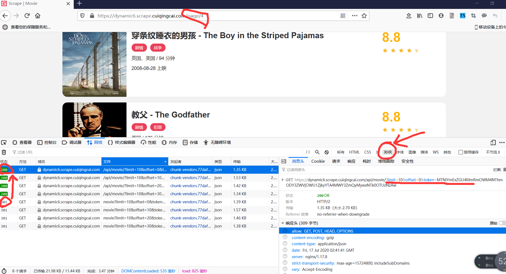
    
    - 分页网页地址：https://dynamic6.scrape.cuiqingcai.com/page/2
    - 分页动态请求ajax接口(真实数据接口)：https://dynamic6.scrape.cuiqingcai.com/api/movie/?limit=10&offset=10&token=ZDNkNjY2NGQ5ZmNiNTRhMGNkYTM4ZDY3MzAwMzk3MGQzNmRiMjI1MSwxNTk0OTU1MDQ2
    - 详情页网页地址：https://dynamic6.scrape.cuiqingcai.com/detail/ZWYzNCN0ZXVxMGJ0dWEjKC01N3cxcTVvNS0takA5OHh5Z2ltbHlmeHMqLSFpLTAtbWIx
    - 详情页动态请求的ajax接口(真实数据接口)：https://dynamic6.scrape.cuiqingcai.com/api/movie/ZWYzNCN0ZXVxMGJ0dWEjKC01N3cxcTVvNS0takA5OHh5Z2ltbHlmeHMqLSFpLTAtbWIx/?token=NTk3Nzg0M2MwZjZlOTIyYWIwZDkzNDRlYzE2OGZhN2U0OTVmZjZmMiwxNTk0OTU0Nzg3
    
    - 总结下来这个网站就有如下特点：
        - 列表页的 Ajax 接口参数带有加密的 token；
        - 详情页的 URL 带有加密 id；
        - 详情页的 Ajax 接口参数带有加密 id(同一部电影，加密id是保持一致的) 和加密 token

- 爬取思路：
    - 通过接口的形式来爬取，必须要把这些加密 id 和 token 构造出来才行，而且必须要一步步来，
    - 首先我们要构造出列表页 Ajax 接口的 token 参数，然后才能获取每部电影的数据信息，
    - 然后根据数据信息构造出加密 id 和 token。
    
    - 加密逻辑一定藏在前端代码中，但前面我们也说了，前端为了保护其接口加密逻辑不被轻易分析出来，
    - 会采取压缩、混淆的方式来加大分析的难度。
    
- 接口深入分析：
    - 分别查看列表页源码和网络请求中js文件
    - 查看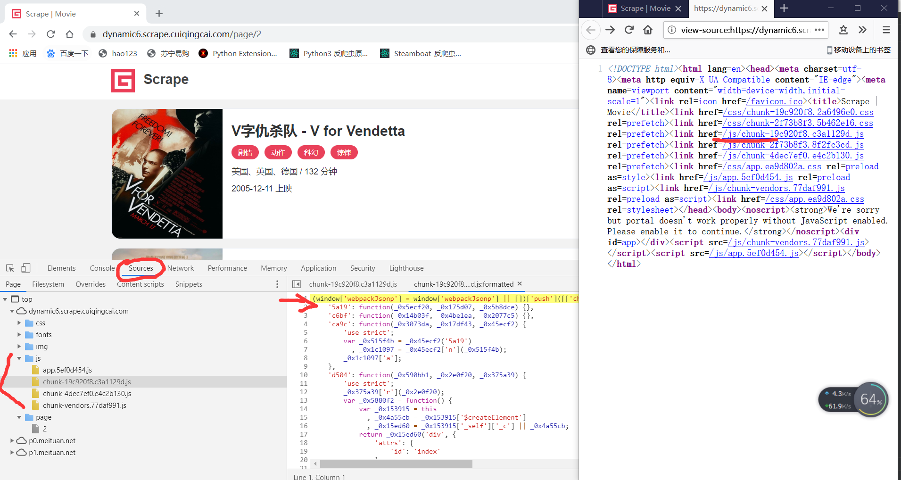
    
    - 查看列表页源码，其 JavaScript 文件名带有编码字符、chunk、vendors 等关键字，
    - 整体就是经过 Webpack 打包压缩后的源代码，目前主流的前端开发，如 Vue.js、React.js 的输出结果都是类似这样的结果。
    
    - 查看JavaScript文件源码，开发者工具中打开 Sources 选项卡下的 Page 选项卡，
    - 然后打开 js 文件夹，这里我们就能看到 JavaScript 的源代码
    - JavaScript源码里面一些变量都是一些十六进制字符串，而且代码全被压缩了。
    - 全部是混淆后的js代码，没错，我们就是要从这里面找出 token 和 id 的构造逻辑


### 5.1.1 列表页接口逆向分析
- 列表页 Ajax 入口寻找
    - 接下来，我们就开始第一步入口的寻找吧，这里简单介绍两种寻找入口的方式：
        - 方式1：全局搜索标志字符串；
        - 方式2：设置 Ajax 断点。
        - 方式3：Hook 关键函数的方式(后期介绍，查看5.1.2)
        - 使用 Chrome 浏览器

- 方式1：全局搜索标志字符串 (首选方式)
    - chrome 全局搜索，我们一般搜索关键字
    - 列表页动态请求ajax接口：https://dynamic6.scrape.cuiqingcai.com/api/movie/?limit=10&offset=10&token=ZDNkNjY2NGQ5ZmNiNTRhMGNkYTM4ZDY3MzAwMzk3MGQzNmRiMjI1MSwxNTk0OTU1MDQ2
    - limit offset 可以自己构造，关键是找到 token 的构造方式
    - 全局搜索 token ，搜索结果显示有两个 js 文件里面含有 token 内容，
    - 查看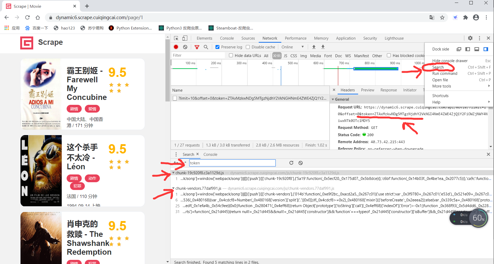
    - 然后，点击开发者工具栏上方，Sources-js文件夹中分别查看每个js文件
    - 打开js文件，显示一行代码，点击左下方的{}格式化代码，弹出来了一个新的选项卡，
    - 其名称是 JavaScript 文件名加上了 :formatted，代表格式化后代码结果，在这里我们再次(ctrl + f)定位到 token 观察一下
    - 两个文件中都有token，但是其中一个token处还有，limit,offset，关键字，放在一个function函数中
    - 可以初步判定，该函数就是生成token和列表页ajax接口的地方,如果不是的话可以继续搜索其他的文件观察下
    - 此时就找到了token构造的位置，然后接下来就可以分析具体的function函数
    - 查看

— 方式2：XHR 断点   
    - 上面方式1中， token 字符串并没有被混淆，所以上面的这个方法是奏效的。之前我们也讲过，这种字符串由于非常容易成为找寻入口点的依据，
    - 所以这样的字符串也会被混淆成类似 Unicode、Base64、RC4 的一些编码形式，这样我们就没法轻松搜索到了
    - 遇到全局搜索不能查找入口，有一种通过打 XHR 断点的方式来寻找入口。
    - XHR 断点，顾名思义，就是在发起 XHR 的时候进入断点调试模式，JavaScript 会在发起 Ajax 请求的时候停住，
    - 页面访问 ajax 接口的瞬间就会暂停一下，这时候我们可以通过当前的调用栈的逻辑顺着找到入口。
    - 具体方式：
        - 第一步：
        - 打开 Chrome 浏览器，访问 https://dynamic6.scrape.cuiqingcai.com/， 多打开几个列表页面
        - network 下面勾选 xhr 类型，可以观察到列表页的ajax接口，类似如下网址，每个页面 ？后面url参数值不一样
        - https://dynamic6.scrape.cuiqingcai.com/api/movie/?limit=10&offset=20&token=ZjdiMGYyN2U2MjVhODhhNDIxMjI1YzI3YzExZWY1OTkyOWExYTVjMSwxNTk1Mzg1NjU0
        - 查看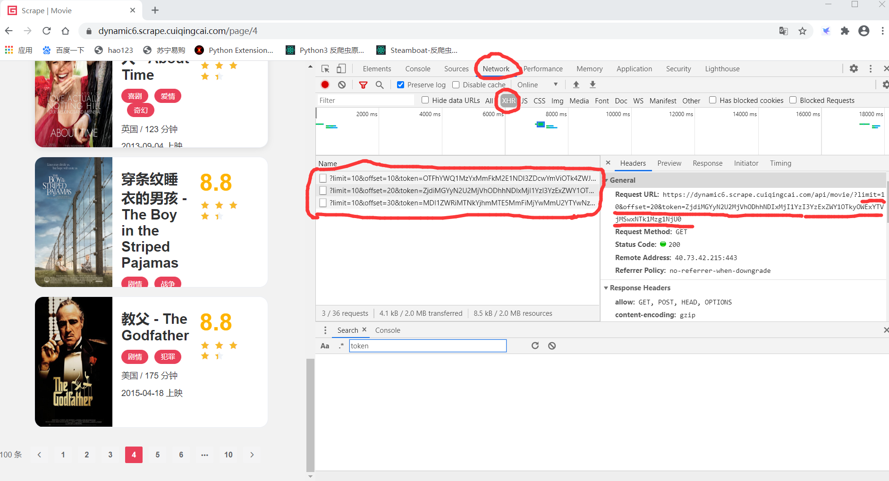
        - 第二步：
        - XHR断点打开，在 Sources 选项卡的右侧，XHR/fetch Breakpoints 处添加一个断点选项。点击 + 号，然后输入匹配的 URL 内容。
        - 添加列表页ajax接口url中有规律的字符串， ajax接口都是.../api/movie/?limit=10... 这样的格式，
        - 所这里我们就截取一段填进去就好了，这里填的就是 /api/movie
        - 然后重新访问 https://dynamic6.scrape.cuiqingcai.com/ ，就会在访问 ajax 接口的瞬间暂停，
        - 然后格式化代码，就可以看到访问 ajax 接口瞬间的位置，图中可以看到在一个send的位置，这里就是发送 ajax 请求的位置
        - 但是，到了这里感觉 Ajax 马上就要发出去了，是不是有点太晚了，我们想找的是构造 Ajax 的时刻来分析 Ajax 参数啊！
        - 第三步：
        - 不用担心，这里我们通过调用栈就可以找回去。我们点击右侧的 Call Stack，这里记录了 JavaScript 的方法逐层调用过程
        - Call Stack 下面的列表项，就是逐层调用的方法，我们可以从上往下，一个个点开查看，
        - 当前指向的是一个名字为 anonymouns，也就是匿名的调用，这个方法对应的就是发送 ajax 请求的send的位置，
        - 在它的下方就显示了调用这个 anonymouns 的方法，名字叫作 _0x60fefc，
        - 然后再下一层就又显示了调用 _0x5d7bb0 这个方法的方法，依次类推。
        - 这里我们可以逐个往下查找，然后通过一些观察看看有没有 token 这样的信息，就能找到对应的位置了，
        - 最后我们就可以找到 onFetchData 这个方法里面找到了这个 token 的构造逻辑，这样我们也成功找到 token 的参数构造的位置了
        - 查看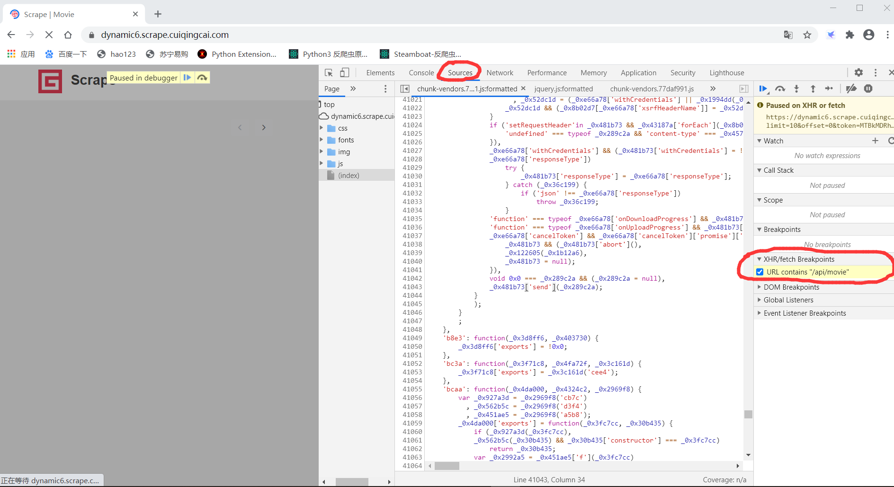
        - 查看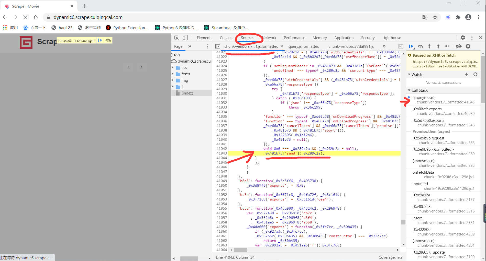
        - 查看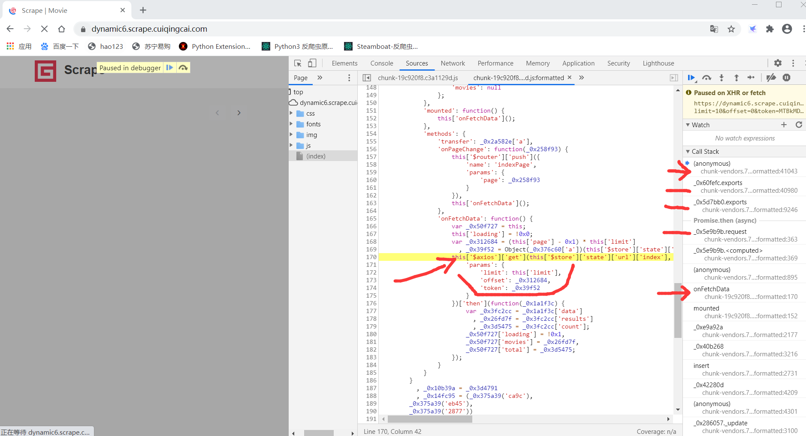

- 列表页接口构造逻辑分析 (token值构造逻辑)
    - 上面采用方式1或者方式2我们已经找到 token 的所在的位置了，可以观察一下这个 token 对应的变量叫作 _0x39f52，
    - 关键就是要找这个变量是哪里来的了。打个断点看下这个变量是在哪里生成的就好了，
    - 我们在定义变量 _0x39f52 对应的169行前面点击一下打一个断点，
    - 刚才 XHR/fetch Breakpoints 处的 XHR 断点 /api/movie 先取消掉
    - 此时重新刷新网页，url 地址栏重新点击一下刷新，此时网页停留在刚刚打的断点位置,具体如下：
    - token值对应的变量 var _0x39f52 = Object(_0x376c60['a'])(this['$store']['state']['url']['index']);_0x39f52 = Object(_0x376c60['a'])(this['$store']['state']['url']['index']);
    - 查看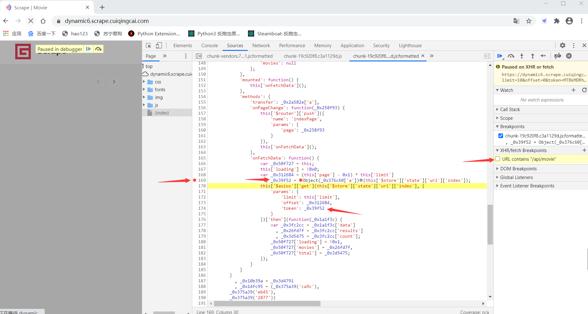
    - 此时我们移动鼠标到 _0x39f52 上显示出来的就是具体的token对应的值，一个加密的字符串
    - token 值是由 _0x376c60['a'] 对应一个函数(变量_0x376c60属性a对应一个function函数)和 /api/movie 一起生成的
    - 移动鼠标到 _0x376c60 和 this 上面会显示该值具体的内容
    - 查看具体的内容，也可以右侧 watch 点击 + 号，将 _0x376c60 和 this 直接复制添加
    - 鼠标复制 this['$store']['state']['url']['index'] 悬浮窗就会显示对应的值：/api/movie
    - 或者复制 this['$store']['state']['url']['index'] watch添加后也会显示对应的值：/api/movie
    - 查看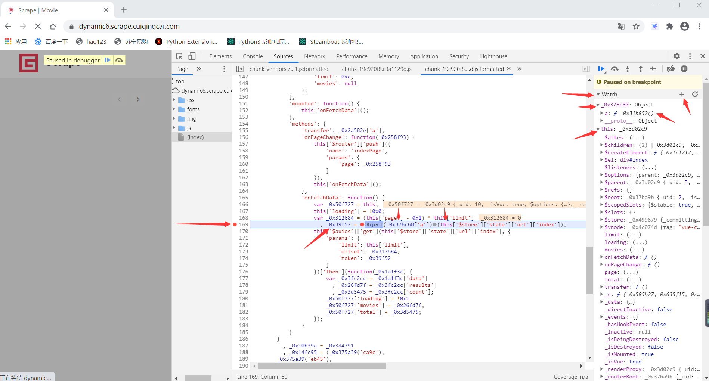
    - 观察可以发现 _0x376c60 是一个 Object 对象，它有个 a 属性，其值(鼠标放在_0x376c60或者复制后添加到watch栏)是一个 function函数：ƒ _0x31b852()
    - 然后 this['$store']['state']['url']['index'] 的值其实就是 /api/movie，就是 Ajax 请求 URL 的 Path。
    - token 值对应的变量 _0x39f52 的属性值就是调用了上面这个 function 函数，然后传入了 /api/movie 得到的。
    - 查看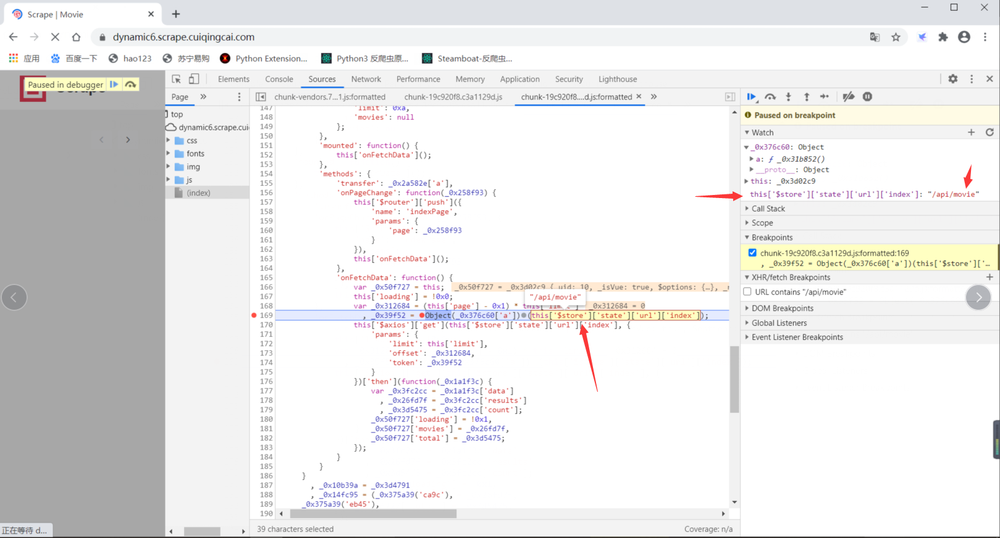

- token 值生成逻辑：    
    - 经过上面分析，已经发现token值是有一个function函数生成的，下一步就是去寻找这个 function 在哪里了，
    - 我们可以把 Watch 面板的 _0x376c60 展开，展开列表里面会显示一个 FunctionLocation，就是这个 function 的代码位置
    - 点击对应的位置进入之后发现其仍然是未格式化的代码，再次点击 {} 格式化代码。
    - 查看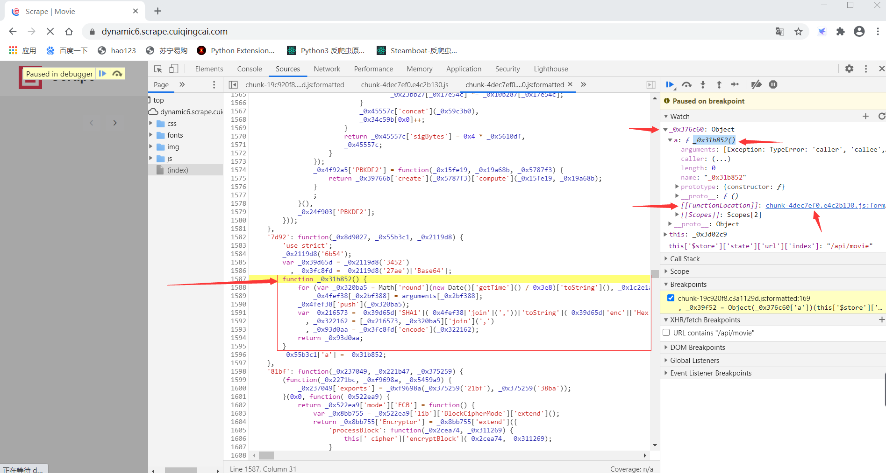
    - 这时候我们就进入了一个新的名字为 _0x31b852 的方法里面，这个方法里面应该就是 token 的生成逻辑了，
    - 我们再function函数这里打上断点，断点打的位置是function下一行1588行，第一个红点就是函数执行的第一个断点
    - 函数里面功能依次执行，后面都会自动打上浅蓝色断点
    - for这一行开始，每一行都打上一个断点，然后点击 Resume 暂停继续按钮，调试到函数结束的大括号位置
    - 每行代码执行后，变量的值都会在右上角显示灰色的值，也可以把鼠标放在变量上或者复制要查看的代码，都会弹出具体的值
    - 右侧调试面板，watch里面可以复制添加具体的变量，添加后重刷新网页重新调试
    - scope 栏目里面也会显示调试过的变量，函数的参数，返回值等信息
    - 查看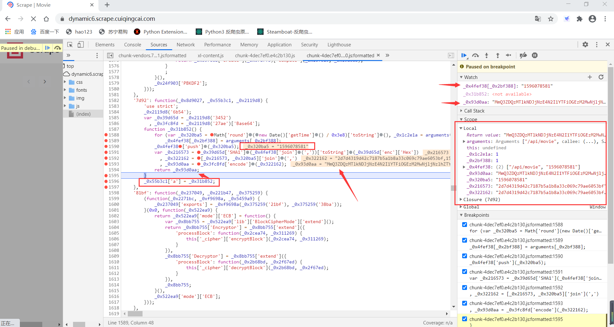
    - function 函数具体如下：
```javascript
function _0x31b852() {
        for (var _0x320ba5 = Math['round'](new Date()['getTime']() / 0x3e8)['toString'](), _0x1c2e1a = arguments['length'], _0x4fef38 = new Array(_0x1c2e1a), _0x2bf388 = 0x0; _0x2bf388 < _0x1c2e1a; _0x2bf388++)
            _0x4fef38[_0x2bf388] = arguments[_0x2bf388];
        _0x4fef38['push'](_0x320ba5);
        var _0x216573 = _0x39d65d['SHA1'](_0x4fef38['join'](','))['toString'](_0x39d65d['enc']['Hex'])
          , _0x322162 = [_0x216573, _0x320ba5]['join'](',')
          , _0x93d0aa = _0x3fc8fd['encode'](_0x322162);
        return _0x93d0aa;
    }
```
- for 这行代码里面定义了一些变量，用逗号隔开，先定义了 _0x320ba5 是一个时间戳，_0x1c2e1a 表示数组array的长度，_0x4fef38 一个初始化数组，类似列表，后面有一些干扰混淆代码
- _0x4fef38变量: 2个元素的列表 ["/api/movie", "1596078581"]
- 具体执行步骤：
    - 传入的 /api/movie 参数会构造一个初始化列表，变量命名为 _0x4fef38。
    - 获取当前的时间戳，命名为 _0x320ba5，push 到 _0x4fef38 这个变量里面。
    - 将 _0x4fef38 变量用“,”拼接，然后进行 SHA1 编码，命名为 _0x216573。
    - 将 _0x216573 （SHA1 编码的结果）和 _0x320ba5 （时间戳）再次用逗号拼接，命名为 _0x322162。
    - 将 _0x322162 进行 Base64 编码，命名为 _0x93d0aa，得到最后的 token 值。
    - 即列表页接口构造逻辑分析里面 _0x376c60['a'] 对应函数_0x31b852() 就是 _0x93d0aa token值
    - 以上的一些逻辑经过反复的观察就可以比较轻松地总结出来了，其中有些变量可以实时查看，
    - 同时也可以自己输入到控制台上进行反复验证，相信总结出这个结果并不难。
    
- 加密逻辑我们就分析出来啦，基本的思路就是，使用python实现：
    - 先将 /api/movie 放到一个列表里面，
        - ["/api/movie"]
    - 上面的列表中加入当前时间戳，此时列表中有两个元素，
        - ["/api/movie", "1596078581"]
    - 将列表内容用逗号拼接；
        - /api/movie,1596078581
    - 将拼接的结果进行 SHA1 编码； 
        - 2d7d4319d42c7187b5a1b8a33c069c79ae6053bf
    - 将编码的结果和时间戳再次拼接；
        - 2d7d4319d42c7187b5a1b8a33c069c79ae6053bf,1596078581
    - 将拼接后的结果进行 Base64 编码。
        - MmQ3ZDQzMTlkNDJjNzE4N2I1YTFiOGEzM2MwNjljNzlhZTYwNTNiZiwxNTk2MDc4NTgx
- Python 实现逻辑查看 040_JavaScript逆向_列表页获取_构造逻辑破解


### 5.1.2 详情页接口逆向分析（Hook 技术）
- 本节使用上面5.1.1提到的方式3：Hook 关键函数的方式

- 我们查看列表页返回结果：
    - 方式1：Chrome浏览器里面查看ajax动态请求的response
    - 方式2：上面040已经模拟了ajax请求，直接打印输出查看
- 我们在第一页观察elements里面已经有了电影详情页地址，说明获取列表页时候，详情页地址也已经请求获取了
    - 网址都是https://dynamic6.scrape.cuiqingcai.com/detail/ 加上一个字符串
    - ID 1 第一部电影：ZWYzNCN0ZXVxMGJ0dWEjKC01N3cxcTVvNS0takA5OHh5Z2ltbHlmeHMqLSFpLTAtbWIx
    - ID 2 第二部电影：ZWYzNCN0ZXVxMGJ0dWEjKC01N3cxcTVvNS0takA5OHh5Z2ltbHlmeHMqLSFpLTAtbWIy
    - ID 3 第三部电影：ZWYzNCN0ZXVxMGJ0dWEjKC01N3cxcTVvNS0takA5OHh5Z2ltbHlmeHMqLSFpLTAtbWIz
    - ID 4          ：ZWYzNCN0ZXVxMGJ0dWEjKC01N3cxcTVvNS0takA5OHh5Z2ltbHlmeHMqLSFpLTAtbWI0
    - ID 5          ：ZWYzNCN0ZXVxMGJ0dWEjKC01N3cxcTVvNS0takA5OHh5Z2ltbHlmeHMqLSFpLTAtbWI1
    - 看似有规律，就是末尾字符串不同，但是去查看第二个、第三个列表页，规律发生了变化，并没有和第一页规律一致
    
- 每个详情页唯一不同就是带了一个加密的ID,我们去查看该ID是什么时候生生成的？
    - 看看页面elements，可以看到在没有点击之前，详情页链接的 href 里面就已经带有加密 id 了
    - 可以确定，这个加密 id 是在列表页 Ajax 请求完成之后生成的，而且肯定也是由 JavaScript 生成的了。

- 加密ID是如何生成的？
    - 由于详情页URL除了ID不同，就是相同的，并且ID是在列表页请求时候就生成了
    - 列表页URL地址有一定规律，含有标志性字符串，可以使用全局搜索或者XHR断点方式查找网址构造逻辑
    - 详情页并不能采用像列表页一样使用断点调试去找ID生成位置，过程太繁琐复杂，不一定找的到。

- Hook 技术介绍    
    - Hook 技术中文又叫作钩子技术，它就是在程序运行的过程中，对其中的某个方法进行重写，
    - 在原有的方法前后加入我们自定义的代码。相当于在系统没有调用该函数之前，钩子程序就先捕获该消息，
    - 可以先得到控制权，这时钩子函数便可以加工处理（改变）该函数的执行行为。

    - 通俗点来说呢，比如我要 Hook 一个方法 funA，可以先临时用一个变量存一下，把它存成 A，
    - 然后呢，我再重新声明一个新的方法 funB，里面添加自己的逻辑，比如加点调试语句、输出语句等等，
    - 然后在新的方法 funB 里面再调用 A，这里调用的 A 就是之前原始的方法 funA。
    - 这样就相当于新的方法 funB 里面混入了我们自己定义的逻辑，同时又把原来的方法 A 也执行了一遍。
    - 所以这不会影响原有的执行逻辑和运行效果，但是我们通过这种改写便可以顺利在原来的 A 方法前后加上了我们自己的逻辑，这就是 Hook。
```python
def funA():
    print('hello')
    
A = funA()

def funB():
    print('你好')
    funA()
    print('world')

B = funB()
```
- 上面案例就是一Hook方法的简单演示
    - 我们要寻找funA执行的位置，通过执行我们funB方法，输出 你好 以后就是执行 funA 的位置

- 怎么使用 Hook 的方式来找到加密 id 的加密入口点呢？原理和上面一样
    - 加密 id 是一个 Base64 编码的字符串，那么生成过程中想必就调用了 JavaScript 的 Base64 编码的方法，
    - 这个方法名叫作 btoa，这个 btoa 方法可以将参数转化成 Base64 编码。
    - 当然 Base64 也有其他的实现方式，比如利用 crypto-js 这个库实现的，这个可能底层调用的就不是 btoa 方法了。
    - 所以，其实现在并不确定是不是调用的 btoa 方法实现的 Base64 编码，那就先试试吧。
    - 要实现 Hook，其实关键在于将原来的方法改写，这里我们其实就是 Hook btoa 这个方法了，
    - btoa 这个方法属于 window 对象，我们将 window 对象的 btoa 方法进行改写即可。

- 具体使用方法如下：
```javascript
(function () {
   'use strict';
   function hook(object, attr) {
       var func = object[attr];
       object[attr] = function () {
           console.log('hooked', object, attr, arguments);
           var ret = func.apply(object, arguments);
           debugger;
           console.log('result', ret);
           return ret;
      }
  }
   hook(window, 'btoa');
})()

```
- 具体步骤：
    - 首先，定义了一个 hook 方法，传入 object 和 attr 参数，意思就是 Hook 的 object 对象的 attr 参数。
        - 例如我们如果想 Hook 一个 alert 方法，那就把 object 对象设置为 window，把 attr 参数设置为要 alert 的字符串。
        - 这里我们想要 Hook Base64 的编码方法，那么这里就只需要传入 Hook 的window 对象和 btoa 方法就好了。
    - 然后是定义一个变量， var func = object[attr]，相当于先把对象和参数赋值为一个变量，
        - 我们调用 func 方法就可以实现和原来相同的功能。
    - 接着，我们再直接改写这个方法的定义（修改该方法），直接改写 object[attr]，将其改写成一个新的方法，
        - 新的方法开头加入console.log调试语句
        - 在新的方法中，通过 func.apply 方法又重新调用了原来的方法，将其赋值到一个ret变量中，新方法最后返回原来方法的执行结果
    - 这样我们就可以保证，前后方法的执行效果是不受什么影响的，之前这个方法该干啥就还是干啥的。
        - 但是和之前不同的是，我们自定义方法之后，现在可以在 func 方法执行的前后，
        - 再加入自己的代码，如 console.log 将信息输出到控制台，如 debugger 进入断点等等
    - 最后，我们调用 hook 方法，传入 window 对象和 btoa 字符串(即window对象的btoa方法)即可

- Hook 逻辑说明：
    - hook 过程中，我们先临时保存下来了 func 方法，然后定义一个新的方法，接管程序控制权，
    - 在新方法中自定义我们想要的实现，同时在新的方法里面再重新调回 func 方法，保证前后结果是不受影响的。
    - 所以，我们达到了在不影响原有方法效果的前提下，可以实现在方法的前后实现自定义的功能，就是 Hook 的完整实现过程。
    - 最后，我们调用 hook 方法，只需要传入 window 对象和 btoa 字符串(方法的名称)即可。

- 上面已经 hook 了 btoa 方法，接下来就是注入代码，三种注入方法：
    - 直接控制台注入；
    - 复写 JavaScript 代码；
    - Tampermonkey 注入。

- 方法1：控制台注入
    - 直接复制上面代码到Chrome的console控制台，然后enter执行，执行完这段代码之后
    - 相当于我们就已经把 window 对象的 btoa 方法改写为我们自定义的新方法了，
    - 此时，我们可以控制台调用下 btoa 方法，回车之后就可以看到它进入了我们自定义方法的 debugger 的位置停下了
    - 查看
    - 查看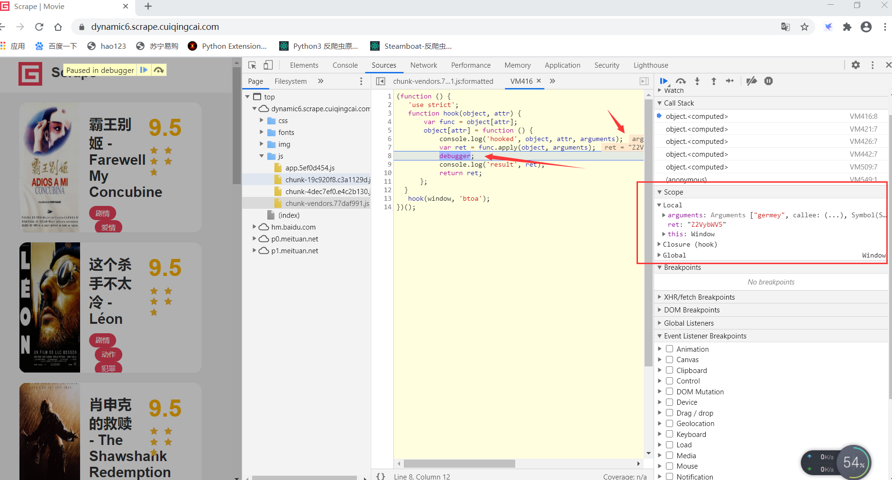
