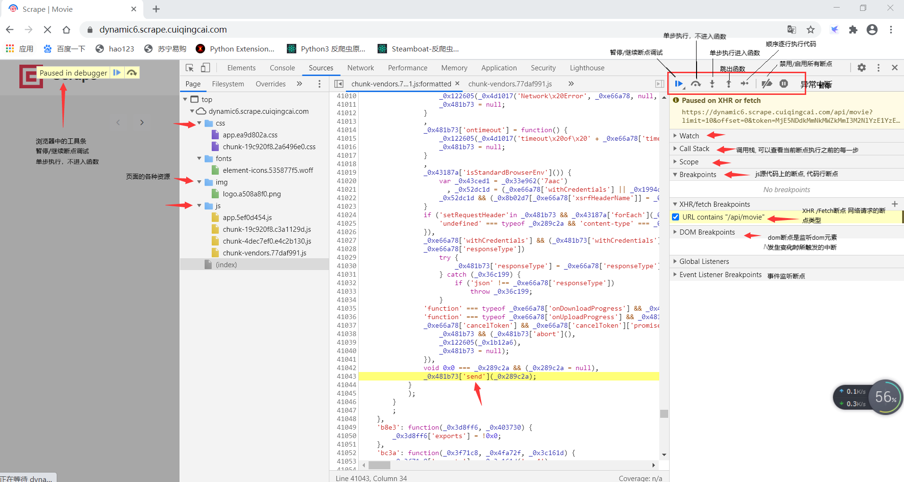

# 1 JavaScript 断点调试介绍
- 你平时是怎么调试 JavaScript 代码的？
    - 方法1：最原始的方法是用 alert() 在页面上打印内容
    - 方法2：稍微改进一点的方法是用 console.log() 在 JavaScript 控制台上输出内容。
- 用上面这两种土办法确实解决了很多小型 JavaScript 脚本的调试问题，但是大型代码就有点力不从心了。
- 本文主要介绍其中的 JavaScript 断点设置和调试功能，Chrome 中功能越发强大的开发者工具

- 什么是断点？
    - 通常，您可能希望停止执行代码，以便您可以逐行地查看特定的上下文。
    - 一旦代码在断点处停止，我们就可以通过访问作用域，查看调用堆栈，甚至在运行时更改代码来进行调试。

- 如何设置断点？
    - 以js文件为例
    - 首先，打开 Chrome 开发工具并转到 Sources 选项卡
    - 然后，左侧资源栏里面打开我们要调试的 JavaScript 文件
    - 打开文件后，我们可以通过单击的那行代码前面的行数字来设置断点

# 2 JavaScript 调试面板介绍
- 查看
- 面板功能介绍参考上图：
    - Sources 面板的左边是内容源，包括页面中的各种资源。css、img、js文件。异步加载的 js 文件，在加载后也会出现在这里的。
    - Sources 面板的中间主区域用于展示左边资源文件的内容。比如点开一个js文件，中间就会显示具体内容。
    - Sources 面板的右边是调试功能区，最上面的一排按钮分别是暂停/继续、单步执行、单步跳入、单步跳出、按步执行、禁用/启用所有断点、异常中断。具体参考上图。

# 3 断点类型
- chrome中的断点调试技术支持的断点类型：
    - BreakPoints
        - 代码行断点：代码断点是在代码行处设置的中断，代码执行到断点处暂停
        - 条件断点：条件断点和代码断点类似，当条件为真时，才会触发断点中断。具体操作如下：前置流程参考代码断点，在任意代码行号处右击选中->增加添加断点，这个时候你就可以添加条件断点了。注意：条件断点处的表达式中的变量作用范围，和设置断点处的代码堆栈作用范围有关联。
        - 异常断点：代码中有异常抛出时，可以通过异常中断进行拦截。右侧最后一个图标，点击异常中断暂停图标，会出现异常捕获的选项，点击即可。
        - 函数断点：函数中断是代码层的调试技巧，利用debug函数(Chrome API)在函数调用前就行中断处理。
    - XHR/Fetch BreakPoints
        - XHR/Fetch断点
        - XHR/Fetch断点，是针对网络请求的断点类型，当使用这两种网络传输方式的时候，可以根据URL的名称快速定位到传输方法的调用处。
        - 具体操作如下：
            - 在Sources面板右侧，找到XHR/Fetch BreakPoints ，右侧有个加号，点击添加需要捕获的URL即可
            - 一般是捕获URL中的每一个参数作为条件，比如图片001中就是捕获URL中的 /api/movie
    - DOM BreakPoints
        - DOM断点：dom断点是监听dom元素发生变化时所触发的中断，对页面特效的追踪很有效果
        - dom断点是监听dom元素发生变化时所触发的中断，对页面特效的追踪很有效果
        - 它支持的几种断点类型：
            - subtree modifications: 删除添加编辑当前所选节点的子节点内容时触发断点，更改属性不会触发
            - Attribtues modifications：当前所选节点上添加或移除属性，或者属性值发生变化时触发这类断点
            - Node Removal:在移除当前选定的节点时触发
        - 具体操作如下：
            - 在Elements栏目，利用元素选择工具选中页面中的html元素节点->右击break on->选择你要断点的类型
    - Event Listener BreakPoints
        - 事件监听断点
        - 当你想捕获某个事件时，使用事件断点在合适不过了。通过注册捕获事件的监听，当页面触发这个事件时，就会中断到事件触发的地方。
        - 具体操作如下：
            - 右侧在Event Listener BreakPoints处添加需要监听的事件即可。
            - 展开列表，里面有默认的各种事件，勾选即可

