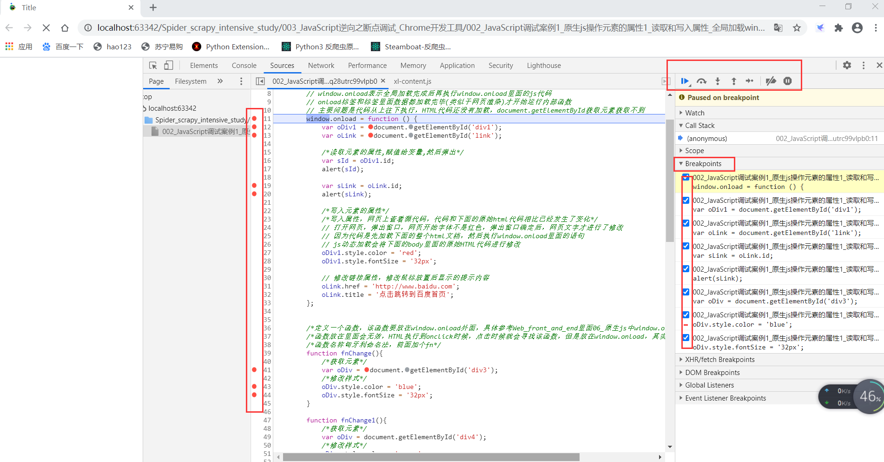
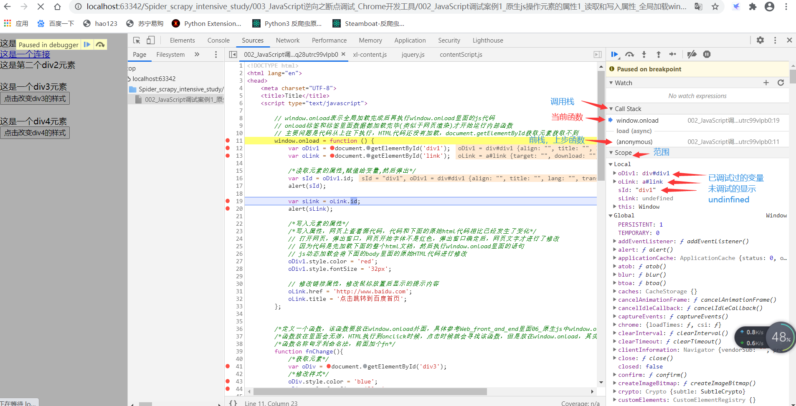
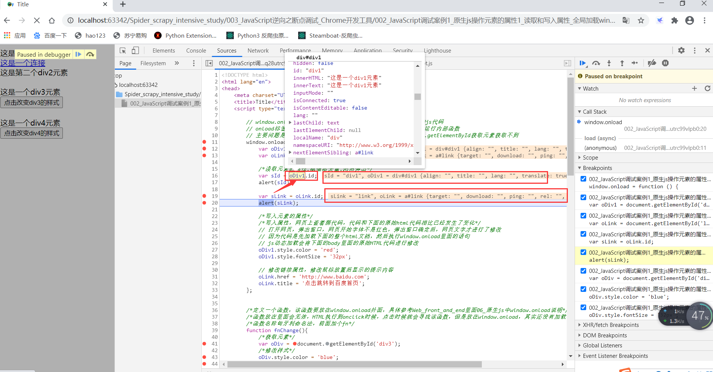

# 1 JavaScript 断点调试介绍
- 你平时是怎么调试 JavaScript 代码的？
    - 方法1：最原始的方法是用 alert() 在页面上打印内容
    - 方法2：稍微改进一点的方法是用 console.log() 在 JavaScript 控制台上输出内容。
- 用上面这两种土办法确实解决了很多小型 JavaScript 脚本的调试问题，但是大型代码就有点力不从心了。
- 本文主要介绍其中的 JavaScript 断点设置和调试功能，Chrome 中功能越发强大的开发者工具

- 什么是断点？
    - 通常，您可能希望停止执行代码，以便您可以逐行地查看特定的上下文。
    - 一旦代码在断点处停止，我们就可以通过访问作用域，查看调用堆栈，甚至在运行时更改代码来进行调试。

- 如何设置断点？
    - 以js文件为例
    - 首先，打开 Chrome 开发工具并转到 Sources 选项卡
    - 然后，左侧资源栏里面打开我们要调试的 JavaScript 文件
    - 打开文件后，我们可以通过单击的那行代码前面的行数字来设置断点

# 2 JavaScript 调试面板介绍
- 查看
- 具体右上角调试按钮使用参考下面# 4 断点调试案例1和 # 5 断点调试案例2
- 面板功能介绍参考上图：
    - Sources 面板的左边是内容源，包括页面中的各种资源。css、img、js文件。异步加载的 js 文件，在加载后也会出现在这里的。
    - Sources 面板的中间主区域用于展示左边资源文件的内容。比如点开一个js文件，中间就会显示具体内容。
    - Sources 面板的右边是调试功能区，最上面的一排按钮分别是暂停/继续、单步执行、单步跳入、单步跳出、按步执行、禁用/启用所有断点、异常中断。具体参考上图。

# 3 断点类型
- chrome中的断点调试技术支持的断点类型：
    - BreakPoints
        - 代码行断点：代码断点是在代码行处设置的中断，代码执行到断点处暂停
        - 条件断点：条件断点和代码断点类似，当条件为真时，才会触发断点中断。具体操作如下：前置流程参考代码断点，在任意代码行号处右击选中->增加添加断点，这个时候你就可以添加条件断点了。注意：条件断点处的表达式中的变量作用范围，和设置断点处的代码堆栈作用范围有关联。
        - 异常断点：代码中有异常抛出时，可以通过异常中断进行拦截。右侧最后一个图标，点击异常中断暂停图标，会出现异常捕获的选项，点击即可。
        - 函数断点：函数中断是代码层的调试技巧，利用debug函数(Chrome API)在函数调用前就行中断处理。
    - XHR/Fetch BreakPoints
        - XHR/Fetch断点
        - XHR/Fetch断点，是针对网络请求的断点类型，当使用这两种网络传输方式的时候，可以根据URL的名称快速定位到传输方法的调用处。
        - 具体操作如下：
            - 在Sources面板右侧，找到XHR/Fetch BreakPoints ，右侧有个加号，点击添加需要捕获的URL即可
            - 一般是捕获URL中的每一个参数作为条件，比如图片001中就是捕获URL中的 /api/movie
    - DOM BreakPoints
        - DOM（Document Object Model 文档对象模型的缩写， 
            - 核心 DOM ：针对任何结构化文档的标准模型
            - XML DOM ：针对 XML 文档的标准模型
            - HTML DOM ： 针对 HTML 文档的标准模型
            - DOM 定义了所有 XML/HTML 元素的对象和属性，以及访问它们的方法。
            - 换言之，XML/HTML DOM 是关于如何获取、修改、添加或删除 HTML 元素的标准
        - DOM 断点：dom断点是监听dom元素发生变化时所触发的中断，对页面特效的追踪很有效果
        - dom断点是监听dom元素发生变化时所触发的中断，对页面特效的追踪很有效果
        - 它支持的几种断点类型：
            - subtree modifications: 删除添加编辑当前所选节点的子节点内容时触发断点，更改属性不会触发
            - Attribtues modifications：当前所选节点上添加或移除属性，或者属性值发生变化时触发这类断点
            - Node Removal:在移除当前选定的节点时触发
        - 具体操作如下：
            - 在Elements栏目，利用元素选择工具选中页面中的html元素节点->右击break on->选择你要断点的类型
    - Event Listener BreakPoints
        - 事件监听断点
        - 当你想捕获某个事件时，使用事件断点在合适不过了。通过注册捕获事件的监听，当页面触发这个事件时，就会中断到事件触发的地方。
        - 具体操作如下：
            - 右侧在Event Listener BreakPoints处添加需要监听的事件即可。
            - 展开列表，里面有默认的各种事件，勾选即可

# 4 断点调试案例1
- 查看003文件中：002_JavaScript调试案例1_原生js操作元素的属性1_读取和写入属性_全局加载window.onload.html文件
- Chrome 打开上面的 HTML 文件

- 调试步骤：
    - 查看    
    - 进入source页面，选择html文件，html里面的JavaScript代码左侧打上要调试的断点
    - 左侧打上的代码断点，右侧Breakpoints列表中是一一对应的
    - 右上角控制按钮介绍：
        - 暂停播放键(常用)：点击该按钮，按照调试断点列表逐个向下运行，没点击一次，执行到下一个断点，每次执行一个断点
        - 向右弯箭头：单步执行，不会进入函数，直接跳过该段代码，该段script中代码都会跳过，继续就会进入js文件中
        - 向下箭头(常用)：进入当前函数，比如window.onload对应的function里面，然后继续点击，单步执行，每次执行一行代码
        - 向上箭头：跳出当前函数，继续执行，就是单步执行，效果同向右弯箭头
        - 向右箭头：逐行执行代码，如果不进入函数，类似上面弯箭头，先使用向下箭头进入函数，然后逐行执行，类似于向下箭头，每次执行一行代码
        - 长方形加斜线：禁用、启用所有断点，禁用后所有断点变成灰色，点击暂停播放键，网页代码按原始代码顺序执行
        - 圆圈播放键：查看断点调试中的异常

- 右侧调试信息栏：
    - 查看
    - call stack：
        - 调用栈，向下依次显示前栈，显示执行到当前断点处之前的每一步
        - 可以从当前栈，逐步向前找，就可以找到一些关键信息，比如网址请求里面的token信息生成的位置
    - scope：范围，显示当前代码执行的一些变量函数信息，执行过的变量显示具体的信息，未执行的显示undefined

- 代码栏详细信息查看：
    - 中间代码框中，调试过的断点，右上侧就会显示具体的变量信息
    - 将鼠标放置在变量或者函数代码上面，显示变量的所有相关信息，放在变量上会显示变量的结果
    - 具体移动鼠标位置滚动信息栏，里面会显示标签元素样式，标签内部内容，标签父子节点等等信息
    - 查看