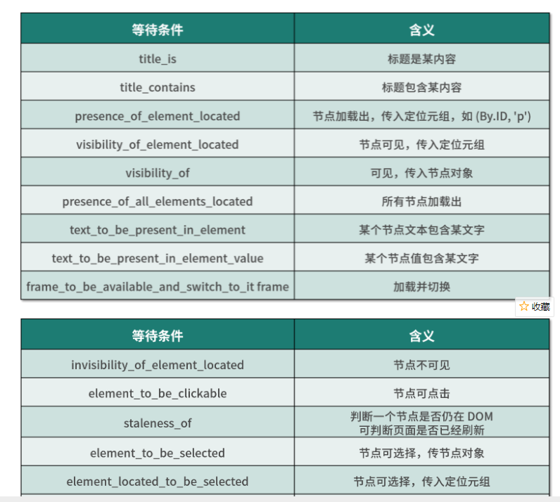

#### 000_Selenium使用_参考Spider_development_study_note爬虫开发项目003文件夹和ch09文件夹的文档及案例
#### 003中的77. 动态HTML_selenium使用.md

# 1 源码中有iframe框架
- 切换 Frame
- 网页中有一种节点叫作 iframe，也就是子 Frame，相当于页面的子页面，
- 它的结构和外部网页的结构完全一致。Selenium 打开页面后，默认是在父级 Frame 里面操作，
- 而此时如果页面中还有子 Frame，Selenium 是不能获取到子 Frame 里面的节点的。
- 这时就需要使用 switch_to.frame 方法来切换 Frame

- iframe 里面的标签是无法直接选定的，必须先切换进去框架
    - 使用框架的name切换，比如QQ邮箱的登陆模块框架
    driver.switch_to.frame("login_frame")
    - 使用框架标签位置切换，比如豆瓣登陆模块框架
    driver.switch_to.frame(driver.find_elements_by_tag_name("iframe")[0])
- 切出框架，切换到外层默认框架
    driver.switch_to.default_content()   
    driver.switch_to.parent_frame() 
- 参考004豆瓣登陆案例
- 豆瓣登陆如果需要验证码，可以加入睡眠时间，然后手动填写


# 2 验证码的识别
- url不变，验证码不变
  - 请求验证码的地址，获得相应，识别

- url不变，验证码会变
  - 思路：对方服务器返回验证码的时候，会和每个用户的信息和验证码进行一个对应，之后，在用户发送post请求的时候，会对比post请求中法的验证码和当前用户真正的存储在服务器端的验证码是否相同

  - 1.实例化session
  - 2.使用session请求登录页面，获取验证码的地址
  - 3.使用session请求验证码，识别
  - 4.使用session发送post请求’

- 使用selenium登录，遇到验证码
  - url不变，验证码会变，同上
  - url不变，验证码不变
    - 1.selenium请求登录页面，同时拿到验证码的地址
    - 2.获取登录页面中driver中的cookie，交给requests模块发送验证码的请求，识别
    - 3.输入验证码，点击登录

# 3 selenium使用的注意点
- 获取文本(text)和获取属性(get_attribute)
  - 先定位到元素，然后调用`.text`或者`get_attribute`方法来取属性的值
  - 获取文本值: 每个 WebElement 节点都有 text 属性，直接调用这个属性就可以得到节点内部的文本信息
```python
from selenium import webdriver
browser=webdriver.Chrome()
url='https://dynamic2.scrape.cuiqingcai.com/'
browser.get(url)
logo=browser.find_element_by_class_name('logo-image')
print(logo)
print(logo.get_attribute('src'))
```
- 运行之后，程序便会驱动浏览器打开该页面，
- 然后获取 class 为 logo-image 的节点，最后打印出它的 src 属性
  
  
- selenium获取的页面数据是浏览器中检查可以看到的所有elements的内容，里面包含了js返回的元素，但是网页源码是没有网页内容
- 网页源码中只有一些css和js文件的引用
- find_element和find_elements的区别
    - find_element返回一个element，如果没有会报错
    - find_elements返回一个列表，没有就是空列表
    - 在判断是否有下一页的时候，使用find_elements来根据结果的列表长度来判断
- 如果页面中含有iframe、frame，需要先调用driver.switch_to.frame的方法切换到frame中才能定位元素

- selenium请求第一页的时候回等待页面加载完了之后在获取数据，但是在点击翻页之后，
    hi直接获取数据，此时可能会报错，因为数据还没有加载出来，需要time.sleep(3)
- selenium中find_element_by_class_name智能接收一个class对应的一个值，不能传入多个
    class_name传入的值有空格不能找到，被认为是符合元素了
- 建议元素定位时候使用driver.find_element_by_xpath


```
db.stu.aggregate({$group:{_id:"$name",counter:{$sum:2}}})

db.stu.aggregate({$group:{_id:null,counter:{$sum:1}}})
db.stu.aggregate({$group:{_id:"$gender",name:{$push:"$name"}}})
db.stu.aggregate({$group:{_id:"$gender",name:{$push:"$$ROOT"}}})
db.tv3.aggregate(
  {$group:{_id:{"country":"$country",province:"$province",userid:"$userid"}}},
  {$group:{_id:{country:"$_id.country",province:"$_id.province"},count:{$sum:1}}},
  {$project:{country:"$_id.country",province:"$_id.province",count:"$count",_id:0}}
  )
db.stu.aggregate(

  {$match:{age:{$gt:20}}},
  {$group:{_id:"$gender",count:{$sum:1}}}
  )
db.t2.aggregate(
  {$unwind:"$size"}
  )
db.t3.aggregate(
  {$unwind:"$tags"},
  {$group:{_id:null,count:{$sum:1}}}
  )
db.t3.aggregate(
  {$unwind:{path:"$size",preserveNullAndEmptyArrays:true}}
  )
```

# 4 Selenium 执行 JavaScript
- Selenium API 并没有提供实现某些操作的方法，
- 比如，下拉进度条。但它可以直接模拟运行 JavaScript，此时使用 execute_script 方法即可实现，代码如下：
```python
from selenium import webdriver
browser = webdriver.Chrome()
browser.get('https://www.zhihu.com/explore')
browser.execute_script('window.scrollTo(0, document.body.scrollHeight)')
browser.execute_script('alert("To Bottom")')
```
- 这里利用 execute_script 方法将进度条下拉到最底部，然后弹出 alert 提示框。
- 有了这个方法，基本上 API 没有提供的所有功能都可以用执行 JavaScript 的方式来实现了。


# 5 Selenium 获取 ID、位置、标签名、大小
- WebElement 节点还有一些其他属性，比如 id 属性可以获取节点 id，
- location 属性可以获取该节点在页面中的相对位置，
- tag_name 属性可以获取标签名称，
- size 属性可以获取节点的大小，也就是宽高，这些属性有时候还是很有用的。
```python
from selenium import webdriver
browser = webdriver.Chrome()
url = 'https://dynamic2.scrape.cuiqingcai.com/'
browser.get(url)
input = browser.find_element_by_class_name('logo-title')
print(input.id)
print(input.location)
print(input.tag_name)
print(input.size)
```

# 6 延时等待
- 在 Selenium 中，get 方法会在网页框架加载结束后结束执行，此时如果获取 page_source，
- 可能并不是浏览器完全加载完成的页面，如果某些页面有额外的 Ajax 请求，
- 我们在网页源代码中也不一定能成功获取到。所以，这里需要延时等待一定时间，确保节点已经加载出来。
- 这里等待的方式有两种：一种是隐式等待，一种是显式等待。

- 隐式等待
    - 当使用隐式等待执行测试的时候，如果 Selenium 没有在 DOM 中找到节点，
    - 将继续等待，超出设定时间后，则抛出找不到节点的异常。
    - 换句话说，隐式等待可以在我们查找节点而节点并没有立即出现的时候，等待一段时间再查找 DOM，默认的时间是 0。
    - implicitly_wait 方法实现了隐式等待。参考下面代码：
```python
from selenium import webdriver 
browser = webdriver.Chrome() 
browser.implicitly_wait(10) 
browser.get('https://dynamic2. scrape.cuiqingcai.com/') 
input = browser.find_element_by_class_name('logo-image') 
print(input)
```

- 显式等待
    - 隐式等待的效果其实并没有那么好，因为我们只规定了一个固定时间，而页面的加载时间会受到网络条件的影响。
    - 这里还有一种更合适的显式等待方法，它指定要查找的节点，然后指定一个最长等待时间。
    - 如果在规定时间内加载出来了这个节点，就返回查找的节点；
    - 如果到了规定时间依然没有加载出该节点，则抛出超时异常。
    - 使用案例，Python_prevent_spider的04文件夹打码平台使用
    - 示例如下：
    
```python
from selenium import webdriver 
from selenium.webdriver.common.by import By 
from selenium.webdriver.support.ui import WebDriverWait 
from selenium.webdriver.support import expected_conditions as EC 
browser = webdriver.Chrome() 
browser.get('https://www.taobao.com/') 
# 显示等待，传入浏览器，超时时间，单位秒
wait = WebDriverWait(browser, 10) 
# until等待验证，EC模块进行检测，presence_of_element_located元素是否加载处理，使用元素ID或者CSS选择器
input = wait.until(EC.presence_of_element_located((By.ID, 'q'))) 
button =  wait.until(EC.element_to_be_clickable((By.CSS_SELECTOR, '.btn-search'))) 
print(input, button)
```
- 首先引入 WebDriverWait 这个对象，指定最长等待时间，然后调用它的 until() 方法，传入要等待条件 expected_conditions。
- 比如，这里传入了 presence_of_element_located 这个条件，代表节点出现，其参数是节点的定位元组，也就是 ID 为 q 的节点搜索框。
- 这样做的效果就是，在 10 秒内如果 ID 为 q 的节点（即搜索框）成功加载出来，就返回该节点；如果超过 10 秒还没有加载出来，就抛出异常。
- 对于按钮，我们可以更改一下等待条件，比如改为 element_to_be_clickable，也就是可点击，
- 所以查找按钮时先查找 CSS 选择器为.btn-search 的按钮，如果 10 秒内它是可点击的，也就代表它成功加载出来了，就会返回这个按钮节点；
- 如果超过 10 秒还不可点击，也就是没有加载出来，就抛出异常。

- 等待条件，其实还有很多，比如判断标题内容，判断某个节点内是否出现了某文字等。
- 下表我列出了所有的等待条件。
- 
- [更多详细的等待条件的参数及用法介绍可以参考官方文档](http://selenium-python.readthedocs.io/api.html#module-selenium.webdriver.support.expected_conditions)


# 7 Selenium 操作 Cookies
- 使用 Selenium，还可以方便地对 Cookies 进行操作，
- 例如获取、添加、删除 Cookies 等。示例如下：
```python
from selenium import webdriver 
browser = webdriver.Chrome() 
browser.get('https://www.zhihu.com/explore') 
print(browser.get_cookies()) 
browser.add_cookie({'name': 'name', 'domain': 'www.zhihu.com', 'value': 'germey'}) 
print(browser.get_cookies()) 
browser.delete_all_cookies() 
print(browser.get_cookies())
```
- 加载完成后，浏览器实际上已经生成 Cookies 了。
- 接着，调用 get_cookies 方法获取所有的 Cookies。然后，我们再添加一个 Cookie，这里传入一个字典，有 name、domain 和 value 等内容。
- 接下来，再次获取所有的 Cookies，可以发现，结果会多出这一项新加的 Cookie。
- 最后，调用 delete_all_cookies 方法删除所有的 Cookies。

# 8 Selenium 反屏蔽
- 很多网站都加上了对 Selenium 的检测，来防止一些爬虫的恶意爬取。
- 即如果检测到有人在使用 Selenium 打开浏览器，那就直接屏蔽。
- 其大多数情况下，检测基本原理是检测当前浏览器窗口下的 window.navigator 对象是否包含 webdriver 这个属性。
- 因为在正常使用浏览器的情况下，这个属性是 undefined，然而一旦我们使用了 Selenium，Selenium 会给 window.navigator 设置 webdriver 属性。
- 很多网站就通过 JavaScript 判断如果 webdriver 属性存在，那就直接屏蔽。

- Selenium 中，我们可以使用 CDP（即 Chrome Devtools-Protocol，Chrome 开发工具协议）来解决这个问题，
- 通过 CDP 我们可以实现在每个页面刚加载的时候执行 JavaScript 代码，执行的 CDP 方法叫作 Page.addScriptToEvaluateOnNew
- 在每次页面加载之前将 webdriver 属性置空了。
- 另外我们还可以加入几个选项来隐藏 WebDriver 提示条和自动化扩展信息，代码实现如下：
```python
from selenium import webdriver
from selenium.webdriver import ChromeOptions

option = ChromeOptions()
option.add_experimental_option('excludeSwitches', ['enable-automation'])
option.add_experimental_option('useAutomationExtension', False)
browser = webdriver.Chrome(options=option)
browser.execute_cdp_cmd('Page.addScriptToEvaluateOnNewDocument', {
   'source': 'Object.defineProperty(navigator, "webdriver", {get: () => undefined})'
})
browser.get('https://antispider1.scrape.cuiqingcai.com/')
```
- 大多数的情况，以上的方法均可以实现 Selenium 反屏蔽。
- 但对于一些特殊的网站，如果其有更多的 WebDriver 特征检测，可能需要具体排查。