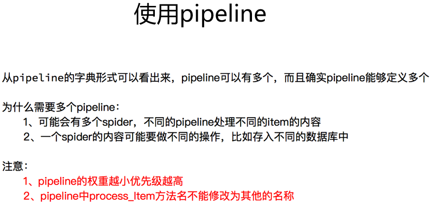
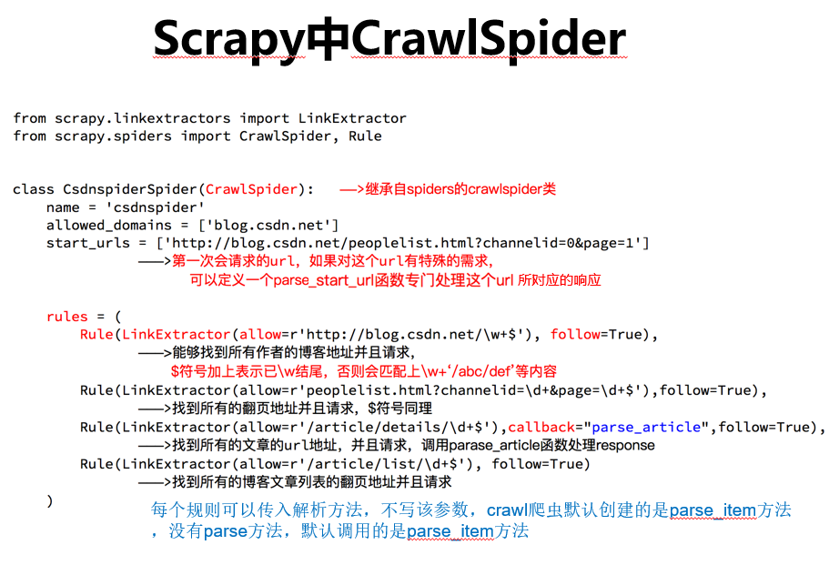
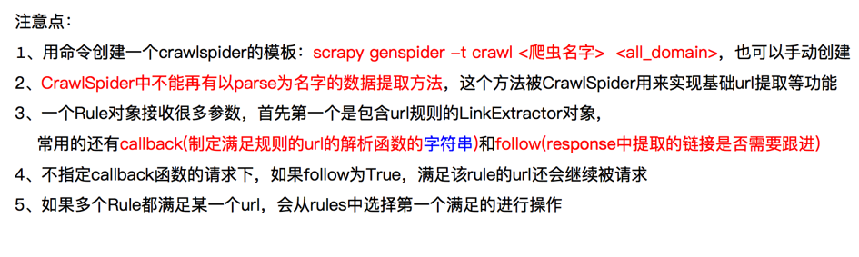
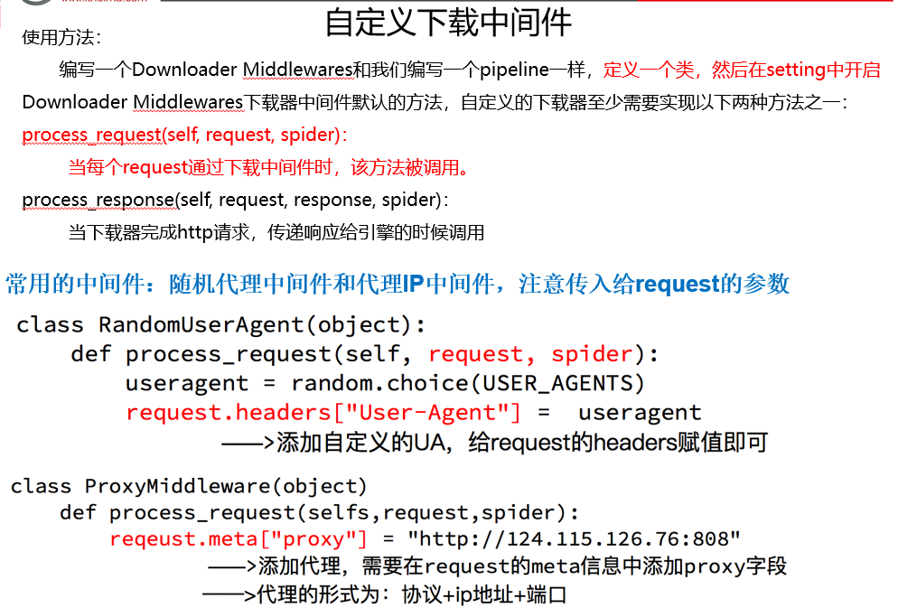
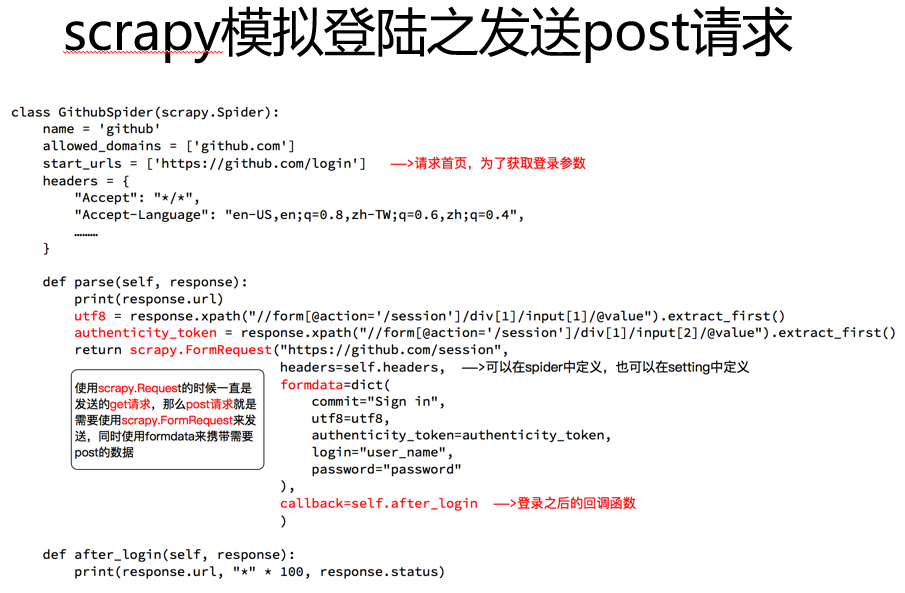
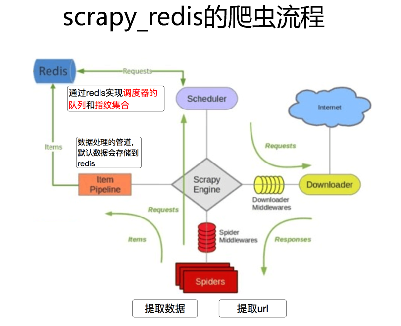
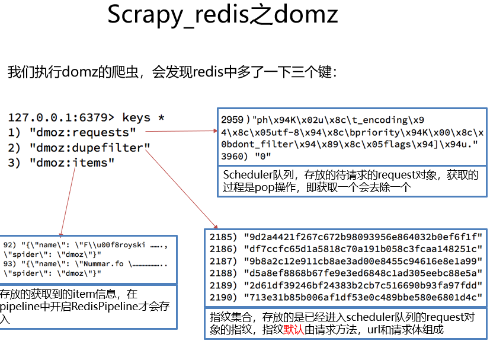
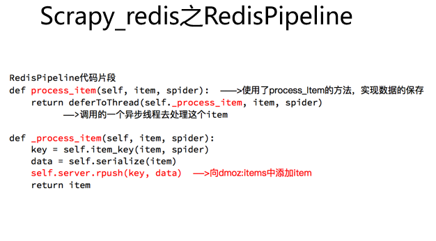
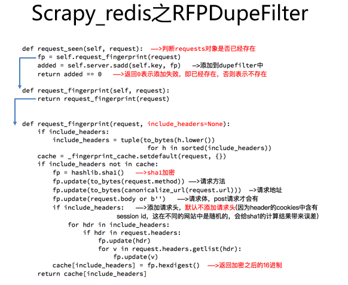
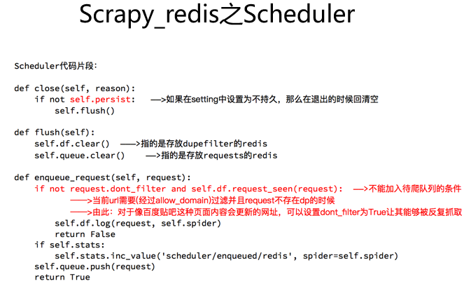

#### Scrapy 入门基础参考 Spider_devlopment_study_note中的md笔记和相关项目
#### Scrapy spider、crawlspider、redis-spider详细每一步的设置步骤参考Spider_devlopment_study_note的MD笔记
#### ch12 cnblog爬虫(基础爬虫)、sht爬虫(redis爬虫，redis过滤)  
#### ch17：yunqi爬虫(crawl规则爬虫)
#### TZKT_Study_Note项目中多有个requests和scrapy爬虫实例，P03_51job爬虫，scrapy-redis-MongoDB综合爬虫案例


# 学习视频来源：传智播客15期 20 爬虫scrapy框架及案例
# 以下以上视频学习笔记

# 1. Scrapy介绍
- 通用爬虫流程
- 

- 类似scrapy爬虫流程
- 

- scrapy爬虫流程
- 
- 以上两图，整个流程是相同的，只不过名称有所不同，但是功能都是相似的


## 1.1 scrapy各组件的作用
- 
- Scrapy主要有5大部件和2个中间件
- 爬虫流程图说明：
    - Scrapy Engine引擎分别连接四个部件：Spider、ItemPipeline、Downloader、Scheduler
    - 四个部件都要通过Scrapy Engine引擎进行工作，数据都需要和引擎进行交换
    - 图中的橙色箭头线只是表示流向，比如request、response，但是调度器Scheduler和下载器Downloader并没有实际联系
    - 它们之间的联系都需要通过Scrapy Engine引擎


### 1.1.1 scrapy 组件介绍
- 一个核心：    
    - **Scrapy Engine(引擎，相当于大脑)**:
        - 负责Spider、ItemPipeline、Downloader、Scheduler中间的通讯，信号、数据传递等。

- 四大部件：   
    - **Scheduler(调度器)**:
        - 它负责接受引擎发送过来的Request请求对象(请求对象里面不仅是url地址，还有UA，代理等其它对象)
        - 并按照一定的方式进行整理排列，入队，当引擎需要时，交还给引擎。
    - **Downloader（下载器）**：
        - 负责下载Scrapy Engine(引擎)发送过来的所有Requests请求对象，
        - 并将其获取到的Responses对象交还给Scrapy Engine(引擎)，由引擎交给Spider爬虫来处理，
    - **Spider（爬虫）**：
        - 它负责处理所有Responses对象,从中分析提取数据，获取Item字段需要的数据，
        - 并将需要继续爬取的URL提交给引擎，引擎再次交给Scheduler(调度器)
        - 将items数据提交给引擎，引擎再提交给Item Pipeline进行处理(存储到数据库，下载等等)
    - **Item Pipeline(管道)**：
        - 它负责处理Spider中获取到的Item，并进行进行后期处理（详细分析、过滤、存储等）的地方.

- 两个中间件：   
    - **Downloader Middlewares（下载器中间件）**：
        - 下载器中间件位于引擎和下载器之间，它们传输的数据就是requests和responses
        - 主要是对requests和responses进行设置，主要是自定义扩展下载功能的组件。
        - Scrapy的官方文档中的解释：下载器中间件是介于Scrapy的request/response处理的钩子框架，
        - 是用于全局修改Scrapy request和response的一个轻量、底层的系统。
        - 容易理解的话表述就是：更换代理IP，更换Cookies，更换User-Agent，自动重试等
        - 上述具体的自定义设置在项目文件的settings.py里面，
        
        - 具体设置参考Spider_devlopment_study_note中的ch17
        - 设置请求头，更会随机的User-Agent:本项目005文件中的cric项目中的settings和middlewares设置
        - 使用post发送账号密码登陆请求：本项目文件夹中login项目
        
    - **Spider Middlewares（爬虫中间件）**：
        - 爬虫中间件位于引擎和爬虫之间，它们传输的数据就是response、requests、items
        - 主要自定扩展和操作引擎和Spider中间通信的功能组件（比如进入Spider的Responses;和从Spider出去的Requests）
        - items虽然也经过爬虫中间件，但是有专门的Item Pipeline(管道)对起进行处理
        - scrapy 默认是未做任何处理，直接返回直接获取到的 response、requests、items

- 上面所有组件，我们需要手动编写：
    - 爬虫、管道、中间件，重点是爬虫和管道，中间件辅助
    - 下载器和调度器框架自己内部实现


### 1.1.2  Spider 爬虫      
- Spider 爬虫结构
    - 对应的是文件夹spiders下的py文件
    - __init__: 初始化爬虫名称，可传入start_urls列表，该方法一般不写，爬虫名称、初始URL、允许域名直接放在类下面当做全局变量
    - start_requests: 生成Requests对象交给Scrapy下载并返回response，该方法启动爬虫自动实现
    - parse：根据返回的response解析出相应的item，item自动进入pipeline：如果需要，
    - 解析出url,url自动交给requests模块，一直循环下去
    - parse_body：进入二级页面解析网页详细信息

- Spider 类基本属性：
    - Spider类：
        - Spider 继承自 scrapy.spiders.Spider，这个类是最简单最基本的 Spider 类，每个其他的 Spider 必须继承自这个类，
        - 还有后面要说明的一些特殊 Spider 类，比如redisSpider, crawlSpider 等也都是继承自它
    - name：
        - 爬虫名称，是定义 Spider 名字的字符串。
        - Spider 的名字定义了 Scrapy 如何定位并初始化 Spider，所以其必须是唯一的。 
        - 不过我们可以生成多个相同的 Spider 实例，这没有任何限制。 
        - name 是 Spider 最重要的属性，而且是必需的。
        - 如果该 Spider 爬取单个网站，一个常见的做法是以该网站的域名名称来命名 Spider。
        - 例如，如果 Spider 爬取 mywebsite.com，该 Spider 通常会被命名为 mywebsite。
    - allowed_domains：
        - 允许爬取的域名，是可选配置，不在此范围的链接不会被跟进爬取。
    - start_urls：
        - 起始 URL 列表，当我们没有实现 start_requests 方法时，默认会从这个列表开始抓取。
    - custom_settings：
        - 这是一个字典，是专属于本 Spider 的配置，此设置会覆盖项目全局的设置，
        - 而且此设置必须在初始化前被更新，所以它必须定义成类变量。
    - crawler：
        - 此属性是由 from_crawler 方法设置的，代表的是本 Spider 类对应的 Crawler 对象，
        - Crawler 对象中包含了很多项目组件，利用它我们可以获取项目的一些配置信息，
        - 如最常见的就是获取项目的设置信息，即 Settings。
    - settings：
        - 是一个 Settings 对象，利用它我们可以直接获取项目的全局设置变量。

- Spider 常用的方法：
    -  start_requests： 
        - 默认实现的方法，读取并请求 start_urls 属性，并根据返回的结果调用 parse 方法解析结果。
        - 此方法用于生成初始请求，它必须返回一个可迭代对象，
        - 此方法会默认使用 start_urls 里面的 URL 来构造 Request，而且 Request 是 GET 请求方式。
        - 如果我们想在启动时以 POST 方式访问某个站点，可以直接重写这个方法，发送 POST 请求时我们使用 FormRequest 即可。
    - parse：
        - 默认处理 start_requests 方法返回的 response 对象
        - 当 Response 没有指定回调函数时，该方法会默认被调用，它负责处理 Response，处理返回结果，
        - 并从中提取出想要的数据和下一步的请求，然后返回。
        - 该方法需要返回一个包含 Request 或 Item 的可迭代对象。
    - closed：
        - 当 Spider 关闭时，该方法会被调用，在这里一般会定义释放资源的一些操作或其他收尾操作。

- Spider 类来说，整个爬取循环如下所述：
    - 以初始的 URL 初始化 Request 对象，并设置回调函数 parse(self, response)。 
    - 当该 Request 成功请求并返回时，将生成 Response，并作为参数传给该回调函数 parse(self, response)。
    - 在回调函数 parse 内分析返回的网页内容。返回结果可以有两种形式：
        - 一种是解析到的有效结果返回字典或 Item 对象。下一步可经过处理后（或直接）保存，
        - 另一种是解析到的下一个（如下一页）链接，可以利用此链接构造 Request 并设置新的回调函数，返回 Request 继续请求分析。
    - 返回数据的处理方法：
        - 如果返回的是字典或 Item 对象，可通过 Feed Exports 等形式存入文件，如果设置了 Pipeline 的话，可以经由 Pipeline 处理（如过滤、修正等）并保存。
        - 如果返回的是 Reqeust，那么 Request 执行成功得到 Response 之后会再次传递给 Request 中调用的回调函数，可以再次使用选择器来分析新得到的网页内容，并根据分析的数据生成 Item。
        - 如果是 request 请求下一页就调用 parse 方法继续处理，如果是 request 请求二级页面就调用 parse_body 方法

- spider 补充注意点：
    - start_request: 此方法默认启动爬虫时候只被调用一次，读取start_urls内容并启动爬取过程
        - start_request是用来处理start_urls的方法，可以scrapy.Spider的源码查看
        - 返回最初始的response交给parse函数处理
    - name: 设置爬虫名称，爬虫名称不能和爬虫项目文件夹名称重复
    - start_urls: 设置开始第一批爬取的url,
        - 该url默认会调用start_request方法，返回response交给parse方法
        - 我们可以在parse之前重写该方法，会覆盖默认的方法
    - response注意：
        - 起始url的response或者后面一些url的response，response里面是不是有我们在网页上查看元素里面看到的内容，一般大多数情况下是使用class属性定位
        - 使用Chrome开发者工具，查看网址的response或者查看网页源码，然后查找是否有class属性值或者一些其它属性
        - 如果查看元素能看见，但是response里面没有，就说明该内容是js动态请求生成的，就需要进行js逆向分析
        - 参考4.1中京东图书爬虫，图书价格页面和查看元素里面都可以看到，但是response里面没有，就是js动态生成的
    - allow_domains: spider允许爬取的域名列表
        - 特别注意，allow_domains只会对start_urls以后的域名进行过滤
        - start_urls不会受allow_domains的影响
        - 此处的allow_domains一定不要写错了，如果写错了，爬虫只会爬取start_urls，然后下一页由于被错误的域名过滤掉了，就爬虫直接结束了
            - 入坑记录：
            - 运行爬虫的时候，就会出现第一次请求和解析都正常，后面的请求都被过滤掉了。
            - 原来scrapy框架下的allowed_domains默认只会对第二次以后的请求域名是否符合进行校验，
            - 而对于start_requests的url是不会做限制的，因此第一次的请求是可以正常请求和解析的
            - tieba爬虫项目：allowed_domains = ['tieba.baidu.com']写错成'tieba.com'
            - 导致只爬取了第一页，下一页不爬取，检查了多遍终于才发现问题，有些常用的思维非常容易入坑，teiba.com多好的域名啊！！！
            - 注意：在爬取搜狗的网站的时候，搜狗的主域名是sogou.com，别写成了错误的“sougou.com”
    - log: 日志记录
     
- Item Pipeline 和 spider详细具体参考Spider_devlopment_study_note项目中的ch12中的cnblog和sht爬虫


### 1.1.3 Item Pipeline 管件
- 具体查看：
    - Spider_devlopment_study_note 中ch12中的cnblogSpider和sht项目中代码文字注释
    - TZKT_Study_Note项目中多有个requests和scrapy爬虫实例，P03_51job爬虫，scrapy-redis-MongoDB综合爬虫案例

- Item Pipeline，它的调用发生在 Spider 产生 Item 之后。
    - 当 Spider 解析完 Response 之后，Item 就会传递到 Item Pipeline，被定义的 Item Pipeline 组件会顺次调用，完成一连串的处理过程，比如数据清洗、存储等。
    - 它的主要功能有：
        - 清洗 HTML 数据；
        - 验证爬取数据，检查爬取字段；
        - 查重并丢弃重复内容；
        - 将爬取结果储存到数据库。

- Item Pipeline 管件
    - 爬虫提取出数据存入item后，item中保存的数据需要进一步的处理，比如清洗，去重，验证，存储等
    - item常用处理方式：
        - 方式1：存储item内容到json、csv、xml、pickle、marshal 等格式的文件
        - 方式2：存储item内容到数据库，最常用就是MongoDB数据库，参考P03_51job爬虫项目
        - 方式3：下载图片或者视频到本地，参考sht爬虫项目
    - 爬虫自己默认创建的管道，管道中可以自定义很多功能，但是必须要实现一个process_item方法，自定义的管道件不需要实现该函数
        - process_item方法说明:
            - spider爬虫提取出的item作为参数传入，同时传入的参数还有spider
            - 一个参数是 item，每次 Spider 生成的 Item 都会作为参数传递过来。另一个参数是 spider，就是 Spider 的实例。
            - 此方法在默认创建的管道必须实现，默认的管道我们可以修改后实现不同功能，比如存储item到json文件或者存储item到数据库都可以，参考上面案例
                - sht爬虫项目就是默认管道用来存储item到json文件
                - P03_51job爬虫项目默认管道就是用于连接数据库，然后存储item到数据库中
            - 必须return返回一个item对象，这样，被丢弃之后的item不会被之后的pipeline处理

- 管道件里面默认常用方法：
        - __init__: 构造函数
            - 进行一些必要的参数初始化
        - process_item(self, item, spider)：
            - 具体处理item对象的函数
            - 如果返回的是 Item 对象，那么此 Item 会被低优先级的 Item Pipeline 的 process_item() 方法进行处理，直到所有的方法被调用完毕。
            - 如果抛出的是 DropItem 异常，那么此 Item 就会被丢弃，不再进行处理。
        - open_spider(self, spider):
            - spider对象被开启时调用
            - 在这里我们可以做一些初始化操作，如开启数据库连接等。
            - 其中参数 spider 就是被开启的 Spider 对象。
        - close_spider(self, spider):
            - spider对象被关闭时调用  
            -  Spider 关闭的时候自动调用的，在这里我们可以做一些收尾工作，
            - 如关闭数据库连接等，其中参数 spider 就是被关闭的 Spider 对象
        - from_crawler(cls, crawler)：
            - from_crawler() 方法是一个类方法，用 @classmethod 标识，是一种依赖注入的方式。
            - 它的参数是 crawler，通过 crawler 对象，我们可以拿到 Scrapy 的所有核心组件，
            - 如全局配置的每个信息，然后创建一个 Pipeline 实例。
            - 参数 cls 就是 Class，最后返回一个 Class 实例。
        - get_media_requests(self, item, info):
            - 下载图片或者视频的处理函数，参考sht爬虫项目
        - file_path(self, request, response=None, info=None):
            - 文件路径定义函数，即文件夹重命名函数，参考sht爬虫项目
            
    - 注意点：
        - 启用 Item Pipeline 后，Item Pipeline 会自动调用这个方法。
        - process_item 方法必须返回包含数据的字典或 Item 对象，或者抛出 DropItem 异常。

- 文件下载和图片下载管件：
    - 官方文档中关于文件和图片下载说明：https://doc.scrapy.org/en/latest/topics/media-pipeline.html
    - 参考代码 sht 项目中自定义图片下载管道，sht 项目中使用了 image_urls字段
    
    - 注意：内置的 ImagesPipeline 会默认读取 Item 的 image_urls 字段，并认为该字段是一个列表形式，它会遍历 Item 的 image_urls 字段，然后取出每个 URL 进行图片下载。
    - Item 的图片链接字段并不是 image_urls 字段表示的，也不是列表形式，而是单个的 URL。所以为了实现下载，我们需要重新定义下载的部分逻辑，即需要自定义 ImagePipeline，继承内置的 ImagesPipeline，重写方法。
```
from scrapy import Request
from scrapy.exceptions import DropItem
from scrapy.pipelines.images import ImagesPipeline
class ImagePipeline(ImagesPipeline):
    def file_path(self, request, response=None, info=None):
        url = request.url
        file_name = url.split('/')[-1]
        return file_name
    def item_completed(self, results, item, info):
        image_paths = [x['path'] for ok, x in results if ok]
        if not image_paths:
            raise DropItem('Image Downloaded Failed')
        return item
    def get_media_requests(self, item, info):
        yield Request(item['url'])
```
- 自定义图片下载管道说明:
    -  ImagePipeline，继承 Scrapy 内置的 ImagesPipeline，重写了下面几个方法。
    - get_media_requests()。它的第一个参数 item 是爬取生成的 Item 对象。我们将它的 url 字段取出来，然后直接生成 Request 对象。此 Request 加入调度队列，等待被调度，执行下载。
    - file_path()。它的第一个参数 request 就是当前下载对应的 Request 对象。这个方法用来返回保存的文件名，直接将图片链接的最后一部分当作文件名即可。它利用 split() 函数分割链接并提取最后一部分，返回结果。这样此图片下载之后保存的名称就是该函数返回的文件名。
    - item_completed()，它是当单个 Item 完成下载时的处理方法。因为并不是每张图片都会下载成功，所以我们需要分析下载结果并剔除下载失败的图片。如果某张图片下载失败，那么我们就不需保存此 Item 到数据库。该方法的第一个参数 results 就是该 Item 对应的下载结果，它是一个列表形式，列表每一个元素是一个元组，其中包含了下载成功或失败的信息。这里我们遍历下载结果找出所有成功的下载列表。如果列表为空，那么该 Item 对应的图片下载失败，随即抛出异常 DropItem，该 Item 忽略。否则返回该 Item，说明此 Item 有效。
    - 具体对比查看 sht 项目中自定义图片下载管道，该管道实现功能更复杂一点
    - 补充1：
        - 自定义图片管道可以定义多个，每个管道可以用来处理 item 中不同 url 列表字段，只需要 get_media_requests 方法中取出即可
        - 如果是 url 有多个元素就 for 循环取出(查看 sht 项目)，如果就一个元素直接上面代码中 yield 请求
    - 补充2：
        - 需要优先调用 ImagePipeline 对 Item 做下载后的筛选，下载失败的 Item 就直接忽略，它们就不会保存到 MongoDB 和 MySQL 里。
        - 随后再调用其他存储的 Pipeline，这样就能确保存入数据库的图片都是下载成功的。


### 1.1.4 爬虫中间件
- Spider Middleware： 实际使用中主要用来处理 Response 对象
- Downloader Middleware： 实际使用中主要用来处理 Request 对象

- Spider Middleware 和 Downloader Middleware
- 参考099文件中 002 和 005 图片
- 具体查看 middlewares.py 中的两个类，scrapy 默认中间件对直接获取到的 response、requests、items 是不作处理，直接返回，需要处理需要自己定义

- Spider Middleware 有如下三个作用。
    - 我们可以在 Downloader 生成的 Response 发送给 Spider 处理之前，也就是在 Response 发送给 Spider 之前对 Response 进行处理。
    - 我们可以在 Spider 生成的 Request 发送给 Scheduler 之前，也就是在 Request 发送给 Scheduler 之前对 Request 进行处理。
    - 我们可以在 Spider 生成的 Item 发送给 Item Pipeline 之前，也就是在 Item 发送给 Item Pipeline 之前对 Item 进行处理。
    
    - Scrapy 其实已经默认提供了许多 Spider Middleware，它们被 SPIDER_MIDDLEWARES_BASE 这个变量所定义。
    - SPIDER_MIDDLEWARES_BASE 变量的内容如下：
    - 第一个 Middleware 是最靠近引擎的，最后一个 Middleware 是最靠近 Spider 的
    
{
'scrapy.spidermiddlewares.httperror.HttpErrorMiddleware': 50,

'scrapy.spidermiddlewares.offsite.OffsiteMiddleware': 500,

'scrapy.spidermiddlewares.referer.RefererMiddleware': 700,

 'scrapy.spidermiddlewares.urllength.UrlLengthMiddleware': 800,

'scrapy.spidermiddlewares.depth.DepthMiddleware': 900,
}


- Spider Middleware 核心方法
    - Spider Middleware 为 Scrapy 提供了基础的功能。如果我们想要扩展其功能，只需要实现某几个方法即可。
    - 核心方法有如下 4 个，查看 middlewares.py 文件，里面默认有两个类，一个爬虫中间件类，一个下载器中间件类：
        - process_spider_input(response, spider)
        - process_spider_output(response, result, spider)
        - process_spider_exception(response, exception, spider)
        - process_start_requests(start_requests, spider)

- process_spider_input(response, spider) 方法
    - Downloader 生成的 Response 发送给 Spider 处理之前，也就是在 Response 发送给 Spider 之前对 Response 进行处理
    - 当 Response 通过 Spider Middleware 时，该方法被调用，处理该 Response。
    - 图上流向：Scrapy Engine ---> Spider
    - 方法的参数有两个：
        - response，即 Response 对象，即被处理的 Response；    
        - spider，即 Spider 对象，即该 response 对应的 Spider 爬虫。
    - process_spider_input() 应该返回 None 或者抛出一个异常。
    - 如果其返回 None，Scrapy 将会继续处理该 Response，调用所有其他的 Spider Middleware 直到 Spider 爬虫处理该 Response。
    - 如果其抛出一个异常，Scrapy 将不会调用任何其他 Spider Middleware 的 process_spider_input() 方法，并调用 Request 的 errback() 方法。 
    - errback 的输出将会以另一个方向被重新输入到中间件中，使用 process_spider_output() 方法来处理，当其抛出异常时则调用 process_spider_exception() 来处理。

- process_spider_output(response, result, spider) 方法
    - 当 Spider 处理 Response 返回结果时，该方法被调用
    - 图上流向：Spider ---> Scrapy Engine
    - 方法的参数有三个：
        - response，即 Response 对象，即生成该输出的 Response；
        - result，包含 Request 或 Item 对象的可迭代对象，即 Spider 返回的结果；
        - spider，即 Spider 对象，即其结果对应的 Spider。
    - process_spider_output() 必须返回包含 Request 或 Item 对象的可迭代对象。
    
- process_spider_exception(response, exception, spider) 方法
    - 当 Spider 或 Spider Middleware 的 process_spider_input() 方法抛出异常时， 该方法被调用。
    - 方法的参数有三个：
        - response，即 Response 对象，即异常被抛出时被处理的 Response；
        - exception，即 Exception 对象，被抛出的异常；
        - spider，即 Spider 对象，即抛出该异常的 Spider。
    - process_spider_exception() 必须返回结果，要么返回 None ， 要么返回一个包含 Response 或 Item 对象的可迭代对象。
        - 如果其返回 None ，Scrapy 将继续处理该异常，调用其他 Spider Middleware 中的 process_spider_exception() 方法，直到所有 Spider Middleware 都被调用。
        - 如果其返回一个可迭代对象，则其他 Spider Middleware 的 process_spider_output() 方法被调用， 其他的 process_spider_exception() 将不会被调用。

- process_start_requests(start_requests, spider) 方法
    - 该方法以 Spider 爬虫启动的 Request 为参数时被调用，执行的过程类似于 process_spider_output() ，只不过其没有相关联的 Response 并且必须返回 Request。
    - 方法的参数有两个：
        - start_requests，即包含 Request 的可迭代对象，即 Start Requests；
        - spider，即 Spider 对象，即 Start Requests 所属的 Spider。
    - 其必须返回另一个包含 Request 对象的可迭代对象，该对象去下载器下载后再返回 Response。


### 1.1.4 下载中间件
- Downloader Middleware 即下载中间件，它是处于 Scrapy 的 Request 和 Response 之间的处理模块。
- Scheduler 从队列中拿出一个 Request 发送给 Downloader 执行下载，这个过程会经过 Downloader Middleware 的处理。
- 另外，当 Downloader 将 Request 下载完成得到 Response 返回给 Spider 时会再次经过 Downloader Middleware 处理。       
        
- Downloader Middleware 在整个架构中起作用的位置是以下两个:
    - 在 Scheduler 调度出队列的 Request 发送给 Downloader 下载之前，也就是我们可以在 Request 执行下载之前对其进行修改。
    - 在下载后生成的 Response 发送给 Spider 之前，也就是我们可以在生成 Resposne 被 Spider 解析之前对其进行修改。
    - Downloader Middleware 的功能十分强大，修改 User-Agent、处理重定向、设置代理、失败重试、设置 Cookies 等功能都需要借助它来实现。

- Downloader Middleware 变量 
    - Scrapy 其实已经默认提供了许多 Downloader Middleware，比如负责失败重试、自动重定向等功能的 Middleware，它们被 DOWNLOADER_MIDDLEWARES_BASE 变量所定义。
    - DOWNLOADER_MIDDLEWARES_BASE 变量的内容如下所示：   
{

    'scrapy.downloadermiddlewares.robotstxt.RobotsTxtMiddleware': 100,

    'scrapy.downloadermiddlewares.httpauth.HttpAuthMiddleware': 300,

    'scrapy.downloadermiddlewares.downloadtimeout.DownloadTimeoutMiddleware': 350,

    'scrapy.downloadermiddlewares.defaultheaders.DefaultHeadersMiddleware': 400,

    'scrapy.downloadermiddlewares.useragent.UserAgentMiddleware': 500,

    'scrapy.downloadermiddlewares.retry.RetryMiddleware': 550,

    'scrapy.downloadermiddlewares.ajaxcrawl.AjaxCrawlMiddleware': 560,

    'scrapy.downloadermiddlewares.redirect.MetaRefreshMiddleware': 580,

    'scrapy.downloadermiddlewares.httpcompression.HttpCompressionMiddleware': 590,

    'scrapy.downloadermiddlewares.redirect.RedirectMiddleware': 600,

    'scrapy.downloadermiddlewares.cookies.CookiesMiddleware': 700,

    'scrapy.downloadermiddlewares.httpproxy.HttpProxyMiddleware': 750,

    'scrapy.downloadermiddlewares.stats.DownloaderStats': 850,

    'scrapy.downloadermiddlewares.httpcache.HttpCacheMiddleware': 900,

}
    - 如果自己定义的 Downloader Middleware 要添加到项目里，DOWNLOADER_MIDDLEWARES_BASE 变量不能直接修改。
    - Scrapy 提供了另外一个设置变量 DOWNLOADER_MIDDLEWARES，我们直接修改这个变量就可以添加自己定义的 Downloader Middleware，
    - 以及对应禁用 DOWNLOADER_MIDDLEWARES_BASE 里面定义的 Downloader Middleware。
        
- Downloader Middleware 核心方法
    - Scrapy 内置的 Downloader Middleware 为 Scrapy 提供了基础的功能，但在项目实战中我们往往需要单独定义 Downloader Middleware。
    - 不用担心，这个过程非常简单，我们只需要实现某几个方法即可。
    - 每个 Downloader Middleware 都定义了一个或多个方法的类，核心的方法有如下三个。
        - process_request(request, spider)
        - process_response(request, response, spider)
        - process_exception(request, exception, spider)
        
        
- process_request(request, spider) 方法
    - 图上流向：Scrapy Engine ---> Downloader
    - Request 被 Scrapy 引擎调度给 Downloader 之前，process_request() 方法就会被调用，
    - 也就是在 Request 从队列里调度出来到 Downloader 下载执行之前，我们都可以用 process_request() 方法对 Request 进行处理。
    - 方法的返回值必须为 None、Response 对象、Request 对象之一，或者抛出 IgnoreRequest 异常。
    
    - process_request() 方法的参数有如下两个。
        - request，即 Request 对象，即被处理的 Request；
        - spider，即 Spider 对象，即此 Request 对应的 Spider。
    
    - 返回类型不同，产生的效果也不同。下面归纳一下不同的返回情况。
        - 当返回为 None 时，Scrapy 将继续处理该 Request，接着执行其他 Downloader Middleware 的 process_request() 方法，直到 Downloader 把 Request 执行后得到 Response 才结束。这个过程其实就是修改 Request 的过程，不同的 Downloader Middleware 按照设置的优先级顺序依次对 Request 进行修改，最后推送至 Downloader 执行。
        - 当返回为 Response 对象时，更低优先级的 Downloader Middleware 的 process_request() 和 process_exception() 方法就不会被继续调用，每个 Downloader Middleware 的 process_response() 方法转而被依次调用。调用完毕之后，直接将 Response 对象发送给 Spider 来处理。
        - 当返回为 Request 对象时，更低优先级的 Downloader Middleware 的 process_request() 方法会停止执行。这个 Request 会重新放到调度队列里，其实它就是一个全新的 Request，等待被调度。如果被 Scheduler 调度了，那么所有的 Downloader Middleware 的 process_request() 方法会被重新按照顺序执行。
        - 如果 IgnoreRequest 异常抛出，则所有的 Downloader Middleware 的 process_exception() 方法会依次执行。如果没有一个方法处理这个异常，那么 Request 的 errorback() 方法就会回调。如果该异常还没有被处理，那么它便会被忽略。

- process_response(request, response, spider) 方法
    - 图上流向：Downloader --->  Scrapy Engine
    - Downloader 执行 Request 下载之后，会得到对应的 Response。Scrapy 引擎便会将 Response 发送给 Spider 进行解析。
    - 在发送之前，我们都可以用 process_response() 方法来对 Response 进行处理。
    - 方法的返回值必须为 Request 对象、Response 对象之一，或者抛出 IgnoreRequest 异常。

    - process_response() 方法的参数有如下三个。
        - request，是 Request 对象，即此 Response 对应的 Request。
        - response，是 Response 对象，即此被处理的 Response。
        - spider，是 Spider 对象，即此 Response 对应的 Spider。

    - 下面对不同的返回情况做一下归纳：
        - 当返回为 Request 对象时，更低优先级的 Downloader Middleware 的 process_response() 方法不会继续调用。该 Request 对象会重新放到调度队列里等待被调度，它相当于一个全新的 Request。然后，该 Request 会被 process_request() 方法顺次处理。
        - 当返回为 Response 对象时，更低优先级的 Downloader Middleware 的 process_response() 方法会继续调用，继续对该 Response 对象进行处理。
        - 如果 IgnoreRequest 异常抛出，则 Request 的 errorback() 方法会回调。如果该异常还没有被处理，那么它便会被忽略。

- process_exception(request, exception, spider) 方法
    - 当 Downloader 或 process_request() 方法抛出异常时，例如抛出 IgnoreRequest 异常，process_exception() 方法就会被调用。
    - 方法的返回值必须为 None、Response 对象、Request 对象之一。

    - process_exception() 方法的参数有如下三个：
        - request，即 Request 对象，即产生异常的 Request。
        - exception，即 Exception 对象，即抛出的异常。
        - spdier，即 Spider 对象，即 Request 对应的 Spider。

    - 下面归纳一下不同的返回值。
        - 当返回为 None 时，更低优先级的 Downloader Middleware 的 process_exception() 会被继续顺次调用，直到所有的方法都被调度完毕。
        - 当返回为 Response 对象时，更低优先级的 Downloader Middleware 的 process_exception() 方法不再被继续调用，每个 Downloader Middleware 的 process_response() 方法转而被依次调用。
        - 当返回为 Request 对象时，更低优先级的 Downloader Middleware 的 process_exception() 也不再被继续调用，该 Request 对象会重新放到调度队列里面等待被调度，它相当于一个全新的 Request。然后，该 Request 又会被 process_request() 方法顺次处理。

### 1.1.5 下载中间件修改实例(自定义UserAgent)
- Scrapy 发送的 Request 使用的 User-Agent 是 Scrapy/1.4.0(+http://scrapy.org)，
- 这其实是由 Scrapy 内置的 UserAgentMiddleware 设置的，UserAgentMiddleware 的源码如下所示：
```
from scrapy import signals

class UserAgentMiddleware(object):

    def __init__(self, user_agent='Scrapy'):

        self.user_agent = user_agent

    @classmethod

    def from_crawler(cls, crawler):

        o = cls(crawler.settings['USER_AGENT'])

        crawler.signals.connect(o.spider_opened, signal=signals.spider_opened)

        return o

    def spider_opened(self, spider):

        self.user_agent = getattr(spider, 'user_agent', self.user_agent)

    def process_request(self, request, spider):

        if self.user_agent:

            request.headers.setdefault(b'User-Agent', self.user_agent)

```
- 上述代码执行步骤：
    - from_crawler() 方法中，首先尝试获取 settings 里面的 USER_AGENT，然后把 USER_AGENT 传递给 init() 方法进行初始化，
    - 其参数就是 user_agent。如果没有传递 USER_AGENT 参数就默认设置为 Scrapy 字符串。
    - 我们新建的项目没有设置 USER_AGENT，所以这里的 user_agent 变量就是 Scrapy。
    - 接下来，在 process_request() 方法中，将 user-agent 变量设置为 headers 变量的一个属性，这样就成功设置了 User-Agent。
    - 因此，User-Agent 就是通过此 Downloader Middleware 的 process_request() 方法设置的。
      
- 修改请求时的 User-Agent 可以有两种方式：
    - 一是修改 settings 里面的 USER_AGENT 变量；
    - setting.py 里面加一行 USER_AGENT 的定义即可
    - USER_AGENT = 'Mozilla/5.0 (Macintosh; Intel Mac OS X 10_12_6) AppleWebKit/537.36 (KHTML, like Gecko) Chrome/59.0.3071.115 Safari/537.36'
    - 二是通过 Downloader Middleware 的 process_request() 方法来修改。

- 设置随机的 User-Agent，那就需要借助 Downloader Middleware 了。所以接下来我们用 Downloader Middleware 实现一个随机 User-Agent 的设置。
    - 第一步：middlewares.py 里面自定义添加一个 RandomUserAgentMiddleware 的类
```
import random

class RandomUserAgentMiddleware():

    def __init__(self):

        self.user_agents = ['Mozilla/5.0 (Windows; U; MSIE 9.0; Windows NT 9.0; en-US)',

            'Mozilla/5.0 (Windows NT 6.1) AppleWebKit/537.2 (KHTML, like Gecko) Chrome/22.0.1216.0 Safari/537.2',

            'Mozilla/5.0 (X11; Ubuntu; Linux i686; rv:15.0) Gecko/20100101 Firefox/15.0.1'

        ]

    def process_request(self, request, spider):

        request.headers['User-Agent'] = random.choice(self.user_agents)
# 类的 __init__() 方法中定义了三个不同的 User-Agent，并用一个列表来表示。
# 接下来实现了 process_request() 方法，它有一个参数 request，我们直接修改 request 的属性即可。
# 在这里我们直接设置了 request 对象的 headers 属性的 User-Agent，设置内容是随机选择的 User-Agent，这样一个 Downloader Middleware 就写好了。
```
- 第二步：在 settings.py 中，将 DOWNLOADER_MIDDLEWARES 取消注释(默认该变量没有启用)，并设置成如下内容：
    - DOWNLOADER_MIDDLEWARES = {'scrapydownloadertest.middlewares.RandomUserAgentMiddleware': 543,}

    
    
## 1.2 scrapy 爬取一个网站的流程
- Scrapy爬取一个网站的工作流程如下，结合上面的图片理解：  
    - 1.首先Spiders（爬虫里面写有start_url）将需要发送请求的url(requests)经ScrapyEngine（引擎）交给Scheduler（调度器）。
    - 2.Scheduler（排序，入队）处理后，经ScrapyEngine，DownloaderMiddlewares(可选，主要有User_Agent, Proxy代理)交给Downloader。
    - 3.Downloader向互联网发送请求，并接收下载响应（response）。将响应（response）经ScrapyEngine，SpiderMiddlewares(可选)交给Spiders。　　　　　
    - 4.Spiders处理response，提取数据并将数据经ScrapyEngine交给ItemPipeline保存（可以是本地，可以是数据库）。
    - 5.response中提取的url即新的Request经ScrapyEngine交给Scheduler进行下一个循环。直到无Url请求程序停止结束。
    


## 1.3 scrapy 项目流程
- 创建项目
    - scrapy startproject xxx
- 创建爬虫
    - cd 项目目录下
    - scrapy genspider xxx allowed_domains（该步命令也可以直接进入spider的py文件直接手动书写）
    - scrapy genspider –t crawl xxx allowed_domains  
        - 上面默认继承的是scrapy.Spider类，此处生成scrapy.spiders.CrawlSpider规则爬虫
        - 例如：
        - scrapy genspider first_spider jpdd.com
            - first_spider   爬虫名字
            - jpdd.com       限制爬取数据的范围
        - 爬虫py文件都是在spiders文件夹下面，上面命令可以创建多个爬虫
        - 爬虫都是位于spiders文件夹下面
        
- 完善：spider
    - 提取item所需的数据，提取url地址构成request对象      
- 完善管道：items pipelines
- 完善设置：settings 
- 运行爬虫
    - cd项目目录   
    - scrapy crawl first_spider

- 爬虫的项目结构

- 完善爬虫

 
- 注意：避免爬虫名和项目名重复 ；
    - 不管在终端还是pycharm 都要切换到当前目录下 cd myspider
    - allowed_domains : 限定爬取的范围
- 常用的命令shell终端命令：
    - scrapy startproject xxx（创建项目）
    - scrapy crawl XX（运行XXX爬虫）
    - scrapy shell http://www.scrapyd.cn（调试网址为http://www.scrapyd.cn的网站）
    - scrapy version 查看版本信息
    - scrapy list  查看爬虫信息，显示当前目录下所有的爬虫
    - scrapy crawl xxx -o xxx.json 将item内容输出存储为json文件，也可以存储为jsv、xml等格式文件
    
    
## 1.4 Scrapy 中数据提取器 Selector 总结
- Selector 介绍
    - Selector 是基于 lxml 构建的，支持 XPath 选择器、CSS 选择器，以及正则表达式，功能全面，解析速度和准确度非常高
    - 可以直接利用 Selector 这个类来构建一个选择器对象，然后调用它的相关方法如 xpath、css 等来提取数据。
    - start_requests方法返回的 response 对象，在scrapy中可以看做就是一个 Selector 对象，直接response.xpath(".//*[@class='day']")或者response.css(".day")提取
    - 针对一段 HTML 代码，我们可以用如下方式构建 Selector 对象来提取数据.
    - 具体使用 xpath 还是 css，根据个人习惯，我更倾向 xpath ，使用/更像HTML标签风格，表达式上下结构清晰
```python
from scrapy import Selector

body = '<html><head><title>Hello World</title></head><body></body></html>'
selector = Selector(text=body)
title = selector.xpath('//title/text()').extract_first()
print(title)

# Hello World
```

- response 说明：
    - 可以使用 response.selector.xpath 方法对数据进行了提取。
    - Scrapy 提供了两个实用的快捷方法，response.xpath 和 response.css，
    - 它们二者的功能完全等同于 response.selector.xpath 和 response.selector.css。
    - response.xpath(".//*[@class='day']")或者response.css(".day") 提取
    - re 正则提取有所不同：
        - re 都是在文本中提取数据，因此直接 response.txt 中查找匹配数据
        - title = re.findall("<!--TitleStart-->(.*?)<!--TitleEnd-->", response.text)[0]
        - publish_date = re.findall("发布时间：20\d{2}-\d{2}-\d{2}", response.text)[0]
        - 参考005中的cric案例
    - response.re 直接提取会报错，但是可以使用以下方法后再使用re:
        - xpath('.')选中全文，然后调用 re 和 re_first 方法，就可以进行正则匹配了。
        - 直接使用re方法等同于上面的re.findall，re_first等同于re.find
```
>>> response.re('Name:\s(.*)')
Traceback (most recent call last):
  File "<console>", line 1, in <module>
AttributeError: 'HtmlResponse' object has no attribute 're'
>>> response.xpath('.').re('Name:\s(.*)<br>')
['My image 1 ', 'My image 2 ', 'My image 3 ', 'My image 4 ', 'My image 5 ']
>>> response.xpath('.').re_first('Name:\s(.*)<br>')
'My image 1 '
```

- Selector 提取数据机制
    - Scrapy提供了自己提取数据的机制，它们被称作选择器（Selector，下面用英文表示），它支持xpath，css和正则表达式三种规则
    - Scrapy的Selector建立在lxml库上，这意味它们在解析速度和精度上都非常相似
    - Selector机制下有两个重要的数据类型：SelectorList(包含多个Selector对象的列表)和Selector(一个Selector对象)，其中前者是后者的集合，前者也是一个列表对象。
    - scrapy提供了extract和extract_first这两种方法提取SelectorList和Selector的具体data内容。
    - 在提取列表中的首个元素内容时，建议使用extract_first方法而非采用列表索引方式extract()[0] 
    - extract()没有值的时候返回是一个空列表，extract_first没有值返回是none，推荐使用extract_first，已经帮我判断了是否为none
        - response.xpath()返回的结果就是SelectorList列表对象，里面每一个元素就是一个Selector对象：
        [<Selector xpath='descendant-or-self::a' data='<a href="image1.html">Name: My image 1 <'>, 
        <Selector xpath='descendant-or-self::a' data='<a href="image2.html">Name: My image 2 <'>, 
        <Selector xpath='descendant-or-self::a' data='<a href="image3.html">Name: My image 3 <'>, 
        <Selector xpath='descendant-or-self::a' data='<a href="image4.html">Name: My image 4 <'>, 
        <Selector xpath='descendant-or-self::a' data='<a href="image5.html">Name: My image 5 <'>]
    - 实际上我们需要的内容是data里面的数据，
        - extract提取所有的 data 对应的内容，
        - extract_first只提取列表中第一个 selector 的 data 对应的内容
        
- Selector 中 extract() 和 extract_first() 区别：
    - scrapy 中选择器返回结果是Selector对象(特殊的列表)，返回的对象实际是一个列表对象：
    - SelectorList(里面有一个或多个Selector)和Selector。
    - 官方推荐使用方法 ：
        - .extract_first()：提取SelectorList对象中第一个元素的内容。即返回列表中的第一个元素的字符串内容。
        - .extract()：如果是SelectorList对象使用，则返回包含所有Selector中字符串内容的列表；如果是Selector使用，则返回该Selector的所有内容。
        - extract()没有值的时候返回是一个空列表(XPath出现问题可能会导致数据越界)，
        - extract_first没有值返回是none值，也不会报错，推荐使用extract_first，已经帮我判断了是否为none
        - 参考Python_advanced_learning中的04文件夹中的XPATH部分有详细总结
    - SelectorList对象虽然是个列表，但是是一个特殊的列表，不能直接使用列表切片取出内容
    - requests 库中使用lxml解析文档后，xpath返回的解析对象(就是一个python中的列表)，可以直接切片取出，参考TZKT项目中的P02和P03中数据提取区别
    - 取出title具体的文字内容，可以使用下面两种方式：
        - title = paper.xpath(".//*[@class='postTitle']/a/text()").extract()[0]     先提取所有内容得到列表，然后取出列表的第一个元素
        - title = paper.xpath(".//*[@class='postTitle']/a/text()").extract_first().strip()  SelectorList列表中的第一个Selector对象的内容元素

- 补充注意点：       
    - 特别注意：是extract_first不是extrast_first()
    - Python strip() 方法用于移除字符串头尾指定的字符（默认参数为空格和换行符）或字符序列(传入的参数)。
    - 该方法只能删除开头或是结尾的字符，不能删除中间部分的字符。

    - 补充1：普通请求里面也可以使用Selector选择器
        - 需要使用parsel的Selector模块(用法和scrapy中一样)
        - from parsel import Selector
        - html = Selector(response.text)    生成一个选择器对象，类似于上面的etree解析
        - title = html.xpath("xxx").extract_first()
        - 或者css选择器也可以
        - title = html.css("xxx").extract_first()
    
    - 补充2：
        - scrapy中初始网址的响应直接使用response.xpath()即可
        - response查找结果，比如li标签继续查找，也是直接li.xpath()    
    
    - 补充3：
        - Python中requests模块或者普通请求的response中使用Xpath
        # 1 导入模块
        import requests
        from lxml import etree
        # 2 获取文本，r.text类型是字符串文本内容，
            如果使用r.content则是bytes字节，还需要解码r.content.decode()
            解码会自动推测编码格式
        r = requests.get(url, headers=headers)
        text = r.text
        # 3 text解析为xml格式，就可以使用xpath查找了
        html = etree.HTML(text,etree.HTMLParser())
        # 4 查找标签，返回值是列表
        jobs = html.xpath(".//div[@id='resultList']//div[@class='el']")
    
    - 补充4：
        - CSS 选择器和 XPath 选择器一样可以嵌套选择。我们可以先用 XPath 选择器选中所有 a 节点，
        - 再利用 CSS 选择器选中 img 节点，再用 XPath 选择器获取属性
        - response.xpath('//a').css('img').xpath('@src').extract()
        - ['image1_thumb.jpg', 'image2_thumb.jpg', 'image3_thumb.jpg', 'image4_thumb.jpg', 'image5_thumb.jpg']
        - 实际使用不推荐
    

## 1.5 scrapy中url地址拼接的多种方式
- Response返回的url地址，对next_url的url地址进行拼接，构造请求,有5种方式
    - 方法1(常用)：手动字符串相加
    - 方法2(推荐)：urllib.parse.urljoin(baseurl,url)  
        - 后面的url会根据baseurl就是爬虫响应的url，可以直接填写response.url或者主域名
        - 进行url地址的拼接，sht项目就是用的方法1或者方法2
        - 使用前先导入：from urllib.parse import urljoin
        - 直接import urllib  然后使用：urllib.parse.urljoin() 识别不了parse，原因未知
    - 方法3：response.follow(url ,callback)  能够根据response的地址把url拼接完整，构造成Request对象，
    - 方法4(推荐)：response.urljoin(url)    更简洁、好用
        - scrapy里面自带的url拼接，只需要传入url即可，默认已经有一个response.url参数了
        - 参考tieba爬虫项目
    - 方法5：scrapy.Request(url,callback,meta,dont_filter)

## 1.6 scrapy.Request()方法中的参数说明？
- scrapy.Request() ===>相当于构造了一个requests对象
- scrapy.Request(url[,callback,method="GET",headers,body,cookies,meta,dont_filter=False])
    - 参数说明：
    - request = scrapy.Request(url=url, meta={'item': item}, callback=self.parse_body)
    - 括号中的参数为可选参数
    - url：接下来要请求处理的url地址
    - callback：回调函数，表示当前的url的响应交给哪个函数去处理
    - meta：实现数据在不同的解析函数(parse parse_body等函数)中传递，meta默认带有部分数据，比如下载延迟，请求深度等
    - dont_filter:默认是False，默认会过滤请求的url地址，即请求过的url地址不会继续被请求，
        - 对需要重复请求的url地址可以把它设置为True，强制重复请求
        - 比如贴吧的翻页请求，页面的数据随着吧友随时发帖会产生变化，需要重复请求，也可以不重复请求，就会漏掉一些内容;
    - 重点注意：cookies参数，必须单独作为一个参数，不能像之前requests库一样，将cookies放在headers内部
        - 并且传入的cookies是一个字典，键值的形式，参考## 2.6 scrapy携带cookies登录

## 1.7 为什么要单独定义item？
- 定义item即提前规划好哪些字段需要抓取，scrapy.Field()仅仅是提前占坑，
    - 通过item.py能够让别人清楚自己的爬虫是在抓取什么数据；
    - 同时来提示哪些字段是需要抓取的，没有定义的字段不能使用，防止手误；
    - item不能直接存入mongodb中，需要转化为字典后再存储。
    - Item使用之前需要先导入并且实例化，之后的使用方法和使用字典相同
        - from yanguan.items import YanguanItem
        - item = YanguanItem() #实例化

## 1.8 pipeline的使用
- pipeline里面可以写多个管道分别用于处理不同爬虫的item，
    - 也可以在一个管道中使用if else进行判断，然后分别处理来自不同爬虫的item
        - 方法1：item里面只需要加一个键come_from来自哪个网站，然后进行判断即可
        - 方法2：传递item到pipeline时候，同时也传递了spider爬虫，spider.name可以判断是哪个爬虫传过来的item
    - pipeline里面默认的process_item(self, item, spider)方法尽量不要重新命名
        - item就是spider中yield item 传来的参数
        - spider就是爬虫，spider.name属性就是定义的爬虫名称
        
        
        
- pipeline的管道下面有两个特殊方法：
    - open_spider：爬虫开启时候执行该函数，仅执行一次，一般用于连接数据库
    - close_spider：爬虫关闭时候执行该函数，仅执行一次，一般用于关闭数据库连接
    
```python 
# 爬虫开启时候执行该函数，仅执行一次，连接数据库
def open_spider(self, spider):
    self.client = pymongo.MongoClient(self.mongo_uri, replicaset=self.replicaset)
    self.db = self.client[self.mongo_db]

# 爬虫关闭时候执行该函数，仅执行一次，关闭数据库连接
def close_spider(self, spider):
    self.client.close()

def process_item(self, item, spider):
    # 判断item是否属于YunqiBookListItem，属于它，就将item数据存入数据库
    if isinstance(item, YunqiBookListItem):
        self._process_booklist_item(item)
    else:
        self._process_bookeDetail_item(item)
    return item
```
        
## 1.9 scrapy中logging模块的使用
- 第一步：settings中设置LOG_LEVEL="WARNING" 级别可以自定义
- 第二步：settings中设置LOG_FILE=""./xxx.log" 设置log文件的保存位置，
        设置后终端不会输出显示日志内容，不设置，日志内容会终端直接输入
- 第三步：在需要输出日志的py文件里面，scrapy中日志有固定的格式，也可以自定义格式
        import logging 然后实例化logger，然后设置logger输出
        
        
        
## 1.10 scrapy爬虫启动后的debug信息
- 爬虫启动运行后，CMD窗口会显示一系列信息，常见信息具体含义参考下图
- 主要展示启动爬虫，爬取过程的一系列信息，日志信息，爬取的页面，爬取结果等等
- 我们一般只关注里面出现的警告错误信息

 
## 1.11 scrapy shell终端调试窗口
- scrapy调试工具
- CMD窗口切换到项目文件下执行命令：scrapy shell 网址
    - scrapy shell http://lab.scrapyd.cn
    - scrapy shell http://www.baidu.com
    - 窗口里面会弹出一些信息，根据窗口提示我们可以查看一些具体信息，比如使用response查看响应的一些信息
    - 使用response.xpath(),查看是否可以返回我们需要的结果
    
- 退出调试执行命令：exit

## 1.12 下一页网址寻找，url地址JS动态生成的如何解决？
- 情况1：下一页的URL地址直接在响应中，直接正则查找即可
- 情况2：下一页的URL地址在响应中没有，是JS动态生成的，去寻找网页生成的规律
    - 响应中一般都会有 var pagecount=()  var currentPage=() 两个字段
    - 一个代表总页数，一个代表当前页
    - 下一页的网址就是使用当前页面加1后进行构造
- 情况3：第一层的清单页都具有相同的规律，可以直接使用CrawlSpider,传入规则，这样爬虫会自动爬取所有符合规则的页面
    - CrawlSpider可以接收多个规则，符合规则的网页都会去请求。规则爬虫就免去的每次都去查找下一页网址。
    - 参考Spider_devlopment_study_note项目中ch17中的云起书院爬虫


# 2 CrawlSpider规则爬虫   
## 2.1 Spider、CrawlSpider、XMLFeedSpider和RedisSpider有什么区别？
- Spider: scrapy.Spider,是所有Spider的基类，它是最基础的爬虫，所有的spider都会继承scrapy.Spider。
    - 它提供了start\_requests()方法的默认实现，
    - 读取并请求spider属性中的start\_urls，
    - 并根据返回的response调用spider中的parse方法
- CrawlSpider: scrapy.spiders.CrawlSpider,规则爬虫，
    - 提供了一个新的属性rules,该属性是一个包含一个或多个Rule对象的集合，
    - 每个Rule对爬取网站的动作定义了特定的规则，传入要爬取网站的规则，
    - 相当于本来要寻找下一页的地址，但是传入规律，会自动爬取符合该规律的所有网址。
- XMLFeedSpider: scrapy.spiders.XMLFeedSpider设计用于通过迭代各个节点来分析XML源。
- RedisSpider：scrapy_redis.spiders.RedisSpider,
    - scrapy-redis是scrapy框架基于redis数据库的组件，
    - 用于scrapy项目的分布式开发和部署，可以方便的进行分布式爬取和数据处理。
    
## 2.2 CrawlSpider使用详解
- 规则爬虫，传入一个规则或者多个规则
    - 规则爬虫默认创建的parse_item方法，没有parse方法，也不能自己定义，会覆盖掉默认的parse方法
    - （parse方法有特殊用途，用于底部提取基础URL，即规则中允许的URL地址是由parse函数去发动请求）
    - 规则网址的response可以使用一个parse_xxx方法进行解析，每个规则都写上方法
    - 也可以不同的规则网址的response分别定义不同的解析方法
    - 参考下图：
    
    
- Rule和LinkExtractor参数说明：
    

- CrawlSpider爬虫注意点：
    - Rule里面的定义规则的网址，url地址不完整，规则爬虫会自动进行补充完整然后请求
    - parse函数用于基础请求，不能自己定义该函数，用来处理规则中的URL链接，然后从中寻找提取链接
    - callback:LinkExtractor根据规则提取的url对应的响应交给callback指定的方法处理
    - follow：LinkExtractor根据规则提取的url对应的响应是否继续使用rules里面的规则来继续过滤提取

- LinkExtractor地址提取
    - 三种常用方式：正则、css、xpath
    - allow=()              里面写正则表达式，最常用
    - restrict_xpaths=()    里面写xpath表达式
    - restrict_css=()       里面写css选择器表达式

```python
# 使用正则表达式
# 定义提取url地址规则，Rule一个规则集合
    rules = (
        # LinkExtractor 连接提取器，提取url地址，提取方法是正则
        # callback 提取出来url地址的response会交给callback的方法处理
        # follow 当前的url地址的response继续进rules里面的规则继续提取url地址
        # 每个详情页的网址就是info后面的数字不同，直接传入\d+，匹配多个数字，\.就代表.,详情页不需要向下继续提取url，follow不需要，不写默认false
        Rule(LinkExtractor(allow=r'/web/site0/tab5240/info\d+\.htm'), callback='parse_item'),
        # 寻找下一页的规则，请求start_urls后，自动根据规则寻找下一页的地址并去请求,不断从新的一页继续寻找下一页，但是不需要callback
        # 每一页里面的response里面的内容列表满足上面rule规则，就会自动请求进去提取内容
        Rule(LinkExtractor(allow=r'/web/site0/tab5240/module14430/page\d+\.htm'), follow=True),
    )
    
# css表达式
rules = [
        Rule(LinkExtractor(
            # 使用css提取网址，只需要定位到网址url所在标签的class属性即可
            restrict_css=('.top-cat', '.sub-cat', '.cat-item')
        ), callback='parse_directory', follow=True),
    ]
```   
   

### 2.2.1 中国保险监督管理委员会circ的CrawlSpider
- 该项目重点是：自定义中间件，参考项目中间件及下面2.4 里面说明
- 随机更换User-Agent参考项目中的settings和middlewares中的设置
- 1 激活虚拟环境，进入要放置爬虫项目的文件夹005_cric里面，分别执行以下命令：
    - scrapy startproject cric 创建爬虫项目
    - cd cric 切换到爬虫项目文件夹
    - scrapy genspider -t crawl cf bxjg.circ.gov.cn 创建crawl爬虫，爬虫名cf（处罚），后面网址是允许的域名
    
    - 该爬虫需要使用代理访问，直接启动爬取会封IP一段时间
    
## 2.3 scrapy模拟登陆携带cookies
- start_urls默认是调用的库里面的start_requests方法解析
- 对于需要携带cookies登陆的网页，直接start_requests方法请求是请求不到的
- 此时就需要重写start_requests方法，请求的时候传入已有的cookies值
- 参考下面的图片：


## 2.4 自定义中间件middlewares
- 中间件自定义和管道一样，先去自定义，然后settings里面启用，
- 设置中间件级别，默认中间件是543，数字越小离引擎越近，越先调用
    - scrapy中传输的spider参数，就是传的当前的爬虫
    - 可以使用句点法取出一些属性直接使用，比如
    - 从settings中取出USER_AGENTS_LIST，下面结果就是代理列表
    - spider.settings.get("USER_AGENTS_LIST")
- middlewares.py自定义中间件后，settings中对应要设置启动
- 最常用的是下载器中间件：
    - 自定义的下载器中间件里面至少要定义一个process_request方法或者process_response方法
    - 不同的方法的返回值不同，参考下面代码
    - process_request(self, request, spider)是一个默认方法，当每一个request通过该中间件时候都会启动该方法，不需要return
        - 用于添加IP代理和添加User-Agent
    - process_response(self, request, response, spider)是一个默认方法，当每一个response通过该中间件时候都会启动该方法，需要return response或者request
    - 第一种不一定有返回值，第二种方法必须有返回值：
```python 
    def process_request(self, request, spider):  # 不第一定需要return
        # Called for each request that goes through the downloader
        # middleware.

        # Must either:
        # - return None: continue processing this request  如果返回None值，就是没有return值，该request还未继续被其它的中间件去处理
        # - or return a Response object              下载中间件的response对象交给引擎去处理
        # - or return a Request object                下载中间件的request对象交给下载器去处理
        # - or raise IgnoreRequest: process_exception() methods of
        #   installed downloader middleware will be called
        return None

    def process_response(self, request, response, spider):  # 一定有return值
        # Called with the response returned from the downloader.

        # Must either;
        # - return a Response object
        # - return a Request object
        # - or raise IgnoreRequest
        return response

```

- 注意：
    - 中间件是在爬虫或者下载器和引擎之间的联系，
    - 自定义中间件要不是处理request要不就是处理response，即上面的两个默认方法至少要实现一个
- 具体参考下图及circ爬虫中的middlewares和settings中的代码


## 2.5 scrapy发送post登录请求
- scrapy中的Request默认就是使用的get方法
- 登录需要传递FormData数据，使用的是post请求
- 此时就需要使用scrapy.FormRequest()进行请求，并且需要传入formdata参数
- 具体参考以下GitHub登录案例
    - formdata中的数据需要先登陆后，然后查看请求里面的FormData数据
    
    - 上面的登录请求需要先手动去寻找登陆地址，填写一些formdata信息
    - scrapy可以自动从初始url寻找登陆的action网址和formdata信息，只需要传入用户名和密码，form其它信息会自动帮我填写
    - 参考下面自动登录案例
    
- scrapy模拟登陆之自动登录案例
    - 模拟自动登录人人网，只需要传入用户名和密码
    - 创建login爬虫项目，创建renren爬虫
        - scrapy startproject login
        - cd login
        - scrapy genspider renren renren.com
    -  scrapy.FormRequest.from_response方法会自动从初始url中寻找登陆地址，登陆表单，只需要传入用户名和密码就可以自动登录
    - 具体参考login爬虫项目中的renren.py爬虫文件及下面图片
    
    
## 2.6 scrapy携带cookies登录
- cookies参数，必须单独作为一个参数，不能像之前requests库一样，将cookies放在headers内部
- 并且传入的cookies是一个字典，使用分割加字典推导式生成所需的字典形式的cookies
- 查看下图，scrapy会去cookies参数里面找，不会去headers里面找cookies
- 下图中注释掉的部分，就是错误的写法


## 2.7 爬虫实例
- tieba爬虫是scrapy.Spider普通爬虫      该爬虫注意allowed_domains = ['tieba.baidu.com']当时写错了，参考代码
- tencent爬虫是CrawlSpider规则爬虫      网址是动态生成的爬取失败，有反爬措施，待研究


# 3 Scrapy_redis爬虫入门
- scrapy-redis项目官网：https://github.com/rolando/scrapy-redis.git
- 下载项目到本地，进入虚拟环境，切换到到放置项目的文件夹
- 执行以下命令，自动下载项目文件到本地：
    - git clone https://github.com/rolando/scrapy-redis.git
    - 自带三个爬虫项目示例，位于example-project里面
- 参考官方案例
- Spider_development项目中的ch12 sht爬虫(redis爬虫，redis过滤)  
- TZKT_Study_Note项目中P03_51job爬虫，scrapy-redis-MongoDB综合爬虫
- 里面都有每步设置详细说明解释，settings里面重点设置scrapy-redis

## 3.1 scrapy-redis爬虫流程及其优势
- 相对于scrapy爬虫，数据都是存储在项目本地
- scrapy-redis中scheduler调度器中的requests和ItemPipeline管道中的items都是存储在redis数据库中
- redis数据库可以本地持久化，里面可以存储数据(但是实际应用中数据持久化一般存储在MongoDB或者MySQL中，redis只是用来分布式爬取和去重)
- 本来是一台电脑一个爬虫，现在通过将requests和items存储在redis数据库，多台电脑通过从redis数据库
- 中取出requests然后去爬取，爬取结果又存储到redis数据库中，可以轻松实现分布式爬虫
- 同时，redis中的set无序集合和zset有序集合类型数据，具有自动去掉重复元素的功能
- 由于redis中数据可以本地持久化，爬取过的对象本地已经有了，就不会在爬取了，
- 可以断点爬取，这次爬虫关闭后，下次启动爬虫，只会爬取未爬过的request对象
- redis的这种属性就可以实现增量式爬虫，爬取过的requests就不在爬取，只会不但爬取新的requests
- 而scrapy.Spider和CrawlSpider爬虫关闭后再次打开，会完全重新开始爬取
- 爬虫流程参考

## 3.2 scrapy-redis爬虫实例各功能介绍
- 参考以下官方项目下的爬虫示例，以dmoz.py爬虫为例
- 006_scrapy_redis爬虫/scrapy-redis/example-project/example/spiders/dmoz.py
- dmoz.py爬虫主程序可以继承Spider\CrawlSpider（这两个可以实现增量式爬虫）或者RedisSpider都可以 
- 如果继承RedisSpider(可以实现分布式爬虫)，不需要再爬虫里面写start_urls，但是需要传入一个键的名称redis_key = 'sht:start_urls'
- RedisSpider启动步骤：
    - 启动redis客户端
    - 启动爬虫，爬虫的自动监听传入的redis_key
    - 传入键名和键值，lpush sht:start_urls http://www.sht.com
    - 爬虫开始爬取，网址爬取结束后，爬虫会一直等于等待状态，然后我们可以继续传入新的网址，然后继续爬取
    - 要结束爬取，直接停止爬虫主程序即可
    - 补充：也可以先传入键值，然后启动爬虫，键值都是本地内存，爬虫根据键名可以读取
    - 参考ch12文件夹中的sht爬虫项目相关说明以及下面5.2当当爬虫
- 创建项目时候可以是普通爬虫或者规则爬虫都可以，也可以终端创建普通爬虫，爬虫继承时候修改为RedisSpider,
- 但是，需要先安装scrapy_redis库，代码开头需要导入from scrapy_redis.spiders import RedisSpider
- 重点是要settings里面加入scrapy-redis的相关设置
- 启动爬虫前先启动redis服务器和客户端


- 从上图可以看出，只需要在settings中增加5行代码(图中红色字体代码)，就可以将普通爬虫变成redis增量式爬虫

- scrapy-redis中的管道：
    - redispipeline中仅仅实现了item数据存储到redis的过程，
    - 我们可以新建一个pipeline（或者修改默认的ExamplePipeline），让数据存储到任意地方

- 爬虫执行后，redis里面会增加三个key，可以使用keys * 查看
- 分别是：待爬取的request对象、已爬取过的request对象的指纹信息、爬取的item信息


- scrapy-redis如何生成指纹：
    - 使用的是以下方法：
    - fp = hashlib.sha1() # sha1生成一个160bit的结果，通常用40位的16进制字符串表示
    - fp.update(to_bytes(request.method))
    - fp.update(to_bytes(canonicalize_url(request.url)))
    - fp.hexdigest() 取出加密后的指纹信息
    
## 3.3 scrapy-redis重点
### 3.3.1 request对象什么时候入队
- dont_filter = True ,构造请求的时候，把dont_filter置为True，该url会被反复抓取（url地址对应的内容会更新的情况设置为True）
- 一个全新的url地址被抓到的时候，构造request请求
- url地址在start_urls中的时候，会入队，不管之前是否请求过
    - 构造start_url地址的请求时候，dont_filter = True

```python
def enqueue_request(self, request):
    if not request.dont_filter and self.df.request_seen(request):
        # dont_filter=False True  True request指纹已经存在  #不会入队
        # dont_filter=False True  False  request指纹已经存在 全新的url  #会入队
        # dont_filter=True False  #会入队
        self.df.log(request, self.spider)
        return False
    self.queue.push(request) #入队
    return True
```

### 3.3.2 scrapy_redis去重方法
- 使用sha1加密request得到指纹
- 把指纹存在redis的集合中
- 下一次新来一个request，同样的方式生成指纹，判断指纹是否存在reids的集合中

- 生成指纹具体源码方法
```python
fp = hashlib.sha1()
fp.update(to_bytes(request.method))  #请求方法
fp.update(to_bytes(canonicalize_url(request.url))) #url
fp.update(request.body or b'')  #请求体
return fp.hexdigest()
```
- 然后根据指纹判断数据是否存在redis的集合中，不存在插入
```python
added = self.server.sadd(self.key, fp)
return added != 0
```

## 3.4 scrapy-redis源码核心部分解读
- RedisPipeline处理Items

- RFPDupeFilter指纹加密request对象

- Scheduler调度器处理request对象



# 4 scrapy_redis增量式爬虫实例
- 增量式爬虫：redis数据库可以指纹去重，爬取过的不再爬取，只会爬取新的request对象，就是增量式爬虫
- 分布式爬虫：redis数据库中request对象，连接该数据库的电脑端爬虫都可以拿去request爬取，然后返回数据到redis数据库，就可以实现分布式部署爬取

- 普通的scrapy.Spider或者CrawlSpider只需要settings里面增加一些设置，具体参考settings.py文件里面的设置
- 就可以将普通的Spider或者CrawlSpider变成scrapy_redis增量式爬虫，参考下面京东图书爬虫实例
- scrapy_redis增量式爬虫的爬虫基类还是scrapy库里面的爬虫，只需要设置settings里面即可，还是有start_urls
- scrapy_redis分布式爬虫继承的scrapy_redis库里面的爬虫，不需要设置start_urls，需要设置一个键，settings里面设置相同

## 4.1 京东图书爬虫(scrapy_redis增量式爬虫)
- 006文件下面的book项目中的jdbook京东图书增量式爬虫
- 京东图书scrapy-redis增量式爬虫
    - 需求：抓取京东图书的信息
    - 目标：抓取京东图书包含图书的名字、封面图片地址、图书url地址、作者、出版社、出版时间、价格、图书所属大分类、图书所属小的分类、分类的url地址
    - 京东图书主页：https://book.jd.com/                        主页左边分类 栏目底部就有 全部图书分类，进去就是下面网址
    - 京东图书全部分类url：https://book.jd.com/booksort.html     该网址作为起始网址，已经有了大类小类，清晰明了作为爬取起始地址

- 京东图书爬虫难点1：图书价格是js生成的，需要js逆向分析获取价格真实地址
    - 下面分析也是js逆向分析通用步骤，很多js生成的数据都可以使用以下方法查找到
    - 工具：使用Firefox和Chrome浏览器
    - 分析步骤：
    - 火狐打开打开一个小分类，中国当代小说：https://list.jd.com/list.html?cat=1713,3258,3297&tid=3297
    - 查看元素，元素页面是有价格的，看下图
    
    - 判断response里面是否有图书价格：
    - 方法1：查看response响应
        - 谷歌打开网页，左侧滚动响应网址，找到响应主网址，右边查看网页的响应response
        - 然后再response里面搜索一个价格，发现并没有价格，说明该网址的请求返回的response并没有价格
    - 方法2：查看网页源码
        - 或者直接查看网页源码，然后搜索一个图书价格，也是没有结果的
    
    - 打开开发者全局搜索工具，右上角关闭的旁边，搜索一个图书的价格，查看结果
        - 结果里面有图书的id，原价，现价，会员价,其中op就是当前价格
        
    
    - 请求列表里面搜索网页特征值，上图箭头所指位置就是网页地址，然后查看请求头和响应
        - 可以查看到真实请求地址响应内容是json格式的数据，列表里面的每个字典就是一本书的价格数据
        - 网页里面的callback方法调用的就是jQuery8553760的数据
        
        - 从网址的headers里面复制网址(复制时注意，左键点击是选定的Request URL窗口,需要左键点击按着不放然后拖动，选定后复制网址)
        - 改地址有很多%号，是已经url编码后的地址，我们需要对起url解码
        - 进入该网址在线解码，http://www.jsons.cn/urlencode
        - 然后将解码后的网址复制到浏览器中打开，结果就是json列表数据，里面就是图书价格
        
        
    
    - 解码后的URL地址分析： 
    - &代表and，将网址分成很多块，？问号及callback后面是回调方法
        - skuIds=后面很多数字，就是图书的id代号，还有一些其它内容
        - 我们可以将解码后的url地址复制到浏览器中，尝试删除一些无关紧要的数据，查看网址的响应
        - 先可以删除?后面callback到skuIds=前面的内容，？问号需要保留，&删除掉
        - 查看响应还是json数据，然后将skuIds=后面只保留一个id其它全部删除，结果就是一本书的价格信息
        
        
        - 此时我们就拿到了真实的价格获取网址：https://p.3.cn/prices/mgets?skuIds=J_12508277
        - 价格是动态请求的，请求地址生成一定用到的response响应里面已有的静态信息
        - 网址的skuIds后面的就是图书的skuID，进网页响应查看器，查看一本图书，图书的div标签里面就有sku的信息，也可以网页搜索sku查看
        - 发现每本图书都有一个data-sku="12508277"，实际sku就是图书的ID号
        
        - 我们只需要获取到data-sku值然后，和https://p.3.cn/prices/mgets?skuIds=J_进行拼接
        - 请求该网址就可以拿到图书的价格,查看jdbook爬虫中内容

# 5 scrapy_redis分布式爬虫(RedisSpider)        
## 5.1 scrapy_redis之RedisSpider爬虫       
- 爬虫要直接继承RedisSpider，需要先安装scrapy_redis模块
- 然后导入模块：from scrapy_redis.spiders import RedisSpider
- RedisSpider爬虫的创建以及settings里面设置和上面4.1中的京东图书爬虫中都是一样的，
- 就是爬虫创建完成后，以下两点不同：
    - 1）爬虫类继承改成RedisSpider
    - 2）然后不需要start_urls，但是设置一个redis_key用于向redis客户端传入起始URL
    - 为什么不要start_urls：
        - 因为RedisSpider爬虫是为了实现分布式爬虫，多台电脑使用同一个redis数据库
        - 多个电脑同时从redis数据库拿去request对象请求，返回items和已爬取的request对象指纹信息
        - 因此将要爬取的start_urls直接传入redis数据库，一个电脑已经爬取过起始url，其它电脑就不会再爬取了
        - 其它电脑只会请求未爬取过的request对象了，如果每个电脑里面的爬虫都写上start_urls
        - 并且是相同的，就会造成重复爬取，数据重复，就不是分布式爬虫了
- 通过RedisSpider和redis_key这两点区别就可以实现分布式爬虫
- 参考下面图片及前面3.1和3.2中相关内容


## 5.2 RedisSpider分布式爬虫实例
- 当当图书爬虫，分布式爬虫
- 起始URL: http://book.dangdang.com/

- 爬虫创建：
    - 该爬虫直接创建在5.1京东图书爬虫相同项目目录下
    - 终端切换到book项目文件夹下，然后使用以下命令直接创建爬虫
    - scrapy genspider dangdang dangdang.com  
    (venv) D:\Hello World\python_work\Spider_scrapy_intensive_study\006_scrapy_redis爬虫\book>scrapy genspider dangdang dangdang.com
    Created spider 'dangdang' using template 'basic' in module:
    book.spiders.dangdang
    - 查看命令，就是使用的基本爬虫创建的当当爬虫
    - 修改dangdang爬虫，导入RedisSpider模块，继承该模块，定义reids_key
    
- 网页图书分类分析：
    - 图书分类分为三级
    - 比如文艺大分类
        - 文艺(一级)
            -文学(二级)
                - 文集(三级)
                - 纪实(三级)
                - ......
            - 传记(二级)
                - ......
            - 艺术(二级)
                - ......
- 数据提取
    - //text()取出标签下所有文字内容注意： 
        - dt//text()  选取dt标签下面所有的文字内容，不管在什么位置 
        - scrapy中使用//text()，后面要使用extract()取出所有的文字内容，结果是一个列表，如果用extract_first()只会取出第一个结果的内容
        - 然后一般还需要取出每个文字内容两端的空白及换行符，需要使用列表循环去除
        - item['b_cate'] = div.xpath('./dl/dt//text()').extract() # 注意：大分类文字查看元素是放在dt下面span标签下多个a标签里面，但是response实际是没有span标签的，此处直接使用//text()取出dt标签下的所有文字内容，结果是一个列表
        - item['b_cate'] = [i.strip() for i in item['b_cate'] if len(i.strip()) > 0] # 取出文字内容两端的换行及空白内容，保留实际长度大于0的内容，去掉列表中的空元素
    - 006中的dangdang爬虫
    - 注意：
        - 在爬取最后一级使用yield返回item内容，爬取窗口里面也会显示爬取结果
        - 不yield或者print爬虫里面只会显示爬取过程，并不会显示items内容                     
                
- RedisSpider爬虫启动：
    - 启动爬虫，命令行启动或者直接py启动
        - INFO: Reading start URLs from redis key 'dangdang:start_url'
        - INFO: Telnet console listening on 127.0.0.1:6023
        - 爬虫处于监听状态等待传入redis_key及其值(起始URL)
    - 传入redis_key，redis客户端使用以下命令(改命令可以一次传入多个URL值)：lpush dangdang:start_url http://book.dangdang.com/  
        - DEBUG: Read 1 requests from 'dangdang:start_url'
    - 爬取后，查看redis中的键，会产生以下两个键
        - "dangdang:requests"     待爬取的request对象
        - "dangdang:dupefilter"   已爬取过的request对象的指纹信息(用于去重)
        - "dangdang:items"        已经爬取到的items内容(需要爬虫里面yield item后改键才会生成)
    - 爬取结束后，redis会继续处于监听状态，可以传入新的网址，或者借书爬虫程序
    - 补充：可以使用del "dangdang:dupefilter" 删除改键，然后由重新爬取
    
 
 # 6 scrapy_redis分布式规则爬虫(RedisCrawlSpider)
 ## 6.1 RedisCrawlSpider介绍
 - RedisCrawlSpider和RedisSpider几乎一样
 - 两点区别：
    - 继承类为RedisCrawlSpider
    - 加上rules规则,规则使用和CrawlSpider一样
    - 一般传入两个规则：寻找下一页地址的规则(一般无回调方法)，寻找列表中详情页URL地址的规则(回调方法，parse_page解析网页具体内容)
 - 爬虫创建:
    - 爬虫创建直接使用规则爬虫命令：scrapy genspider -t crawl xxx xxx.com
    - 导入RedisCrawlSpider模块: from scrapy_redis.spiders import RedisCrawlSpider
    - 加上redis_key，用于接收start_urls，注释掉自动生成的start_urls
    - 修改爬虫父类的CrawlSpider为RedisCrawlSpider
    - 参考下图
 
 
 
 # 7 Pycharm发布代码
 - 发布到服务器直接设置发布即可
 - 参考以下博文：
    - [Pycharm 发布代码到远程服务器或本地Ubuntu虚拟机](https://blog.csdn.net/u011318077/article/details/104626682)
    - [将本地Pycharm项目放到远程Ubuntu服务器上跑](https://blog.csdn.net/qq_28193019/article/details/103147649)
    - [使用pycharm在本地开发，并实时同步到服务器](https://blog.csdn.net/zhangyu4863/article/details/80188207?depth_1-utm_source=distribute.pc_relevant.none-task&utm_source=distribute.pc_relevant.none-task)
 
 - 发布到本电脑Ubuntu虚拟机需要注意：
    - 本地主机和虚拟机之间要相互可以网络访问才行
    - 虚拟机的上网要使用桥接模式(双方才能相互Ping通)，NAT模式只能虚拟机Ping主机，反之则不行
    - ping用于相互网络是否连通测试
    - 虚拟机需要开启ssh
    - 具体参考博文：
        - [Ubuntu18.04网络配置-NAT模式-桥接模式-主机虚拟机相互PING通](https://blog.csdn.net/u011318077/article/details/104633292)
        - [Ubunbu虚拟机配置NAT网络—开启SSH服务—远程连接测试(Putty)](https://blog.csdn.net/u011318077/article/details/104629228)

# 8 Crontab定时爬虫
- Crontab工具(Ubuntu下面才有，Windows系统没有)
    
    

- Crontab实例：
    - 案例演示定时执行一个py文件
        - 爬虫执行也可以用python main.py，将爬虫执行写在main.py里面
        - 爬虫执行也可以使用scrapy crawl xxx
        - 爬虫也可以直接执行xxx_spider.py 主爬虫文件，py文件里面加入执行爬虫的代码
    - 先安装emacs命令工具(用于创建编辑文件)
        - sudo apt-get install emacs
    - /home/felix下面先新建一个crontab_test文件夹，然后切换到该文件夹下、
    
- hello.py文件定时执行步骤：
    - 1 创建hello.py文件，命令: emacs hello.py ，编写代码如下图
        
    - 2 创建test.sh 执行文件，执行命令具体如下图
        - emacs test.sh        创建文件，编写命令
        - chmod +x test.sh     sh脚本添加可执行权限，ls查看添加权限后颜色由白色变为橙色
        
    - 3 执行，test.sh，然后查看run.log中结果
        - 执行一次查看一次，run.log中保存执行的结果
         
        - rm        命令，移除文件
        - clear     清空终端
        - pwd       查看当前文件夹路径
    - 4 添加crontab定时命令：
        - crontab -e   查看定时器
            - 第一次使用时候，需要选择编辑器，数字1-5，一般选择1(后面执行该命令直接进入编辑器)，然后确定
            - 进入到定时器编辑器，然后再文件末尾开始编辑定时命令
            - 一行就是一个定时命令，上面的文字都是说明文档，#注释了不用管它
            - 每分钟执行一次test.sh脚本，路径都要写完整的绝对路径，执行结果输出在run.log中
            - 输入完成后使用ctrl + X 离开，确认保存Y,此时定时器已经在后台开始执行了，起始\是去掉转义
            \* * * * * /home/felix/crontab_test/test.sh >> /home/felix/crontab_test/run.log 2>&1
            
        - crontab -l    查看当前的定时任务，就是将当前的定时器文件的内容展示出来，参考下图
            - 每隔一段时间查看结果，cat run.log  查看run.log中执行的结果，内容越来越多
            
            
        - 关闭定时器：crontab -e  进入编辑器，注释掉最后一行注释代码或者直接删除，退出保存。
        
            

        