# Scrapy 入门基础参考 Spider_devlopment_study_note中的md笔记和相关项目
# Scrapy spider、crawlspider、redis-spider详细每一步的设置步骤参考Spider_devlopment_study_note中
# ch12 cnblog爬虫(基础爬虫)、sht爬虫(redis爬虫，redis过滤)  
# ch17：yunqi爬取(crawl规则爬虫)
# TZKT_Study_Note项目中多有个requests和scrapy爬虫实例
# P03_51job爬虫，scrapy-redis-MongoDB综合爬虫

# 1. Scrapy介绍
- 通用爬虫流程
- 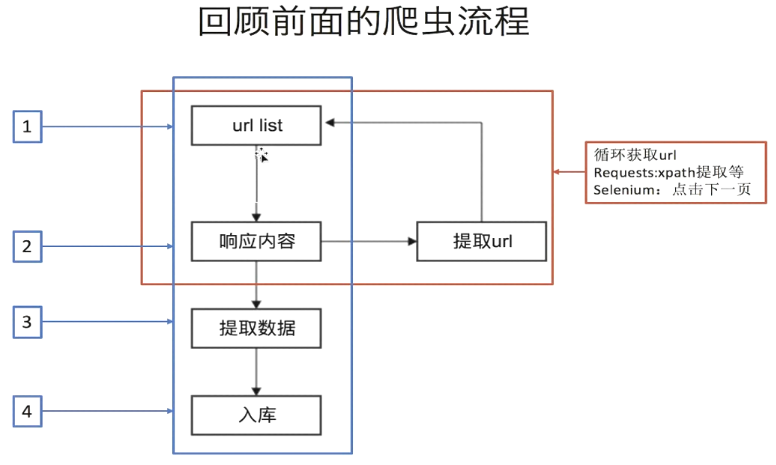

- 类似scrapy爬虫流程
- 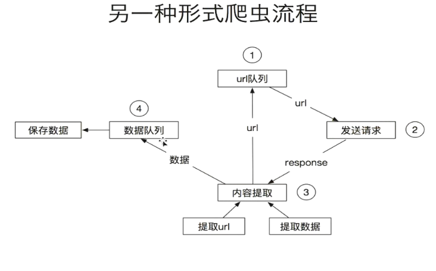

- scrapy爬虫流程
- 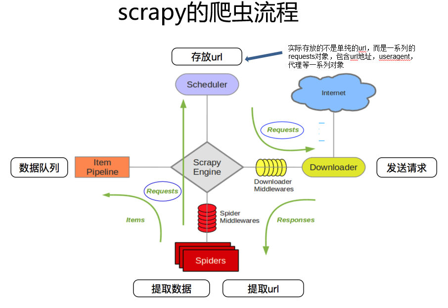
- 以上两图，整个流程是相同的，只不过名称有所不同，但是功能都是相似的

## 1.1 scrapy各组件的作用
- 
- Scrapy主要有5大部件和2个中间件
- 爬虫流程图说明：
    - Scrapy Engine引擎分别连接四个部件：Spider、ItemPipeline、Downloader、Scheduler
    - 四个部件都要通过Scrapy Engine引擎进行工作，数据都需要和引擎进行交换
    - 图中的橙色箭头线只是表示流向，比如request、response，但是调度器Scheduler和下载器Downloader并没有实际联系
    - 它们之间的联系都需要通过Scrapy Engine引擎

- 一个核心：    
    - **Scrapy Engine(引擎，相当于大脑)**:
        - 负责Spider、ItemPipeline、Downloader、Scheduler中间的通讯，信号、数据传递等。

- 四大部件：   
    - **Scheduler(调度器)**:
        - 它负责接受引擎发送过来的Request请求对象(请求对象里面不仅是url地址，还有UA，代理等其它对象)
        - 并按照一定的方式进行整理排列，入队，当引擎需要时，交还给引擎。
    - **Downloader（下载器）**：
        - 负责下载Scrapy Engine(引擎)发送过来的所有Requests请求对象，
        - 并将其获取到的Responses对象交还给Scrapy Engine(引擎)，由引擎交给Spider爬虫来处理，
    - **Spider（爬虫）**：
        - 它负责处理所有Responses对象,从中分析提取数据，获取Item字段需要的数据，
        - 并将需要继续爬取的URL提交给引擎，引擎再次交给Scheduler(调度器)
        - 将items数据提交给引擎，引擎再提交给Item Pipeline进行处理(存储到数据库，下载等等)
    - **Item Pipeline(管道)**：
        - 它负责处理Spider中获取到的Item，并进行进行后期处理（详细分析、过滤、存储等）的地方.

- 两个中间件：   
    - **Downloader Middlewares（下载器中间件）**：
        - 下载器中间件位于引擎和下载器之间，它们传输的数据就是requests和responses
        - 主要是对requests和responses进行设置，主要是自定义扩展下载功能的组件。
        - Scrapy的官方文档中的解释：下载器中间件是介于Scrapy的request/response处理的钩子框架，是用于全局修改Scrapy request和response的一个轻量、底层的系统。
        - 容易理解的话表述就是：更换代理IP，更换Cookies，更换User-Agent，自动重试等
        - 上述具体的手写设置在项目文件的settings.py里面，具体设置参考Spider_devlopment_study_note中的ch17
    - **Spider Middlewares（爬虫中间件）**：
        - 爬虫中间件位于引擎和爬虫之间，它们传输的数据就是responses、requests、items
        - 主要自定扩展和操作引擎和Spider中间通信的功能组件（比如进入Spider的Responses;和从Spider出去的Requests）
        - items虽然也经过爬虫中间件，但是有专门的Item Pipeline(管道)对齐进行处理

- 需要手写的两个部件说明：
- Item Pipeline 管件
    - 爬虫提取出数据存入item后，item中保存的数据需要进一步的处理，比如清洗，去重，存储等
    - pipeline需要处理process_item函数，必须实现的函数
        - process_item:
            - spider提取出的item作为参数传入，同时传入的还有spider
            - 此方法必须实现
            - 必须返回一个item对象，被丢弃之后的item不会被之后的pipeline处理
    - __init__: 构造函数
        - 进行一些必要的参数初始化
    - open_spider(spider):
        - spider对象被开启时调用
    - close_spider(spider):
        - spider对象被关闭时调用  
        
- Spider 爬虫
    - 对应的是文件夹spiders下的py文件
    - __init__: 初始化爬虫名称，可传入start_urls列表，该方法一般不写，爬虫名称、初始URL、允许域名直接放在类下面当做全局变量
    - start_requests: 生成Requests对象交给Scrapy下载并返回response，该方法启动爬虫自动实现
    - parse：根据返回的response解析出相应的item，item自动进入pipeline：如果需要，
    - 解析出url,url自动交给requests模块，一直循环下去
    - parse_body：进入第二层解析网页详细信息

    - Item Pipeline spider详细具体参考Spider_devlopment_study_note项目中的ch12中的cnblog和sht爬虫

- 注意：
    - start_request: 此方法仅能被调用一次，读取start_urls内容并启动循环过程
        - start_request是用来处理start_urls的方法，可以scrapy.Spider的源码查看
        - 返回最初始的response交给parse函数处理
    - name；设置爬虫名称，爬虫名称不能和爬虫项目文件夹名称重复
    - start_urls: 设置开始第一批爬取的url,
        - 该url默认会调用start_request方法，返回response交给parse方法
        - 我们可以在parse之前重写该方法，会覆盖默认的方法
    - allow_domains: spider允许爬取的域名列表
        - 特别注意，allow_domains只会对start_urls以后的域名进行过滤
        - start_urls不会受allow_domains的影响
        - 此处的allow_domains一定不要写错了，如果写错了，爬虫只会爬取start_urls，然后下一页由于被错误的域名过滤掉了，就爬虫直接结束了
            - 入坑记录：
            - 运行爬虫的时候，就会出现第一次请求和解析都正常，后面的请求都被过滤掉了。
            - 原来scrapy框架下的allowed_domains默认只会对第二次以后的请求域名是否符合进行校验，
            - 而对于start_requests的url是不会做限制的，因此第一次的请求是可以正常请求和解析的
            - tieba爬虫项目：allowed_domains = ['tieba.baidu.com']写错成'tieba.com'
            - 导致只爬取了第一页，下一页不爬取，检查了多遍终于才发现问题，有些常用的思维非常容易入坑，teiba.com多好的域名啊！！！
            - 注意：在爬取搜狗的网站的时候，搜狗的主域名是sogou.com，别写成了错误的“sougou.com”
    - log: 日志记录
     
        
## 1.2 scrapy爬取一个网站的流程
- Scrapy爬取一个网站的工作流程如下，结合上面的图片理解：  
    - 1.首先Spiders（爬虫里面写有start_url）将需要发送请求的url(requests)经ScrapyEngine（引擎）交给Scheduler（调度器）。
    - 2.Scheduler（排序，入队）处理后，经ScrapyEngine，DownloaderMiddlewares(可选，主要有User_Agent, Proxy代理)交给Downloader。
    - 3.Downloader向互联网发送请求，并接收下载响应（response）。将响应（response）经ScrapyEngine，SpiderMiddlewares(可选)交给Spiders。　　　　　
    - 4.Spiders处理response，提取数据并将数据经ScrapyEngine交给ItemPipeline保存（可以是本地，可以是数据库）。
    - 5.response中提取的url即新的Request经ScrapyEngine交给Scheduler进行下一个循环。直到无Url请求程序停止结束。
    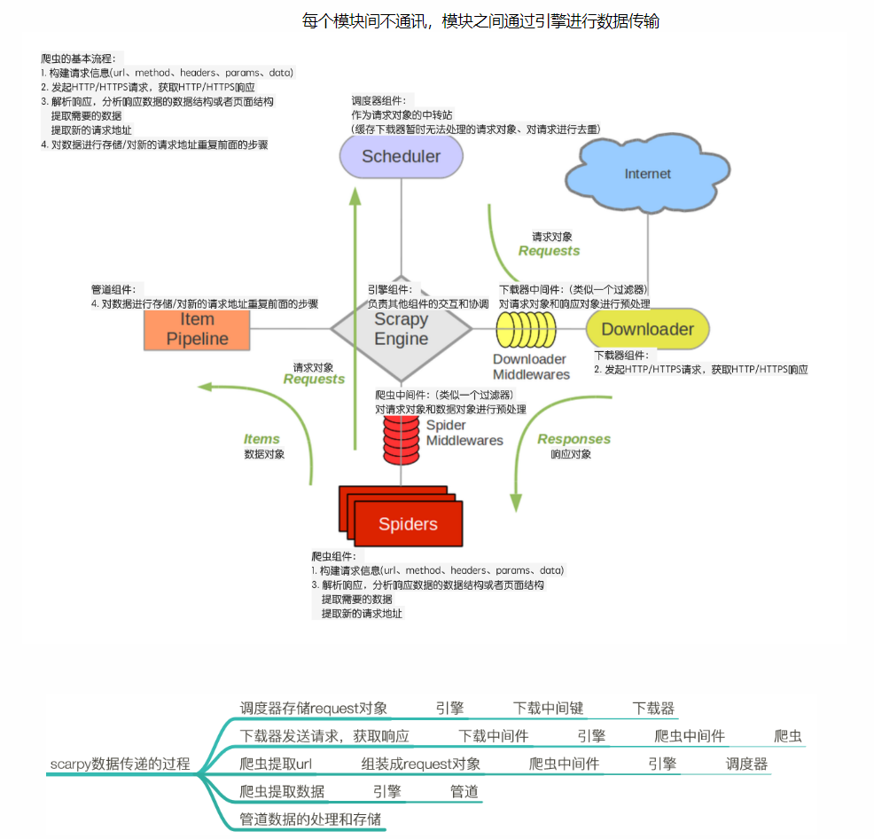

## 1.3 scrapy项目流程
- 创建项目
    - scrapy startproject xxx
- 创建爬虫
    - cd 项目目录下
    - scrapy genspider xxx allowed_domains（该步命令也可以直接进入spider的py文件直接自定义）
    - scrapy genspider –t crawl xxx allowed_domains  
        - 上面默认继承的是scrapy.Spider类，此处生成scrapy.spiders.CrawlSpider规则爬虫
        - 例如：
        - scrapy genspider first_spider jpdd.com
            - first_spider   爬虫名字
            - jpdd.com       限制爬取数据的范围
        - 爬虫py文件都是在spiders文件夹下面，上面命令可以创建多个爬虫
        - 爬虫都是位于spiders文件夹下面
        
- 完善：spider
    - 提取item所需的数据，提取url地址构成request对象      
- 完善管道：items pipelines
- 完善设置：settings 
- 运行爬虫
    - cd项目目录   
    - scrapy crawl first_spider

- 爬虫的项目结构

- 完善爬虫
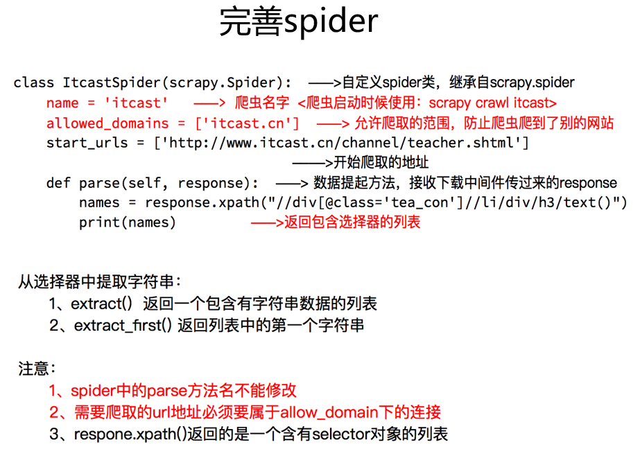
 
- 注意：避免爬虫名和项目名重复 ；
    - 不管在终端还是pycharm 都要切换到当前目录下 cd myspider
    - allowed_domains : 限定爬取的范围
- 常用的命令：
    - scrapy startproject xxx（创建项目）
    - scrapy crawl XX（运行XXX爬虫）
    - scrapy shell http://www.scrapyd.cn（调试网址为http://www.scrapyd.cn的网站）
    - scrapy version 查看版本信息
    - scrapy list  查看爬虫信息，显示目录所有的爬虫
    
    
## 1.4 Scrapy中数据提取的机制？
- Scrapy提供了自己提取数据的机制，它们被称作选择器（Selector，下面用英文表示），它支持xpath，css和正则表达式三种规则
- Scrapy的Selector建立在lxml库上，这意味它们在解析速度和精度上都非常相似
- Selector机制下有两个重要的数据类型：SelectorList和Selector，其中前者是后者的集合，前者也是一个列表对象。
- scrapy提供了extract和extract_first这两种方法提取SelectorList和Selector的字符串内容。
- 在提取列表中的首个元素内容时，建议使用extract_first方法而非采用列表索引方式extract()[0] 
- extract()没有值的时候返回是一个空列表，extract_first没有值返回是none，推荐使用extract_first，已经帮我判断了是否为none
    - response.xpath()返回的结果就是SelectorList，里面每一个元素就是一个Selector：
    [<Selector xpath='descendant-or-self::a' data='<a href="image1.html">Name: My image 1 <'>, 
    <Selector xpath='descendant-or-self::a' data='<a href="image2.html">Name: My image 2 <'>, 
    <Selector xpath='descendant-or-self::a' data='<a href="image3.html">Name: My image 3 <'>, 
    <Selector xpath='descendant-or-self::a' data='<a href="image4.html">Name: My image 4 <'>, 
    <Selector xpath='descendant-or-self::a' data='<a href="image5.html">Name: My image 5 <'>]
    - 实际上我们需要的内容是data里面的数据，extract提取所有的data和extract_first提取第一个data

- scrapy中选择器返回结果是Selector对象(特殊的列表)，返回的对象实际是一个列表对象：SelectorList(里面有一个或多个Selector)和Selector。
    - 官方推荐 ：
    - .extract_first()：提取SelectorList对象中第一个元素的内容。即返回列表中的第一个元素的字符串内容。
    - .extract()：如果是SelectorList对象使用，则返回包含所有Selector中字符串内容的列表；如果是Selector使用，则返回该Selector的所有内容。
    - extract()没有值的时候返回是一个空列表，extract_first没有值返回是none，推荐使用extract_first，已经帮我判断了是否为none
    - 参考Python_advanced_learning中的04文件夹中的XPATH部分有详细总结
    - SelectorList对象虽然是个列表，但是是一个特殊的列表，不能直接使用列表切片取出内容
    - requests中可以返回解析的对象，可以直接切片取出，参考TZKT项目中的P02和P03中数据提取区别
    - 取出title具体的文字内容，可以使用下面两种方式：
        - title = paper.xpath(".//*[@class='postTitle']/a/text()").extract()[0]     内容列表的第一个元素
        - title = paper.xpath(".//*[@class='postTitle']/a/text()").extract_first().strip()  SelectorList列表中的第一个Selector对象的内容元素
        
- 特别注意：是extract_first不是extrast_first()
- Python strip() 方法用于移除字符串头尾指定的字符（默认参数为空格和换行符）或字符序列(传入的参数)。
- 该方法只能删除开头或是结尾的字符，不能删除中间部分的字符。
    
## 1.5 scrapy中url地址拼接的多种方式
- Response返回的url地址，对next_url的url地址进行拼接，构造请求,有5种方式
    - 方法1(常用)：手动字符串相加
    - 方法2(推荐)：urllib.parse.urljoin(baseurl,url)  
        - 后面的url会根据baseurl就是爬虫响应的url，可以直接填写response.url或者主域名
        - 进行url地址的拼接，sht项目就是用的方法1或者方法2
        - 使用前先导入：from urllib.parse import urljoin
        - 直接import urllib  然后使用：urllib.parse.urljoin() 识别不了parse，原因未知
    - 方法3：response.follow(url ,callback)  能够根据response的地址把url拼接完整，构造成Request对象，
    - 方法4(推荐)：response.urljoin(url)    更简洁、好用
        - scrapy里面自带的url拼接，只需要传入url即可，默认已经有一个response.url参数了
        - 参考tieba爬虫项目
    - 方法5：scrapy.Request(url,callback,meta,dont_filter)

## 1.6 scrapy.Request()方法中的参数说明？
- scrapy.Request() ===>相当于构造了一个requests对象
- scrapy.Request(url[,callback,method="GET",headers,body,cookies,meta,dont_filter=False])
    - 参数说明：
    - request = scrapy.Request(url=url, meta={'item': item}, callback=self.parse_body)
    - 括号中的参数为可选参数
    - url：接下来要请求处理的url地址
    - callback：回调函数，表示当前的url的响应交给哪个函数去处理
    - meta：实现数据在不同的解析函数(parse parse_body等函数)中传递，meta默认带有部分数据，比如下载延迟，请求深度等
    - dont_filter:默认是False，默认会过滤请求的url地址，即请求过的url地址不会继续被请求，
        - 对需要重复请求的url地址可以把它设置为True，强制重复请求
        - 比如贴吧的翻页请求，页面的数据随着吧友随时发帖会产生变化，需要重复请求，也可以不重复请求，就会漏掉一些内容;
    - 重点注意：cookies参数，必须单独作为一个参数，不能像之前requests库一样，将cookies放在headers内部
        - 并且传入的cookies是一个字典，键值的形式，参考## 2.6 scrapy携带cookies登录

## 1.7 为什么要单独定义item？
- 定义item即提前规划好哪些字段需要抓取，scrapy.Field()仅仅是提前占坑，
    - 通过item.py能够让别人清楚自己的爬虫是在抓取什么数据；
    - 同时来提示哪些字段是需要抓取的，没有定义的字段不能使用，防止手误；
    - item不能直接存入mongodb中，需要转化为字典后再存储。
    - Item使用之前需要先导入并且实例化，之后的使用方法和使用字典相同
        - from yanguan.items import YanguanItem
        - item = YanguanItem() #实例化

## 1.8 pipeline的使用
- pipeline里面可以写多个管道分别用于处理不同爬虫的item，
    - 也可以在一个管道中使用if else进行判断，然后分别处理来自不同爬虫的item
        - 方法1：item里面只需要加一个键come_from来自哪个网站，然后进行判断即可
        - 方法2：传递item到pipeline时候，同时也传递了spider爬虫，spider.name可以判断是哪个爬虫传过来的item
    - pipeline里面默认的process_item(self, item, spider)方法尽量不要重新命名
        - item就是spider中yield item 传来的参数
        - spider就是爬虫，spider.name属性就是定义的爬虫名称
        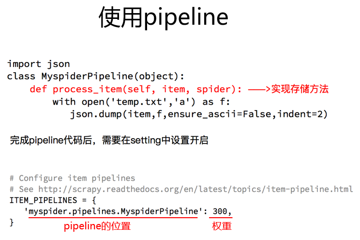
        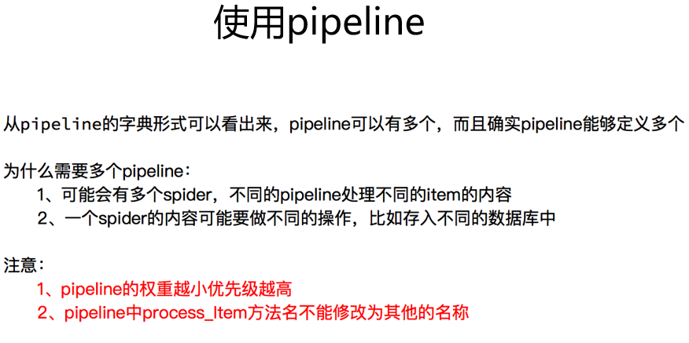
        
- pipeline的管道下面有两个特殊方法：
    - open_spider：爬虫开启时候执行该函数，仅执行一次，一般用于连接数据库
    - close_spider：爬虫关闭时候执行该函数，仅执行一次，一般用于关闭数据库连接
    
```python 
# 爬虫开启时候执行该函数，仅执行一次，连接数据库
def open_spider(self, spider):
    self.client = pymongo.MongoClient(self.mongo_uri, replicaset=self.replicaset)
    self.db = self.client[self.mongo_db]

# 爬虫关闭时候执行该函数，仅执行一次，关闭数据库连接
def close_spider(self, spider):
    self.client.close()

def process_item(self, item, spider):
    # 判断item是否属于YunqiBookListItem，属于它，就将item数据存入数据库
    if isinstance(item, YunqiBookListItem):
        self._process_booklist_item(item)
    else:
        self._process_bookeDetail_item(item)
    return item
```
        
## 1.9 scrapy中logging模块的使用
- 第一步：settings中设置LOG_LEVEL="WARNING" 级别可以自定义
- 第二步：settings中设置LOG_FILE=""./xxx.log" 设置log文件的保存位置，
        设置后终端不会输出显示日志内容，不设置，日志内容会终端直接输入
- 第三步：在需要输出日志的py文件里面，scrapy中日志有固定的格式，也可以自定义格式
        import logging 然后实例化logger，然后设置logger输出
        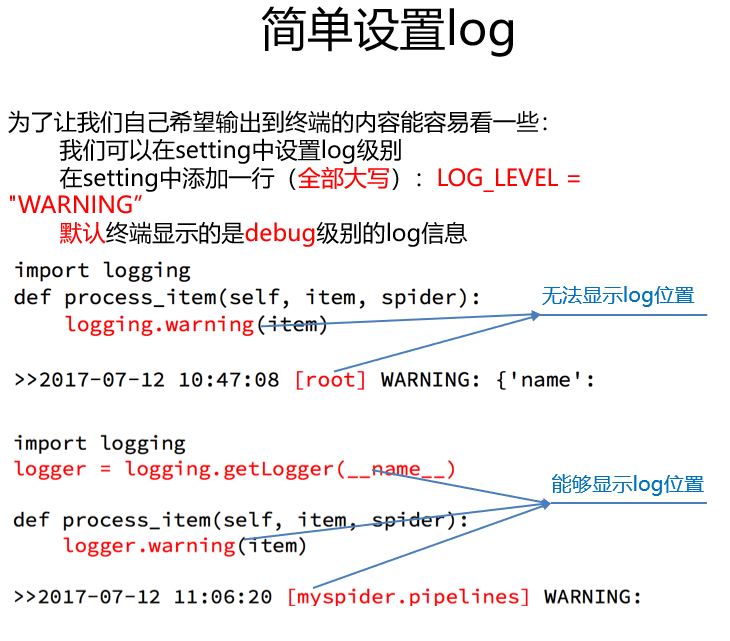
        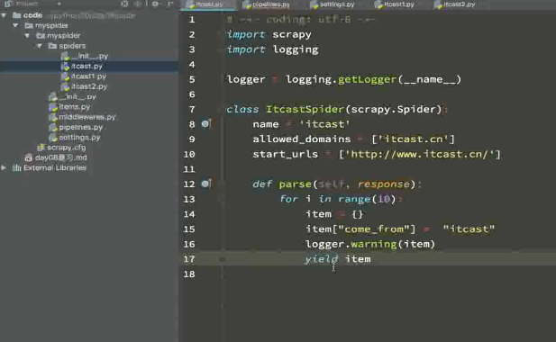
        
## 1.10 scrapy爬虫启动后的debug信息
- 爬虫启动运行后，CMD窗口会显示一系列信息，常见信息具体含义参考下图
- 主要展示启动爬虫，爬取过程的一系列信息，日志信息，爬取的页面，爬取结果等等
- 我们一般只关注里面出现的警告错误信息
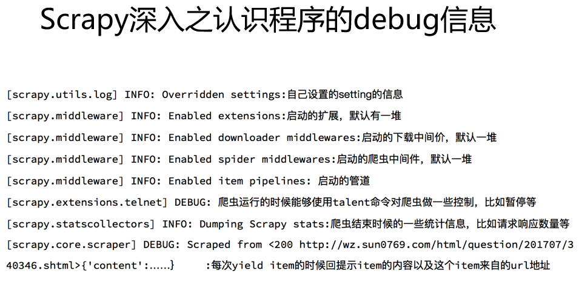
 
## 1.11 scrapy shell终端调试窗口
- scrapy调试工具
- CMD窗口切换到项目文件下执行命令：scrapy shell 网址
    - scrapy shell http://lab.scrapyd.cn
    - scrapy shell http://www.baidu.com
    - 窗口里面会弹出一些信息，根据窗口提示我们可以查看一些具体信息，比如使用response查看响应的一些信息
    - 使用response.xpath(),查看是否可以返回我们需要的结果
    
- 退出调试执行命令：exit

## 1.12 下一页网址寻找，url地址JS动态生成的如何解决？
- 情况1：下一页的URL地址直接在响应中，直接正则查找即可
- 情况2：下一页的URL地址在响应中没有，是JS动态生成的，去寻找网页生成的规律
    - 响应中一般都会有 var pagecount=()  var currentPage=() 两个字段
    - 一个代表总页数，一个代表当前页
    - 下一页的网址就是使用当前页面加1后进行构造
- 情况3：第一层的清单页都具有相同的规律，可以直接使用CrawlSpider,传入规则，这样爬虫会自动爬取所有符合规则的页面
    - CrawlSpider可以接收多个规则，符合规则的网页都会去请求。规则爬虫就免去的每次都去查找下一页网址。
    - 参考Spider_devlopment_study_note项目中ch17中的云起书院爬虫

# 2 CrawlSpider规则爬虫   
## 2.1 Spider、CrawlSpider、XMLFeedSpider和RedisSpider有什么区别？
- Spider: scrapy.Spider,是所有Spider的基类，它是最基础的爬虫，所有的spider都会继承scrapy.Spider。
    - 它提供了start\_requests()的默认实现，
    - 读取并请求spider属性中的start\_urls，
    - 并根据返回的response调用spider中的parse方法
- CrawlSpider: scrapy.spiders.CrawlSpider,规则爬虫，
    - 提供了一个新的属性rules,该属性是一个包含一个或多个Rule对象的集合，
    - 每个Rule对爬取网站的动作定义了特定的规则，传入要爬取网站的规则，
    - 相当于本来要寻找下一页的地址，但是传入规律，会自动爬取符合该规律的所有网址。
- XMLFeedSpider: scrapy.spiders.XMLFeedSpider设计用于通过迭代各个节点来分析XML源。
- RedisSpider：scrapy_redis.spiders.RedisSpider,
    - scrapy-redis是scrapy框架基于redis数据库的组件，
    - 用于scrapy项目的分布式开发和部署，可以方便的进行分布式爬取和数据处理。
    
## 2.2 CrawlSpider使用详解
- 规则爬虫，传入一个规则或者多个规则
    - 规则爬虫默认创建的parse_item方法，没有parse方法，也不能自己定义，会覆盖掉默认的parse方法
    - （parse方法有特殊用途，用于底部提取基础URL，即规则中允许的URL地址是由parse函数去发动请求）
    - 规则网址的response可以使用一个parse_xxx方法进行解析，每个规则都写上方法
    - 也可以不同的规则网址的response分别定义不同的解析方法
    - 参考下图：
    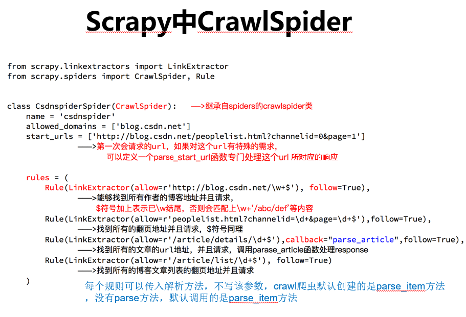
    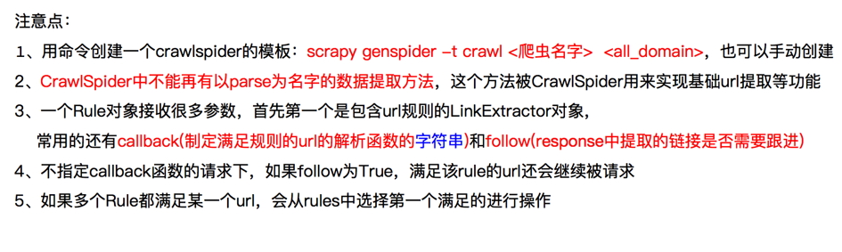
- Rule和LinkExtractor参数说明：
    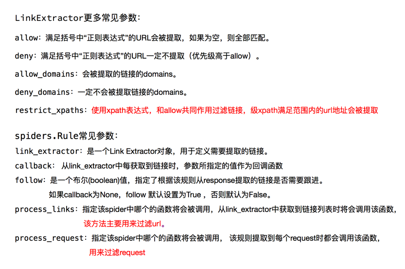

- CrawlSpider爬虫注意点：
    - Rule里面的定义规则的网址，url地址不完整，规则爬虫会自动进行补充完整然后请求
    - parse函数用于基础请求，不能自己定义该函数
    - callback:LinkExtractor根据规则提取的url对应的响应交给callback指定的方法处理
    - follow：LinkExtractor根据规则提取的url对应的响应是否继续使用rules里面的规则来继续过滤提取

- LinkExtractor地址提取
    - 三种常用方式：正则、css、xpath
    - allow=()              里面写正则表达式
    - restrict_xpaths=()    里面写xpath表达式
    - restrict_css=()       里面写css选择器表达式

```python
# 使用正则表达式
# 定义提取url地址规则，Rule一个规则集合
    rules = (
        # LinkExtractor 连接提取器，提取url地址，提取方法是正则
        # callback 提取出来url地址的response会交给callback的方法处理
        # follow 当前的url地址的response继续进rules里面的规则继续提取url地址
        # 每个详情页的网址就是info后面的数字不同，直接传入\d+，匹配多个数字，\.就代表.,详情页不需要向下继续提取url，follow不需要
        Rule(LinkExtractor(allow=r'/web/site0/tab5240/info\d+\.htm'), callback='parse_item'),
        # 寻找下一页的规则，请求start_urls后，自动根据规则寻找下一页的地址并去请求,不断从新的一页继续寻找下一页，但是不需要callback
        # 每一页里面的response里面的内容列表满足上面rule规则，就会自动请求进去提取内容
        Rule(LinkExtractor(allow=r'/web/site0/tab5240/module14430/page\d+\.htm'), follow=True),
    )
    
# css表达式
rules = [
        Rule(LinkExtractor(
            # 使用css提取网址，只需要定位到网址所在标签的class属性即可
            restrict_css=('.top-cat', '.sub-cat', '.cat-item')
        ), callback='parse_directory', follow=True),
    ]
```   
    
    

### 2.2.1 中国保险监督管理委员会circ的CrawlSpider
- 1 激活虚拟环境，进入要创建爬虫项目的文件夹分别执行以下命令：
    - scrapy startproject cric 创建爬虫项目
    - cd cric 切换到爬虫项目文件夹
    - scrapy genspider -t crawl cf bxjg.circ.gov.cn 创建crawl爬虫，爬虫名cf（处罚），后面网址是允许的域名
    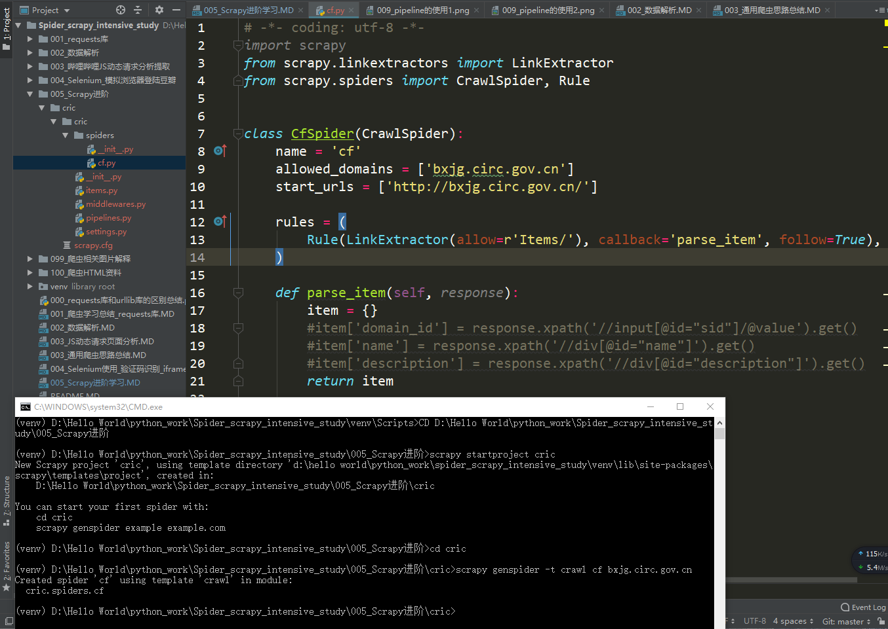
    - 该爬虫需要使用代理访问，会封IP一段时间
    
## 2.3 scrapy模拟登陆携带cookies
- start_urls默认是调用的库里面的start_requests方法解析
- 对于需要携带cookies登陆的网页，直接start_requests方法请求是请求不到的
- 此时就需要重写start_requests方法，请求的时候传入已有的cookies值
- 参考下面的图片：
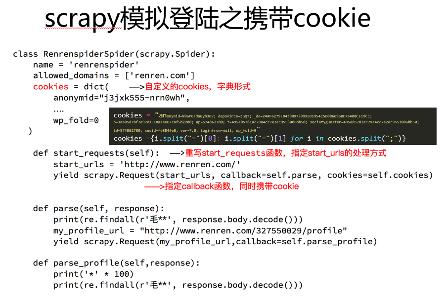
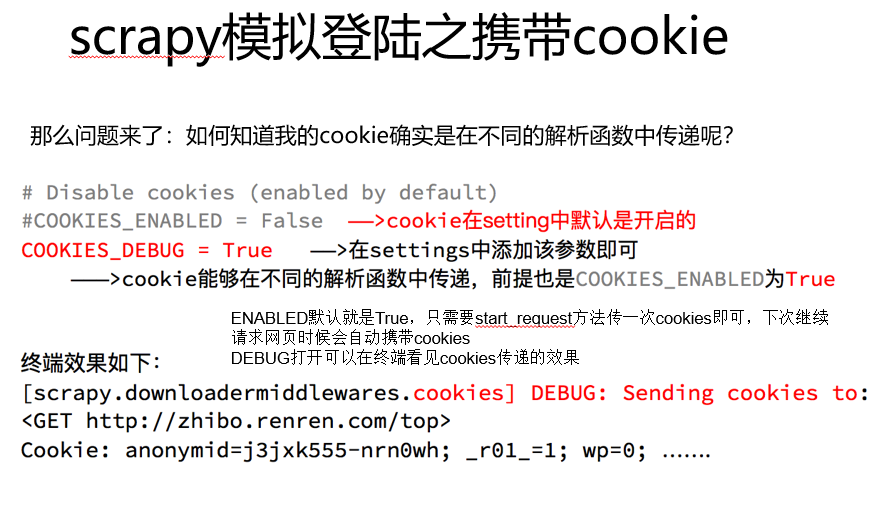

## 2.4 自定义中间件middlewares
- 中间件自定义和管道一样，先去自定义，然后settings里面启用，
- 设置中间件级别，默认中间件是543，数字越小离引擎越近，越先调用
    - scrapy中传输的spider参数，就是传的当前的爬虫
    - 可以使用句点法取出一些属性直接使用，比如
    - 从settings中取出USER_AGENTS_LIST，下面结果就是代理列表
    - spider.settings.get("USER_AGENTS_LIST")
- middlewares.py自定义中间件后，settings中对应要设置启动
- 最常用的是下载器中间件：
    - 自定义的下载器中间件里面至少要定义一个process_request方法或者process_response方法
    - 不同的方法的返回值不同，参考下面代码
    - process_request(self, request, spider)是一个默认方法，当每一个request通过该中间件时候都会启动该方法，不需要return
        - 用于添加IP代理和添加User-Agent
    - process_response(self, request, response, spider)是一个默认方法，当每一个response通过该中间件时候都会启动该方法，需要return response或者request
    - 第一种不一定有返回值，第二种方法必须有返回值：
```python 
    def process_request(self, request, spider):  # 不第一定需要return
        # Called for each request that goes through the downloader
        # middleware.

        # Must either:
        # - return None: continue processing this request  如果返回None值，就是没有return值，该request还未继续被其它的中间件去处理
        # - or return a Response object              下载中间件的response对象交给引擎去处理
        # - or return a Request object                下载中间件的request对象交给下载器去处理
        # - or raise IgnoreRequest: process_exception() methods of
        #   installed downloader middleware will be called
        return None

    def process_response(self, request, response, spider):  # 一定有return值
        # Called with the response returned from the downloader.

        # Must either;
        # - return a Response object
        # - return a Request object
        # - or raise IgnoreRequest
        return response

```

- 注意：
    - 中间件是在爬虫或者下载器和引擎之间的联系，
    - 自定义中间件要不是处理request要不就是处理response，即上面的两个默认方法至少要实现一个
- 具体参考下图及circ爬虫中的middlewares和settings中的代码
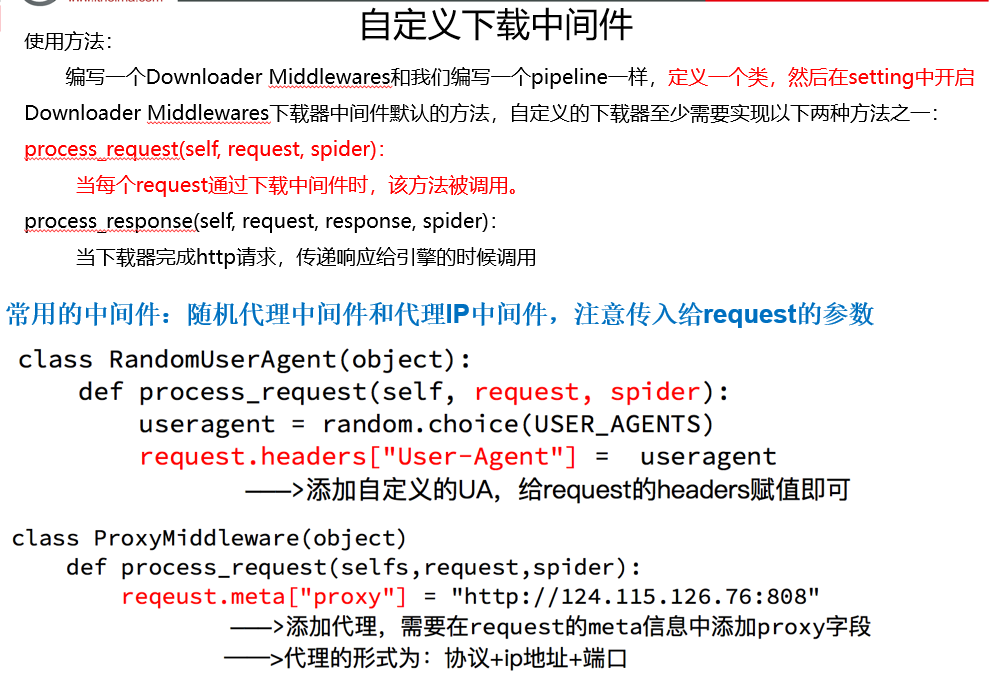

## 2.5 scrapy发送post登录请求
- scrapy中的Request默认就是使用的get方法
- 登录需要传递FormData数据，使用的是post请求
- 此时就需要使用scrapy.FormRequest()进行请求，并且需要传入formdata参数
- 具体参考以下GitHub登录案例
    - formdata中的数据需要先登陆后，然后查看请求里面的FormData数据
    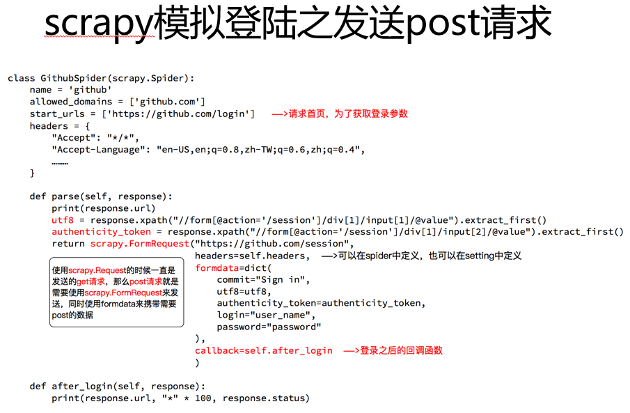
    - 上面的登录请求需要先手动去寻找登陆地址，填写一些formdata信息
    - scrapy可以自动从初始url寻找登陆的action网址和formdata信息，只需要传入用户名和密码，form其它信息会自动帮我填写
    - 参考下面自动登录案例
    
- scrapy模拟登陆之自动登录案例
    - 模拟自动登录人人网，只需要传入用户名和密码
    - 创建login爬虫项目，创建renren爬虫
        - scrapy startproject login
        - cd login
        - scrapy genspider renren renren.com
    -  scrapy.FormRequest.from_response方法会自动从初始url中寻找登陆地址，登陆表单，只需要传入用户名和密码就可以自动登录
    - 具体参考login爬虫项目中的renren.py爬虫文件及下面图片
    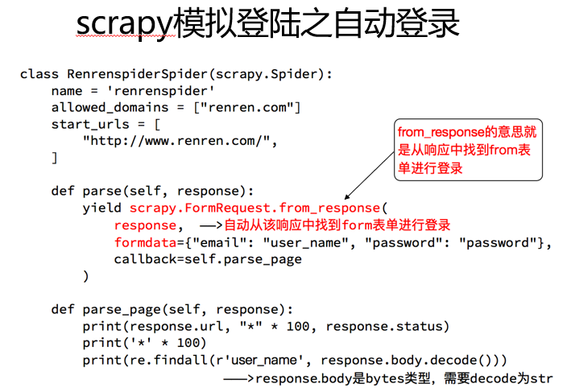
    
## 2.6 scrapy携带cookies登录
- cookies参数，必须单独作为一个参数，不能像之前requests库一样，将cookies放在headers内部
- 并且传入的cookies是一个字典，使用分割加字典推导式生成所需的字典形式的cookies
- 查看下图，scrapy会去cookies参数里面找，不会去headers里面找cookies
- 下图中注释掉的部分，就是错误的写法
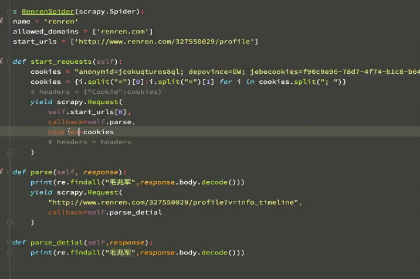

## 2.7 爬虫实例
- tieba爬虫是scrapy.Spider爬虫   该爬虫注意allowed_domains = ['tieba.baidu.com']当时写错了，参考代码
- tencent爬虫是CrawlSpider 网址是动态生成的爬取失败，待研究


# 3 Scrapy-redis爬虫
- scrapy-redis项目官网：https://github.com/rolando/scrapy-redis.git
- 下载项目到本地，进入虚拟环境，切换到到放置项目的文件夹
- 执行以下命令，自动下载项目文件到本地：
    - git clone https://github.com/rolando/scrapy-redis.git
    - 自带三个爬虫项目示例，位于example-project里面
- 参考官方案例
- Spider_development项目中的ch12 sht爬虫(redis爬虫，redis过滤)  
- TZKT_Study_Note项目中P03_51job爬虫，scrapy-redis-MongoDB综合爬虫
- 里面都有每步设置详细说明解释，settings里面重点设置scrapy-redis

## 3.1 scrapy-redis爬虫流程
- 相对于scrapy爬虫，数据都是存储在项目本地
- scrapy-redis中scheduler调度器中的requests和ItemPipeline管道中的items都是存储在redis数据库中
- redis数据库可以本地持久化，里面可以存储数据(但是实际应用中数据持久化一般存储在MongoDB或者MySQL中，redis只是用来分布式爬取和去重)
- 本来是一台电脑一个爬虫，现在通过将requests和items存储在redis数据库，多台电脑通过从redis数据库
- 中取出requests然后去爬取，爬取结果又存储到redis数据库中，可以轻松实现分布式爬虫
- 同时，redis中的set无序集合和zset有序集合类型数据，具有自动去掉重复元素的功能
- 可以实现增量式爬虫，爬取过的requests就不在爬取，只会不但爬取新的requests
- 爬虫流程参考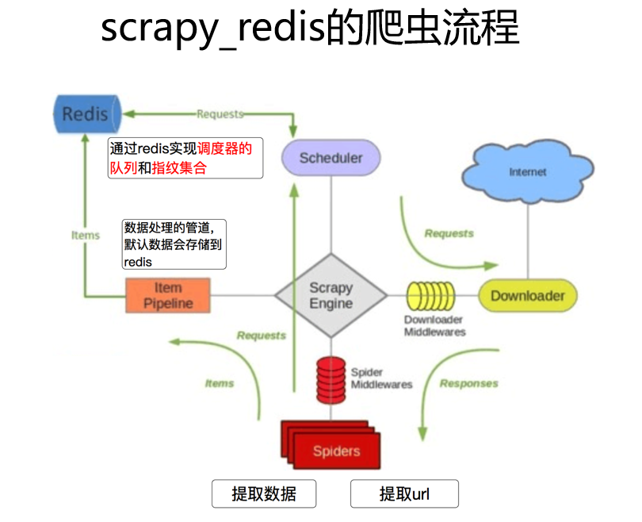

## 3.2 scrapy-redis爬虫实例各功能介绍
- 参考以下官方项目下的爬虫实例，以dmoz.py爬虫为例
- 006_scrapy_redis爬虫/scrapy-redis/example-project/example/spiders/dmoz.py
- dmoz.py爬虫主程序可以继承Spider\CrawlSpider\RedisSpider都可以
- 重点是要settings里面加入scrapy-redis的相关设置
- 启动爬虫前先启动redis服务器和客户端
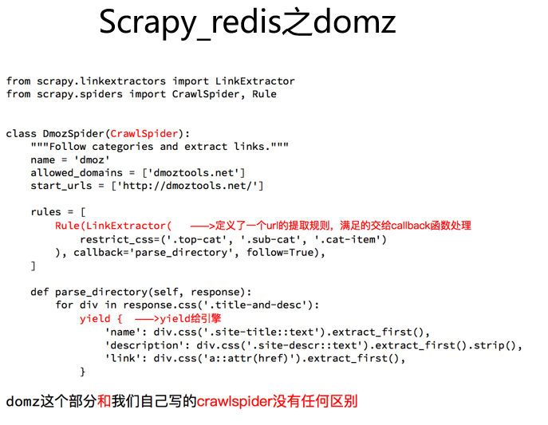
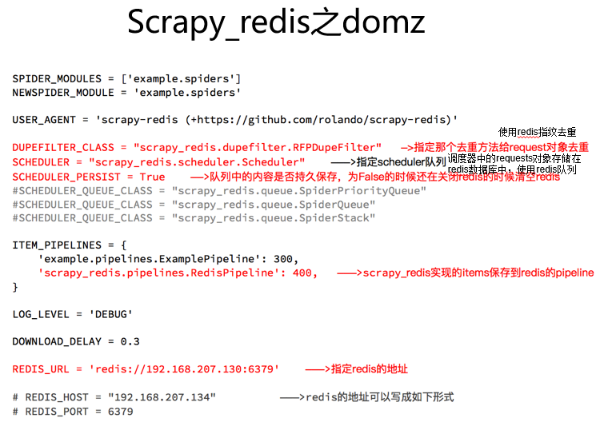

- 从上图可以看出，只需要在settings中增加5行代码，就可以将普通爬虫变成redis增量式爬虫

- scrapy-redis中的管道：
    - redispipeline中仅仅实现了item数据存储到redis的过程，
    - 我们可以新建一个pipeline（或者修改默认的ExamplePipeline），让数据存储到任意地方

- 爬虫执行后，redis里面会增加三个key，可以使用keys * 查看
- 分别是：待爬取的request对象、已爬取过的request对象的指纹信息、爬取的item信息
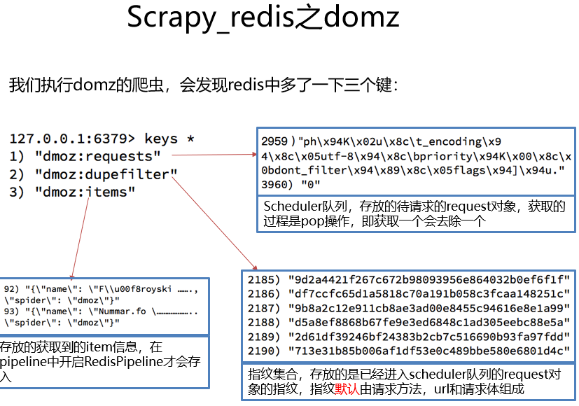

- scrapy-redis如何生成指纹：
    - 使用的是以下方法：
    - fp = hashlib.sha1() # sha1生成一个160bit的结果，通常用40位的16进制字符串表示
    - fp.update(to_bytes(request.method))
    - fp.update(to_bytes(canonicalize_url(request.url)))
    - fp.hexdigest() 取出加密后的指纹信息
    
## 3.3 scrapy-redis重点
### 3.3.1 request对象什么时候入队
- dont_filter = True ,构造请求的时候，把dont_filter置为True，该url会被反复抓取（url地址对应的内容会更新的情况）
- 一个全新的url地址被抓到的时候，构造request请求
- url地址在start_urls中的时候，会入队，不管之前是否请求过
    - 构造start_url地址的请求时候，dont_filter = True

```python
def enqueue_request(self, request):
    if not request.dont_filter and self.df.request_seen(request):
        # dont_filter=False True  True request指纹已经存在  #不会入队
        # dont_filter=False True  False  request指纹已经存在 全新的url  #会入队
        # dont_filter=True False  #会入队
        self.df.log(request, self.spider)
        return False
    self.queue.push(request) #入队
    return True
```

### 3.3.2 scrapy_redis去重方法
- 使用sha1加密request得到指纹
- 把指纹存在redis的集合中
- 下一次新来一个request，同样的方式生成指纹，判断指纹是否存在reids的集合中

- 生成指纹具体源码方法
```python
fp = hashlib.sha1()
fp.update(to_bytes(request.method))  #请求方法
fp.update(to_bytes(canonicalize_url(request.url))) #url
fp.update(request.body or b'')  #请求体
return fp.hexdigest()
```
- 然后根据指纹判断数据是否存在redis的集合中，不存在插入
```python
added = self.server.sadd(self.key, fp)
return added != 0
```

## 3.4 scrapy-redis源码核心部分解读
- RedisPipeline处理Items
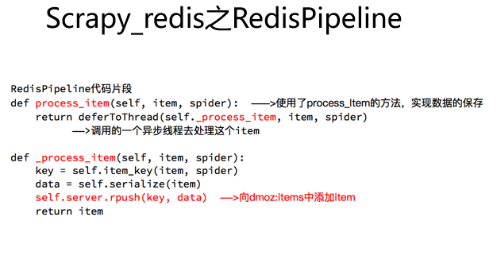
- RFPDupeFilter指纹加密request对象
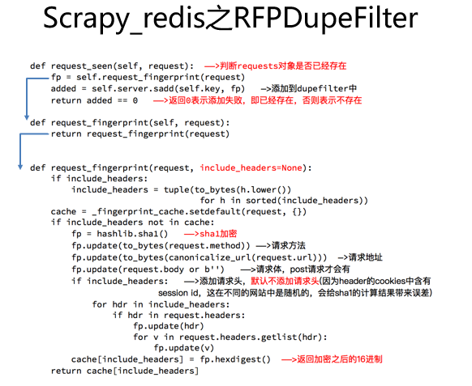
- Scheduler调度器处理request对象
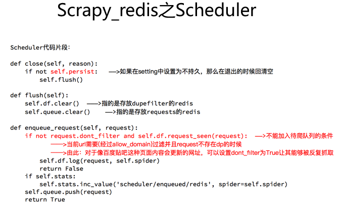

## 3.5 京东图书爬虫
- 京东图书scrapy-redis增量式爬虫
    - 需求：抓取京东图书的信息
    - 目标：抓取京东图书包含图书的名字、封面图片地址、图书url地址、作者、出版社、出版时间、价格、图书所属大分类、图书所属小的分类、分类的url地址
    - 京东图书主页：https://book.jd.com/                        主页左边分类 栏目底部就有 全部图书分类，进去就是下面网址
    - 京东图书全部分类url：https://book.jd.com/booksort.html     该网址作为起始网址，已经有了大类小类，清晰明了作为爬取起始地址
