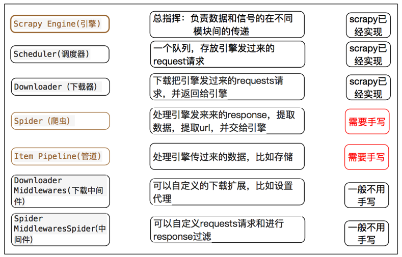

# Scrapy 入门基础参考 Spider_devlopment_study_note中的md笔记和相关项目

# 1. Scrapy介绍
- 通用爬虫流程
- 

- 类似scrapy爬虫流程
- 

- scrapy爬虫流程
- 
- 以上两图，整个流程是相同的，只不过名称有所不同，但是功能都是相似的

## 1.1 scrapy各组件的作用
- 
- Scrapy主要有5大部件和2个中间件
- 爬虫流程图说明：
    - Scrapy Engine引擎分别连接四个部件：Spider、ItemPipeline、Downloader、Scheduler
    - 四个部件都要通过Scrapy Engine引擎进行工作，数据都需要和引擎进行交换
    - 图中的橙色箭头线只是表示流向，比如request、response，但是调度器Scheduler和下载器Downloader并没有实际联系
    - 它们之间的联系都需要通过Scrapy Engine引擎

- 一个核心：    
    - **Scrapy Engine(引擎，相当于大脑)**:
        - 负责Spider、ItemPipeline、Downloader、Scheduler中间的通讯，信号、数据传递等。

- 四大部件：   
    - **Scheduler(调度器)**:
        - 它负责接受引擎发送过来的Request请求对象(请求对象里面不仅是url地址，还有UA，代理等其它对象)
        - 并按照一定的方式进行整理排列，入队，当引擎需要时，交还给引擎。
    - **Downloader（下载器）**：
        - 负责下载Scrapy Engine(引擎)发送过来的所有Requests请求对象，
        - 并将其获取到的Responses对象交还给Scrapy Engine(引擎)，由引擎交给Spider爬虫来处理，
    - **Spider（爬虫）**：
        - 它负责处理所有Responses对象,从中分析提取数据，获取Item字段需要的数据，
        - 并将需要继续爬取的URL提交给引擎，引擎再次交给Scheduler(调度器)
        - 将items数据提交给引擎，引擎再提交给Item Pipeline进行处理(存储到数据库，下载等等)
    - **Item Pipeline(管道)**：
        - 它负责处理Spider中获取到的Item，并进行进行后期处理（详细分析、过滤、存储等）的地方.

- 两个中间件：   
    - **Downloader Middlewares（下载器中间件）**：
        - 下载器中间件位于引擎和下载器之间，它们传输的数据就是requests和responses
        - 主要是对requests和responses进行设置，主要是自定义扩展下载功能的组件。
        - Scrapy的官方文档中的解释：下载器中间件是介于Scrapy的request/response处理的钩子框架，是用于全局修改Scrapy request和response的一个轻量、底层的系统。
        - 容易理解的话表述就是：更换代理IP，更换Cookies，更换User-Agent，自动重试等
        - 上述具体的手写设置在项目文件的settings.py里面，具体设置参考Spider_devlopment_study_note中的ch17
    - **Spider Middlewares（爬虫中间件）**：
        - 爬虫中间件位于引擎和爬虫之间，它们传输的数据就是responses、requests、items
        - 主要自定扩展和操作引擎和Spider中间通信的功能组件（比如进入Spider的Responses;和从Spider出去的Requests）
        - items虽然也经过爬虫中间件，但是有专门的Item Pipeline(管道)对齐进行处理

- 需要手写的两个部件说明：
- Item Pipeline 管件
    - 爬虫提取出数据存入item后，item中保存的数据需要进一步的处理，比如清洗，去重，存储等
    - pipeline需要处理process_item函数，必须实现的函数
        - process_item:
            - spider提取出的item作为参数传入，同时传入的还有spider
            - 此方法必须实现
            - 必须返回一个item对象，被丢弃之后的item不会被之后的pipeline处理
    - __init__: 构造函数
        - 进行一些必要的参数初始化
    - open_spider(spider):
        - spider对象被开启时调用
    - close_spider(spider):
        - spider对象被关闭时调用  
        
- Spider 爬虫
    - 对应的是文件夹spiders下的py文件
    - __init__: 初始化爬虫名称，可传入start_urls列表，该方法一般不写，爬虫名称、初始URL、允许域名直接放在类下面当做全局变量
    - start_requests: 生成Requests对象交给Scrapy下载并返回response，该方法启动爬虫自动实现
    - parse：根据返回的response解析出相应的item，item自动进入pipeline：如果需要，
    - 解析出url,url自动交给requests模块，一直循环下去
    - parse_body：进入第二层解析网页详细信息
        - start_request: 此方法仅能被调用一次，读取start_urls内容并启动循环过程
        - name；设置爬虫名称
        - start_urls: 设置开始第一批爬取的url
        - allow_domains: spider允许爬取的域名列表
        - log: 日志记录
    - Item Pipeline spider详细具体参考Spider_devlopment_study_note项目中的ch12中的cnblog和sht爬虫
     
        
## 1.2 scrapy爬取一个网站的流程
- Scrapy爬取一个网站的工作流程如下，结合上面的图片理解：  
    - 1.首先Spiders（爬虫里面写有start_url）将需要发送请求的url(requests)经ScrapyEngine（引擎）交给Scheduler（调度器）。
    - 2.Scheduler（排序，入队）处理后，经ScrapyEngine，DownloaderMiddlewares(可选，主要有User_Agent, Proxy代理)交给Downloader。
    - 3.Downloader向互联网发送请求，并接收下载响应（response）。将响应（response）经ScrapyEngine，SpiderMiddlewares(可选)交给Spiders。　　　　　
    - 4.Spiders处理response，提取数据并将数据经ScrapyEngine交给ItemPipeline保存（可以是本地，可以是数据库）。
    - 5.response中提取的url即新的Request经ScrapyEngine交给Scheduler进行下一个循环。直到无Url请求程序停止结束。
    

## 1.3 scrapy项目流程
- 创建项目
    - scrapy startproject xxx
- 创建爬虫
    - cd 项目目录下
    - scrapy genspider xxx allowed_domains（该步命令也可以直接进入spider的py文件直接自定义）
        - 例如：
        - scrapy genspider first_spider jpdd.com
            - first_spider   爬虫名字
            - jpdd.com       限制爬取数据的范围
        - 爬虫py文件都是在spiders文件夹下面，上面命令可以创建多个爬虫
        - 爬虫都是位于spiders文件夹下面
        
- 完善：spider
    - 提取item所需的数据，提取url地址构成request对象      
- 完善管道：items pipelines
- 完善设置：settings 
- 运行爬虫
    - cd项目目录   
    - scrapy crawl first_spider

- 爬虫的项目结构

- 完善爬虫

 
- 注意：避免爬虫名和项目名重复 ；
    - 不管在终端还是pycharm 都要切换到当前目录下 cd myspider
    - allowed_domains : 限定爬取的范围
- 常用的命令：
    - scrapy startproject xxx（创建项目）
    - scrapy crawl XX（运行XXX爬虫）
    - scrapy shell http://www.scrapyd.cn（调试网址为http://www.scrapyd.cn的网站）
    - scrapy version 查看版本信息
    - scrapy list  查看爬虫信息，显示目录所有的爬虫
    
    
## 1.4 Scrapy中数据提取的机制？
- Scrapy提供了自己提取数据的机制，它们被称作选择器（Selector，下面用英文表示），它支持xpath，css和正则表达式三种规则
- Scrapy的Selector建立在lxml库上，这意味它们在解析速度和精度上都非常相似
- Selector机制下有两个重要的数据类型：SelectorList和Selector，其中前者是后者的集合，前者也是一个列表对象。
- scrapy提供了extract和extract_first这两种方法提取SelectorList和Selector的字符串内容。
- 在提取列表中的首个元素内容时，建议使用extract_first方法而非采用列表索引方式extract()[0] 
- extract()没有值的时候返回是一个空列表，extract_first没有值返回是none，推荐使用extract_first，已经帮我判断了是否为none
    - response.xpath()返回的结果就是SelectorList，里面每一个元素就是一个Selector：
    [<Selector xpath='descendant-or-self::a' data='<a href="image1.html">Name: My image 1 <'>, 
    <Selector xpath='descendant-or-self::a' data='<a href="image2.html">Name: My image 2 <'>, 
    <Selector xpath='descendant-or-self::a' data='<a href="image3.html">Name: My image 3 <'>, 
    <Selector xpath='descendant-or-self::a' data='<a href="image4.html">Name: My image 4 <'>, 
    <Selector xpath='descendant-or-self::a' data='<a href="image5.html">Name: My image 5 <'>]
    - 实际上我们需要的内容是data里面的数据，extract提取所有的data和extract_first提取第一个data

- scrapy中选择器返回结果是Selector对象(特殊的列表)，返回的对象实际是一个列表对象：SelectorList(里面有一个或多个Selector)和Selector。
    - 官方推荐 ：
    - .extract_first()：提取SelectorList对象中第一个元素的内容。即返回列表中的第一个元素的字符串内容。
    - .extract()：如果是SelectorList对象使用，则返回包含所有Selector中字符串内容的列表；如果是Selector使用，则返回该Selector的所有内容。
    - extract()没有值的时候返回是一个空列表，extract_first没有值返回是none，推荐使用extract_first，已经帮我判断了是否为none
    - 参考Python_advanced_learning中的04文件夹中的XPATH部分有详细总结
    - SelectorList对象虽然是个列表，但是是一个特殊的列表，不能直接使用列表切片取出内容
    - requests中可以返回解析的对象，可以直接切片取出，参考TZKT项目中的P02和P03中数据提取区别
    - 取出title具体的文字内容，可以使用下面两种方式：
        - title = paper.xpath(".//*[@class='postTitle']/a/text()").extract()[0]     内容列表的第一个元素
        - title = paper.xpath(".//*[@class='postTitle']/a/text()").extract_first()  SelectorList列表中的第一个Selector对象的内容元素
    
## 1.5 scrapy中url地址拼接的多种方式
- Response返回的url地址，对next_url的url地址进行拼接，构造请求,有5种方式
    - 方法1(常用)：手动字符串相加
    - 方法2(常用)：urllib.parse.urljoin(baseurl,url)  后面的url会根据baseurl进行url地址的拼接，sht项目就是用的方法1或者方法2
    - 方法3：response.follow(url ,callback)  能够根据response的地址把url拼接完整，构造成Request对象，
    - 方法4(推荐)：response.urljoin(next_url)    更简洁、好用
    - 方法5：scrapy.Request(url,callback,meta,dont_filter)

## 1.6 scrapy.Request()方法中的参数说明？
- scrapy.Request() ===>相当于构造了一个requests对象
- scrapy.Request(url[,callback,method="GET",headers,body,cookies,meta,dont_filter=False])
    - 参数说明：
    - request = scrapy.Request(url=url, meta={'item': item}, callback=self.parse_body)
    - 括号中的参数为可选参数
    - url：接下来要请求处理的url地址
    - callback：回调函数，表示当前的url的响应交给哪个函数去处理
    - meta：实现数据在不同的解析函数(parse parse_body等函数)中传递，meta默认带有部分数据，比如下载延迟，请求深度等
    - dont_filter:默认是False会过滤请求的url地址，即请求过的url地址不会继续被请求，对需要重复请求的url地址可以把它设置为True，比如贴吧的翻页请求，页面的数据总是在变化;start_urls中的地址会被反复请求，否则程序不会启动

## 1.7 为什么要单独定义item？
- 定义item即提前规划好哪些字段需要抓取，scrapy.Field()仅仅是提前占坑，
    - 通过item.py能够让别人清楚自己的爬虫是在抓取什么数据；
    - 同时来提示哪些字段是需要抓取的，没有定义的字段不能使用，防止手误；
    - item不能直接存入mongodb中，需要转化为字典后再存储。
    - Item使用之前需要先导入并且实例化，之后的使用方法和使用字典相同
        - from yanguan.items import YanguanItem
        - item = YanguanItem() #实例化

## 1.8 pipeline的使用
- pipeline里面可以写多个管道分别用于处理不同爬虫的item，
    - 也可以在一个管道中使用if else进行判断，然后分别处理来自不同爬虫的item
        - 方法1：item里面只需要加一个键come_from来自哪个网站，然后进行判断即可
        - 方法2：传递item到pipeline时候，同时也传递了spider爬虫，spider.name可以判断是哪个爬虫传过来的item
    - pipeline里面默认的process_item(self, item, spider)方法尽量不要重新命名
        - item就是spider中yield item 传来的参数
        - spider就是爬虫，spider.name属性就是定义的爬虫名称
        
        
        
## 1.9 scrapy中logging模块的使用
- 第一步：settings中设置LOG_LEVEL="WARNING" 级别可以自定义
- 第二步：settings中设置LOG_FILE=""./xxx.log" 设置log文件的保存位置，
        设置后终端不会输出显示日志内容，不设置，日志内容会终端直接输入
- 第三步：在需要输出日志的py文件里面，scrapy中日志有固定的格式，也可以自定义格式
        import logging 然后实例化logger，然后设置logger输出
        
        
        
## 1.10 scrapy爬虫启动后的debug信息
- 爬虫启动运行后，CMD窗口会显示一系列信息，常见信息具体含义参考下图
- 主要展示启动爬虫，爬取过程的一系列信息，日志信息，爬取的页面，爬取结果等等
- 我们一般只关注里面出现的警告错误信息

 
## 1.11 scrapy shell终端调试窗口
- scrapy调试工具
- CMD窗口切换到项目文件下执行命令：scrapy shell 网址
    - scrapy shell http://lab.scrapyd.cn
    - scrapy shell http://www.baidu.com
    - 窗口里面会弹出一些信息，根据窗口提示我们可以查看一些具体信息，比如使用response查看响应的一些信息
    - 使用response.xpath(),查看是否可以返回我们需要的结果
    
- 退出调试执行命令：exit
