## Crawlab爬虫管理平台安装及使用教程

---

# 1 爬虫管理平台的定义
## 1.1 狭义的爬虫管理平台
- 爬虫管理平台是一个一站式管理系统，集爬虫部署、任务调度、任务监控、结果展示等模块于一体，
- 通常配有可视化 UI 界面，可以在 Web 端通过与 UI 界面交互来有效管理爬虫。
- 爬虫管理平台一般来说是支持分布式的，可以在多台机器上协作运行。

## 1.2 广义的爬虫管理平台
- 后羿采集器、八爪鱼、聚合数据

# 2 为什么需要爬虫管理平台？
- 有了爬虫管理平台，开发者特别是爬虫工程师就能够方便的添加爬虫、执行任务、查看结果，
- 而不用在命令行之间来回切换，非常容易出错。
- 一个常见的场景就是爬虫工程师最初技术选型用了 scrapy 和 crontab 来管理爬虫任务，
- 他不得不小心翼翼的选择定时任务的时间区间，以至于不会将服务器 CPU 或内存占满；
- 更棘手的问题是，他还需要将 scrapy 产生的日志存到文件里，
- 一旦爬虫出错了，他不得不用 shell 命令一个一个来查看日志来定位错误原因，严重时会花上一个整天；
- 还有个严重的问题，爬虫工程师可能发现公司业务量在增加，他需要写上百个爬虫来满足公司的业务需求，
- 而用 scrapy 和 crontab 来管理完全就是个噩梦。

# 2 爬虫管理平台的模块
[爬虫管理平台模块](099_爬虫相关图片解释/034_爬虫管理平台模块.png)
- 爬虫管理平台的模块主要包含以下内容：
    - 任务管理：如何执行、调度爬虫抓取任务，以及如何监控任务，包括日志监控等等；
    - 爬虫管理：包括爬虫部署，即将开发好的爬虫部署（打包或复制）到相应的节点上，以及爬虫配置和版本管理；
    - 节点管理：包括节点（服务器/机器）的注册和监控，以及节点之间的通信，如何监控节点性能状况等；
    - 前端应用：包括一个可视化 UI 界面，让用户可通过与其交互，与后台应用进行通信。
- 当然，有些爬虫管理平台可能还不止这些模块，它可能包括其他比较实用的功能，
    - 例如可配置的抓取规则、可视化配置抓取规则、代理池、Cookie 池、异常监控等等。
    
# 3 现有爬虫管理平台
[现有爬虫管理平台对比](099_爬虫相关图片解释/035_现有爬虫管理平台对比.png)
- 重度 scrapy 爬虫依赖的、又不想折腾的开发者，可以考虑 Scrapydweb；
- 而对于有各种类型的、复杂技术结构的爬虫开发者来说，应该优先考虑更灵活的 Crawlab。

---

# 4 Crawlab爬虫管理平台
- Crawlab 是基于 Golang 的分布式爬虫管理平台，支持 Python、NodeJS、Java、Go、PHP 等多种编程语言以及多种爬虫框架。
- Crawlab 主要解决的是大量爬虫管理困难的问题，例如需要监控上百个网站的参杂 scrapy 和 selenium 的项目不容易做到同时管理，而且命令行管理的成本非常高，还容易出错。
- Crawlab 支持任何语言和任何框架，配合任务调度、任务监控，很容易做到对成规模的爬虫项目进行有效监控管理。

- 项目GitHub地址：https://github.com/crawlab-team/crawlab
- 官方文档地址：https://docs.crawlab.cn/

## 4.1 Crawlab 部署安装
### 4.1.1 安装docker
- Ubuntu虚拟机中安装docker：docker-ce docker-ce-cli docker-compose
    - 具体安装步骤参考：[Ubuntu18.04 安装及使用Docker（安装常见报错及Docker常用命令）](https://blog.csdn.net/u011318077/article/details/104733149)
- docker全部安装完成后，镜像源修改中国的源地址，终端执行命令创建 sudo vi /etc/docker/daemon.json 文件，在其中输入如下内容。
   
        {
          "registry-mirrors": ["https://registry.docker-cn.com"]
        }
 
    - 然后输入:符号，输入wq保存退出

- docker-compose安装注意：
- 上面直接使用 apt install  docker-compose 安装的版本不是最新的，只是1.17
    - sudo apt remove docker-compose 卸载掉 1.17 版本
    - 然后先安装 pip 工具： sudo apt install python-pip
    - pip工具有pip 和 pip3 只安装pip即可
    - 由于系统已经安装了anaconda3，上面安装 pip 默认安装在 anaconda3 python3.7 下面
    - 下面使用pip安装的包，也都会在anaconda3里面，所以下面启动需要创建软连接
    - pip安装参考[Ubuntu上安装pip及使用pip安装包](https://linux.cn/article-10110-1.html)  
    - pip install docker-compose    前提 Ubuntu 系统里面要已经安装了 python3 版本
    - 安装后的 docker-compose 是在 anaconda3 里面 ，需要建立软连接到 /usr/bin 目录下面，才能直接终端运行命令
    - sudo ln -s /home/felix/anaconda3/bin/docker-compose /usr/bin/docker-compose 
    - [](008_Docker容器/026_安装pip工具_pip安装docker-compose最新版.png)
    - 安装完成并且软连接以后，使用以下命令查看是否成功：
        - docker-compose --version  
        - docker-compose ps   查看docker-compose容器，该命令需要先在用户下面创建一个 crawlab 文件夹，然后创建 yml 文件并写入配置，才能使用该命令
    

- Ubuntu安装使用Docker注意：
    - Docker安装完成后，如果不修改源，网速不好，有时候启动或者执行命令会出现失败或者超时提示
    - 安装博文中提到卸载后重新安装，后面发现是网速问题，只需要新建daemon.json文件，添加中国源即可
    - 注意，有些命令需要使用sudo docker xxx xxx ... 执行，直接docker执行会报错
    - 也可以将终端使用 su 回车 输入超级用户密码 回车 进入超级用户 显示符号位#

- Docker安装注意事项:
    - Docker桌面版，WIN10系统只能专业版和企业版可以安装
    - 家庭版安装比较麻烦，需要视同toolbox工具或者修改注册表伪装为专业版骗过软件安装时候的检测
    - Docker安装在WIN10下面需要开启HyperV虚拟功能，该功能开启后会导致VMware和VirtualBox出错
    - 鉴于以上原因，不推荐在WIN10安装Docker,建议Ubuntu虚拟机服务器中安装
    - Win10安装可以具体参考我的QQ浏览器收藏夹中，python相关软件安装/docker安装，里面有家庭版和专业版安装收藏

### 4.1.2 下载 Crawlab 的镜像
- 官方文档命令：sudo docker pull tikazyq/crawlab:latest  下载超时，网络有问题
- 使用以下最新源地址：
    - docker pull tikazyq/crawlab:latest    dockerhub官方下载镜像
    - sudo docker pull registry.cn-hangzhou.aliyuncs.com/crawlab-team/crawlab:latest  阿里云地址
    - 因为我本地 docker 已经配置了阿里云加速地址，可以直接使用官方地址下载即可
    
- [docker下载crawlab镜像](099_爬虫相关图片解释/036_docker下载crawlab镜像.png)
- docker images   查看已有镜像的具体信息   
    - REPOSITORY                                               TAG                 IMAGE ID            CREATED             SIZE
    - registry.cn-hangzhou.aliyuncs.com/crawlab-team/crawlab   latest              d9132fa22f35        2 weeks ago         710MB
    - hello-world                                              latest              fce289e99eb9        15 months ago       1.84kB
    
### 4.1.3 启动crawlab
- 先保证上面 docker docker-compose 安装成功
- crawlab镜像已下载到本地
- crawlab启动步骤：  
    - 在用户下面创建一个 crawlab 文件夹，切换到该文件夹下面
    - 该文件下创建一个 docker-compose.yml 文件，填入配置内容，具体配置查看以下链接：
        - yml配置文件直接使用GitHub上面的docker-compose.yml文件里面的内容，直接复制到本地即可，一般使用不需要做修改
        - 其它连接里面的配置文件已经过期了，版本一直在更新，每次都使用GitHub项目里面的就是最新的配置
    - [docker-compose.yml文件详细参数说明](https://github.com/crawlab-team/crawlab/blob/master/docker-compose.yml)
    - [Docker 安装部署](https://docs.crawlab.cn/Installation/Docker.html)
    - 以及[如何快速搭建实用的爬虫管理平台](https://gitbook.cn/books/5d4ea403664ff37af8176bde/index.html)
    - [yaml配置文件详细说明](https://docs.crawlab.cn/Config/)
    - 执行容器启动命令：docker-compose up 或者 docker-compose up -d (后台运行)
    - 第一次运行上述命令后，Docker Compose 会去拉取所依赖的 MongoDB 和 Redis 的镜像，这可能会花几分钟时间。
    - 可以使用 docker images 查看本地镜像里面已经有了 mongo 和 redis 的tag为latest的镜像
    - 拉取完毕后，四个服务会依次启动，您将会在命令行中看到4个done 并且开始打印log日志信息
    - 并且浏览器中输入http://localhost:8080，就会进入 crawlab 登陆界面(用户名：admin 密码：admin)
    - [](008_Docker容器/027_docker-compose首次运行crawlab_自动下载安装依赖环境镜像.png)
    - [](008_Docker容器/028_pip安装位置_docker-compose安装位置.png)
    - [](008_Docker容器/029_docker-compose启动crawlab_启动成功.png)
    - [](008_Docker容器/031_crawlab网页登录界面.png)
    
    - 退出容器终端，使用 ctrl + z
    - 此时 docker-compose ps 查看容器都在后台运行
    - 停止并删除 crawlab 容器：docker-compose down
    - 终端命令先是 stop 然后 remove
    - 我们也可以停止容器不删除，下次直接启动,停止后再删除：
        - docker-compose stop  
        - docker-compose start
        - docker-compose rm
    - 此时 docker-compose ps 查看，没有容器相关信息
    - 更多 docker-compose 命令查看[Docker使用教程](008_Docker使用教程.MD)
    - [](008_Docker容器/032_停止并删除crawlab容器.png)
    
- 再次启动crawlab：
    - 由于docker容器很小，可以每次用完删除，下次再次直接启动一个新的
    - 先切换到用户felix下面的crawlab文件夹，执行启动命令：docker-compose up 
    - 由于首次启动，crawlab依赖的mongo和redis镜像已经拖取到本地docker了，再次启动迅速启动完成
    - [](008_Docker容器/033_再次启动crawlab容器.png)
    
- 当 Crawlab 有更新时，我们会将新的变更构建更新到新的镜像中。
    - 最新的镜像名称都是 tikazyq/crawlab:latest。
    - 而一个指定版本号的镜像名称为 tikazyq/crawlab:<version>，
    - 例如 tikazyq/crawlab:0.4.7 为 v0.4.7 版本对应的镜像。
    - 拉取最新镜像
        - 使用官方地址拉取(源地址已经更改为私人的阿里云加速地址，速度完美)：
            - docker pull tikazyq/crawlab:latest
        - 使用阿里云加速地址：
            - docker pull registry.cn-hangzhou.aliyuncs.com/crawlab-team/crawlab:latest
    - 日常启动 Docker 容器，后台执行
        - docker-compose up -d
        
- crawlab 环境部署注意点：
- 注意点1：
    - docker-compose.yml 配置文件
    - 需要注意CRAWLAB_API_ADDRESS这个环境变量，很多初学使用者都是因为该变量配置不正确而导致无法登陆。
    - CRAWLAB_API_ADDRESS: "localhost:8000"  # 前端调用的 API 地址，默认为 localhost:8000
    - 避免该端口被其它进程占用，一般不用做修改
- 注意点2：
    - 本机上启动的 Docker Compose，可以在浏览器中输入http://localhost:8080，然后就能看到登陆界面了；
    - 如果您是在其他机器上启动的 Docker Compose，您需要在本机的浏览器中输入http://<your_ip>:8080来看到登陆界面，
    - <your_ip>是其他机器(启动 Docker Compose 的机器)的 IP 地址（请保证 8080 端口在该机器已对外开放）。
- 注意点3：
    - 初始登陆用户名密码是 admin/admin，您可以使用这个用户名密码来登陆。
    - 如果您的环境变量CRAWLAB_API_ADDRESS设置得不正确，
    - 您可能会看到点击登陆后登陆按钮会一直转圈而没有任何提示。
    - 这时请重新在docker-compose.yml中设置正确的CRAWLAB_API_ADDRESS（将localhost替换为<your_ip>），
    - 重新启动docker-compose up。然后在浏览器中输入http://<your_ip>:8080。
  
    
### 4.1.4 安装 CLI 命令行工具
- [CLI 命令行工具](https://docs.crawlab.cn/SDK/CLI.html)
- 安装 CLI 之前，您需要确保您用的 Python 版本是 3.6 以上，否则将可能会在使用中出现错误
- 打开一个新的终端，执行以下命令
    - pip install crawlab-sdk
    - 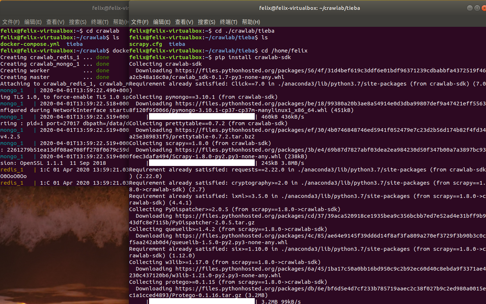
    - 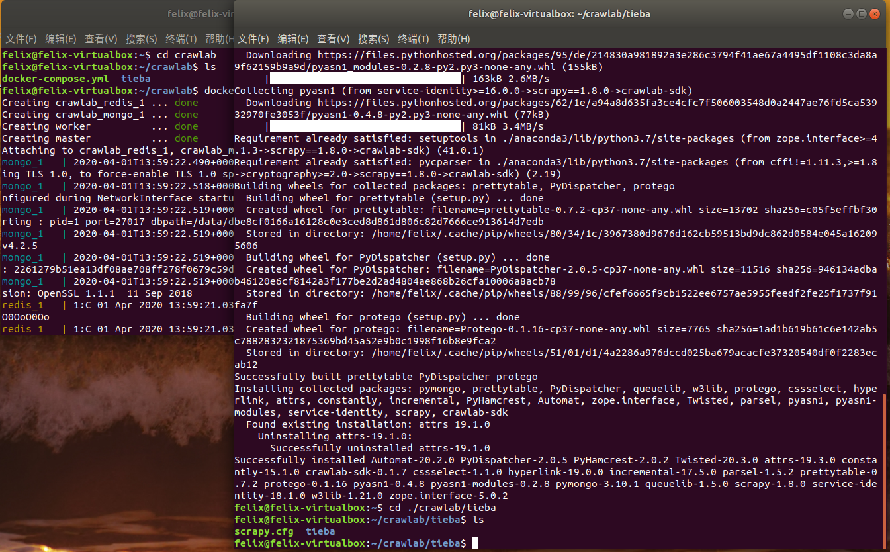
- 安装完成后，需要登录 crawlab 后端，在yml配置文件同级文件夹里面，执行以下登陆命令
    - 登录并输入参数
        - crawlab login -u <username> -a <api_address>
    - 例子
        - crawlab login -u admin -a http://localhost:8080/api
        - 然后会要求输入登录密码：admin
        - 注意：登录之前，不要打开 http://localhost:8080 ，并登陆进去，如果打开或者已经网页手动登陆进去此处输入密码会提示错误
        - 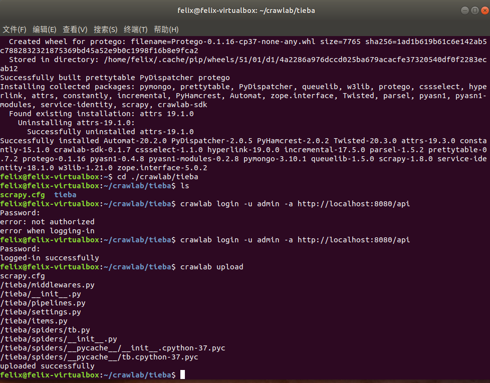   
    - 如果登录成功，CLI 会将用户名、密码、API 地址和获取到的 Token 保存在本地，供后面使用。
    - 注意：这里的 <api_address> 是后端 API 的地址。如果您是用的 Docker 镜像，只需要在 Web 界面 URL 后加一个 /api 后缀就可以了。
    - 例如，如果您访问 Web 的地址是 http://localhost:8080，您的 <api_url> 就是 http://localhost:8080/api

- CLI常用命令：

- 上传爬虫：
    - 上面登陆成功后，切换到爬虫项目文件夹下，即 scrapy.cfg 同级文件夹, 分别执行以下命令：
        - cd /home/felix/crawlab/tieba      切换文件夹
        - crawlab upload                    上传爬虫项目
    - 如果不传参数，CLI 会将当前整个目录打包成 zip 文件并上传的，不是很安全，因此并不推荐此做法。
    - 上传成功后，浏览器打开 http://localhost:8080 自动跳转到管理界面，可以看到已经成功上传的爬虫
    - 当然，如果您想进行更复杂的上传爬虫操作，可以采用下面的命令。
    - 上传指定目录并附带爬虫名称、显示名称、结果集等信息
    
    ```
    crawlab upload \   # \ 表示换行 < > 不需要写
    -n <spider_name> \ # 爬虫名称,要和爬虫py文件里面的爬虫名称一样，不然会出错, 
    -N <display_name> \ # 显示名称
    -m <execute_command> \ # 执行命令
    -c <result_collection> # 结果集
    ```
    - 参数说明：
        - 爬虫名称：爬虫的唯一识别名称（spiders中写的爬虫名name，唯一的用于scrapy crawl xxx），将会在爬虫根目录中创建一个该名称的文件目录，因此建议为没有空格和特殊符号的小写英文，可以带下划线；
        - 显示名称：爬虫显示在前端的名称，可以为任何字符串，爬虫管理平台展示的爬虫名称；
        - 执行命令：爬虫将在 shell 中执行的命令，最终被执行的命令将为 执行命令 和 参数 的组合；
        - 结果集：集合的名称，爬虫抓取结果储存在 MongoDB 数据库里的集合（Collection），类似于 SQL 数据库中的表（Table）。
       
    - 如果您想针对某一个爬虫 ID 上传爬虫，只需要指定 -i 这个命令，将爬虫 ID 传入就可以了，CLI 将上传爬虫并覆盖其爬虫文件。
    - 具体的爬虫上传 CLI 帮助，请查看 crawlab upload --help    
    
- 查看节点列表
    - crawlab nodes
- 查看爬虫列表
    - crawlab spiders
- 查看任务列表
    - crawlab tasks
- 查看定时任务列表
    - crawlab schedules    

- 容器及CLI命令执行注意点：
    - docker-compose up 启动容器在容器的 yml 配置文件同级文件夹下
    - crawlab login 登陆执行在容器的 yml 配置文件同级文件夹下
    - crawlab upload 上传在爬虫的 scrapy.cfg 配置文件同级文件夹下
    - crawlab upload 上传爬虫指定的爬虫名称要和项目中爬虫名称一致（不然会导致爬虫运行时候识别不了爬虫名称无法运行起来）
    
    
## 4.2 Crawlab上传运行爬虫项目实例
## 4.2.1 requests 普通爬虫 (不推荐使用crawlab管理，功能很多不适配)
- 参考文档：
    - [自定义爬虫-使用CLI命令行工具上传爬虫](https://docs.crawlab.cn/Spider/CustomizedSpider.html)
    - [可配置爬虫--功能是基于scrapy的](https://docs.crawlab.cn/Spider/ConfigurableSpider.html) 
- 不推荐，不做详细介绍

## 4.2.2 scrapy 爬虫 (推荐使用crawlab管理，可以管理多个scrapy爬虫)

- 使用007_Crawlab爬虫管理平台下面的tieba爬虫
- 该爬虫本来是本地运行，要想集成到crawlab中去，需要作以下修改：
    - settings中添加crawlab管道，注释掉本来已有的管道：
        - 'crawlab.pipelines.CrawlabMongoPipeline': 888
    - items添加task_id（task_id非必须，可以不用写）
        - task_id = scrapy.Field()
    - 注释掉settings里面的mongo数据库部分(三行代码)
    - 其它部分不变，对比005_Scrapy进阶tieba爬虫原始代码
- crawlab集成scrapy爬虫说明：
    - CrawlabMongoPipeline是crawlab里面内置管道，
    - 该管道已经集成了连接redis和MongoDB数据库和处理存储数据的方法
    
- 参考文档：
    - [自定义爬虫-使用CLI命令行工具上传爬虫](https://docs.crawlab.cn/Spider/CustomizedSpider.html)
    - [Scrapy 爬虫详细设置说明](https://docs.crawlab.cn/Spider/ScrapySpider.html)
- 建议使用 scrapy 爬虫，此处以 tieba 爬虫为例，爬虫为标准 scrapy 文件结构
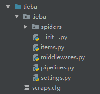

- 准备工作：
    - 确保 4.1 节中 crawlab 已经部署完成
    - 用户下面新建 crawlab 文件夹， 新建 yml 配置文件，具体参考 4.1.3 节
    - 将爬虫项目 tieba 文件夹复制到 /home/felix/crawlab 下面，和 yml 同级
    - 打开一个终端，切换到 crawlab 文件夹，执行以下命令启动 crawlab 容器
        - docker-compose up  确保 4 个服务启动成功
    - 再打开一个终端，切换到 /home/felix/crawlab/tieba 文件夹下
    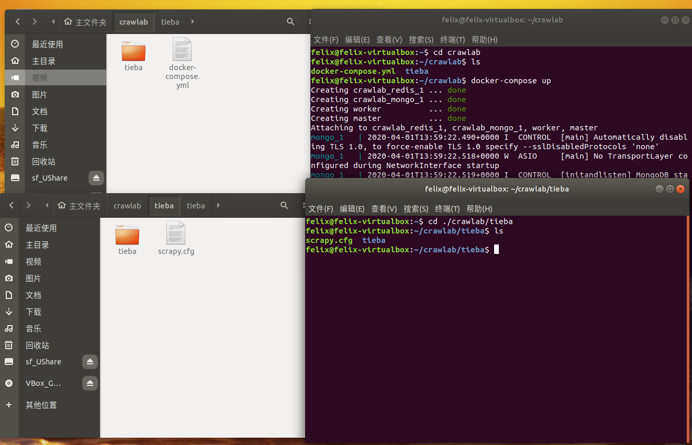
    - 执行以下命令，登陆 crawlab 爬虫管理平台，具体参考 4.1.4 节
        - crawlab login -u admin -a http://localhost:8080/api
    - 登陆成功后，执行以下命令上传项目到 crawlab 管理平台
        - crawlab upload -n tb -N tieba_spider -c tieba_akg (数据集合名称可以上传后管理平台再填写)
      
    - 上传成功后，浏览器打开 http://localhost:8080 自动跳转到管理界面，可以看到已经成功上传的爬虫
    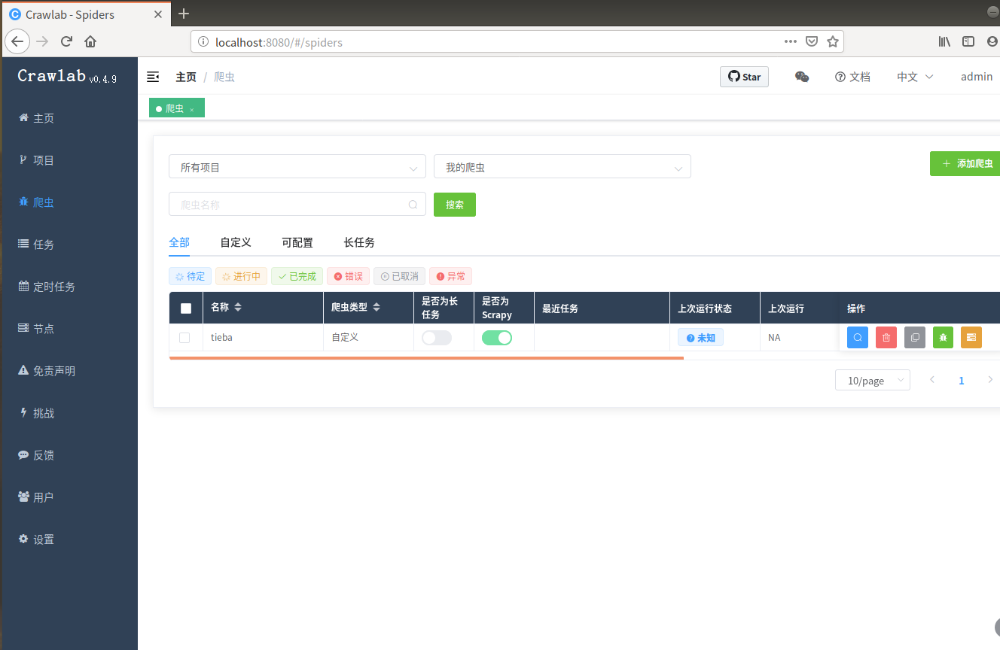
    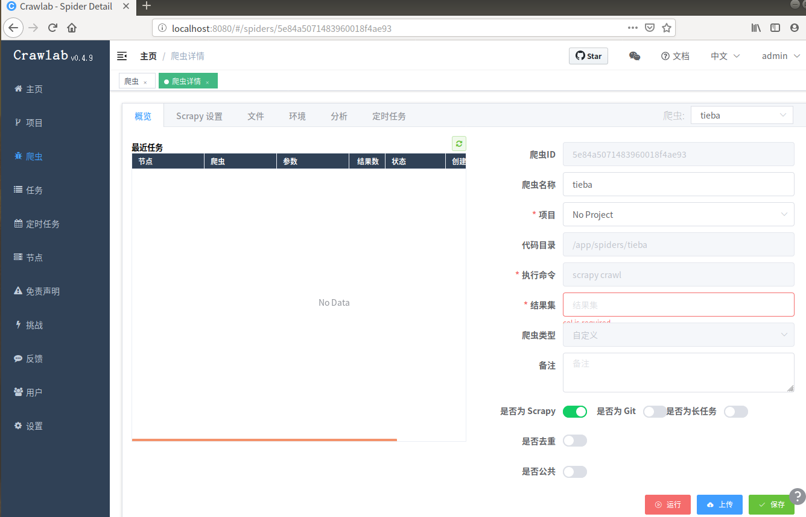
    - 停止docker-compose 容器，关闭 crawlab 管理平台
        - docker-compose down       停止并删除所有的容器 
        - 因为容器镜像占用资源少，可以每次用完可以直接删除，下次重新启动一个全新的容器
        - docker-compose stop  (推荐使用，只会停止master和worker两个服务，mongo和redis处于up状态)
        - 只是停止容器，镜像内容保存，不删除，
        - 下次启动时候 docker-compose up 或者 docker-compose start 都可以，爬虫不用再次上传，直接打开网页爬虫全部都在
        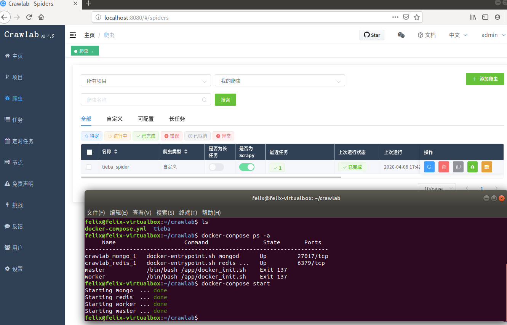
        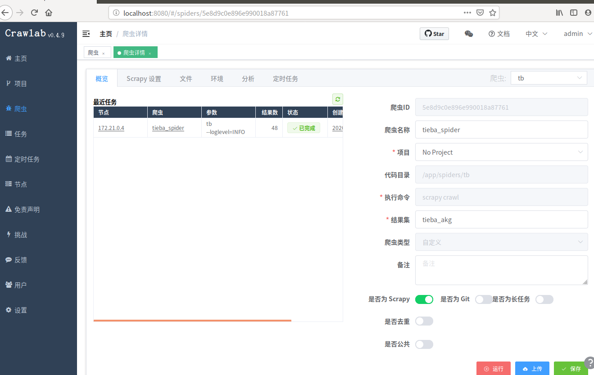
        
- 爬虫项目上传特别注意：
    - 上传爬虫时候如果要指定爬虫名称时，指定的爬虫名称要和爬虫主py文件的爬虫name相同
    - 不然，运行爬虫时候，弹出的确认窗口，Scrapy爬虫后面的参数不会自动填写，也不能手动修改，导致爬虫运行没有反应        
---
- 容器停止全部删除后，一次全新的上传步骤：   
    - 上面上传成功后，docker-compose down 命令关闭删除后
    - docker-compose up 重新启动容器(/home/felix/crawlab)
    - 上传项目(/home/felix/crawlab/tieba)下执行命令：
    - crawlab upload -n tb -N tieba_spider 
    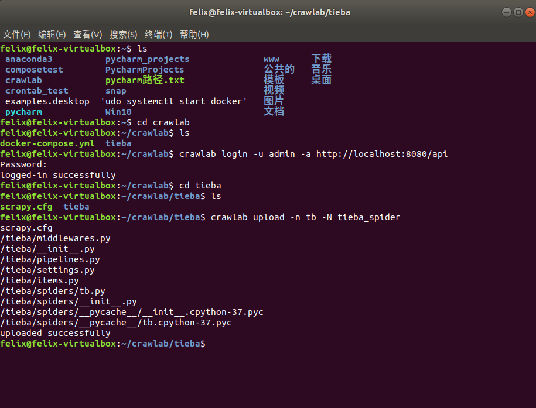
    - 点击爬虫名称，进入爬虫详情，对爬虫进行修改，修改后保存
        - 灰色的不可修改，上传爬虫时候指定了爬虫名称，以该名称已经自动创建了代码目录
        - 项目：No Project 非必须，指的同一类爬虫，我们可以放在同一个项目文件夹下，指定名称后，相同的项目名称爬虫会归为一类
        - 结果集：存储到MongoDB数据库里面集合的名称（database--collection--document）
        - 备注：描述信息，非必须
        - 其它设置看需求进行设置
    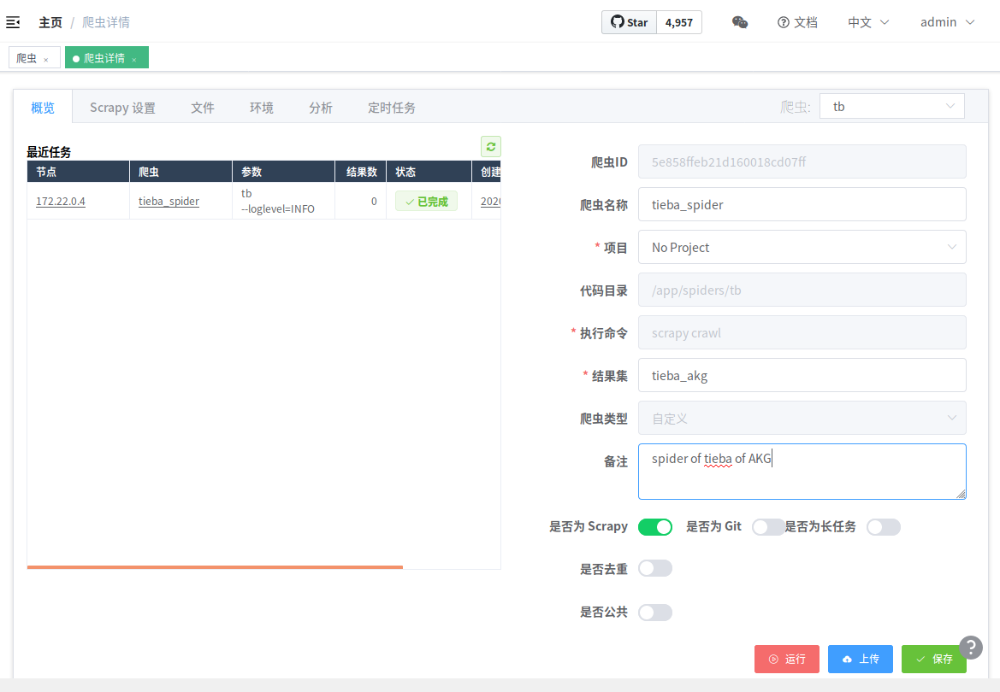
    - 点击右下方，运行爬虫，然后弹出窗口，确认就开始启动爬虫了
        - scrapy爬虫名称是上传时候已经指定，
        - 运行类型，日志等级一般默认即可，也可以自己点击箭头选择其它选项
    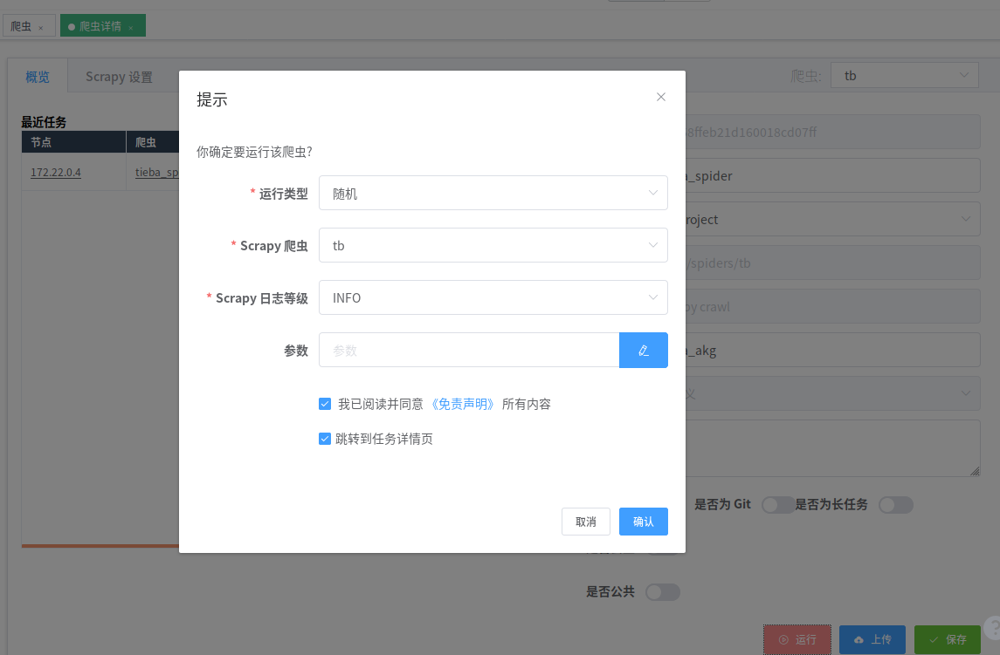
    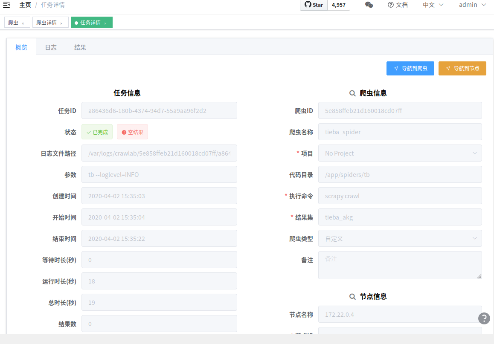
    - 运行中或者运行结束后，点击爬虫任务状态下面的进行中或者已完成查看任务详情
    - 任务详情里面有概览、日志(和WIN10启动爬虫后终端显示的日志结果一样)、结果
    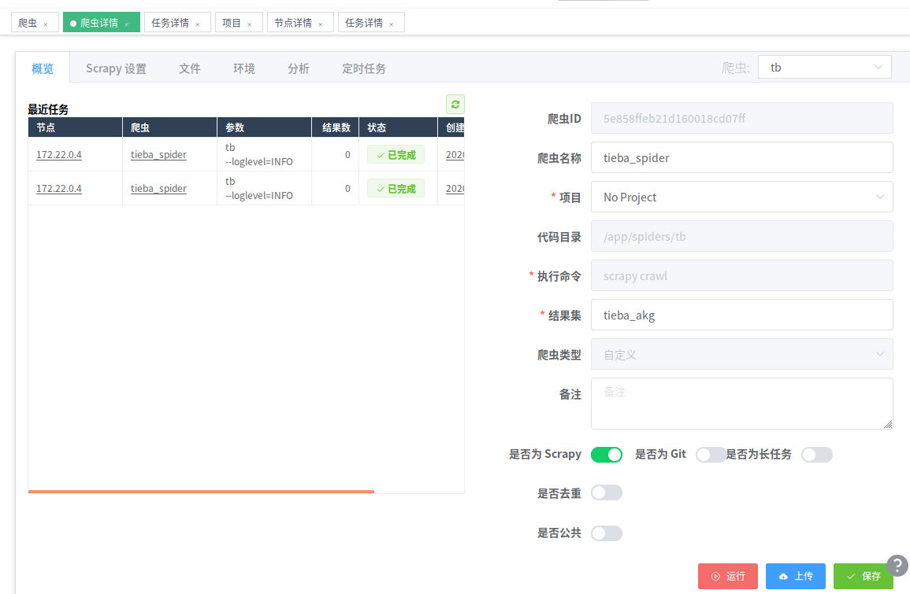
    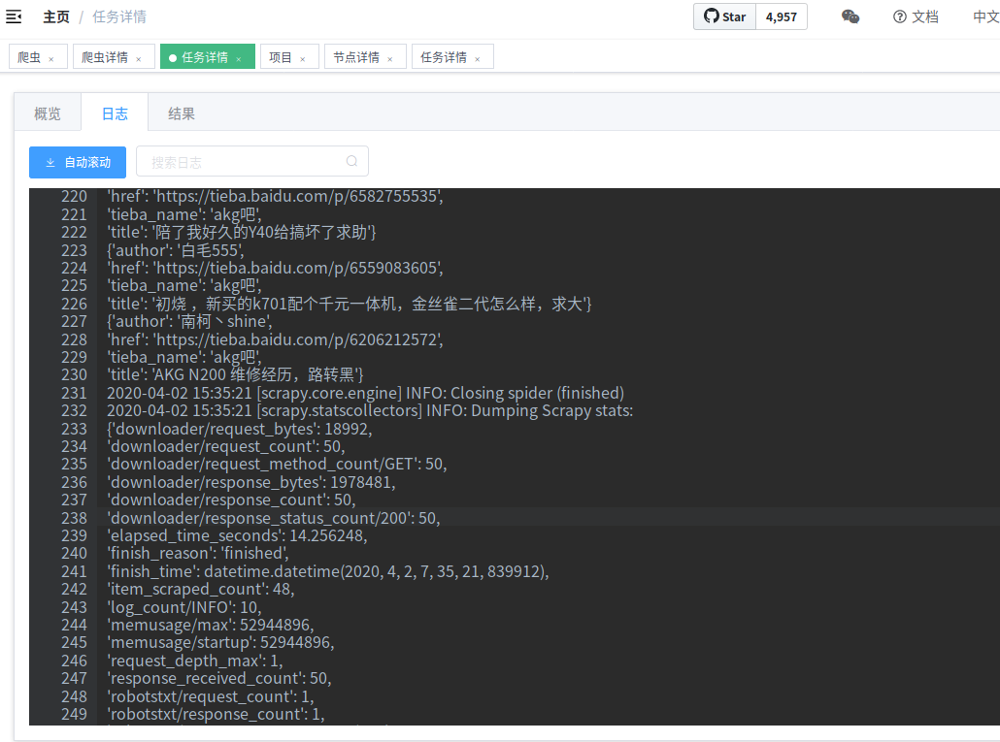
    
- 如果爬虫里面item数据是保存到json文件，未保存到数据库，此时直接运行，我们查看结果里面是空的，但是teiba爬虫我们在WIN10的Pycharm里面直接运行，spiders文件下是有json结果文件的
    - 原因：Crawlab目前只支持MongoDB，而且您需要保证存放的数据与Crawlab的数据库一致，
    - 上面的截图中结果没有数据，主要是忘了集成crawlab的自带管道，只需要将爬虫管道重新设置即可，注释掉之前保存本地json和本地MongoDB数据库的管道接口
    - 具体参考 4.2.2 节开头内容及代码 settings.py 文件
    - 添加 管道设置后 重新启动运行，运行结果如下
    - 此时管理平台中的结果就已经有了数据，下面进入容器里面的调用的docker数据库也可以看见数据了
    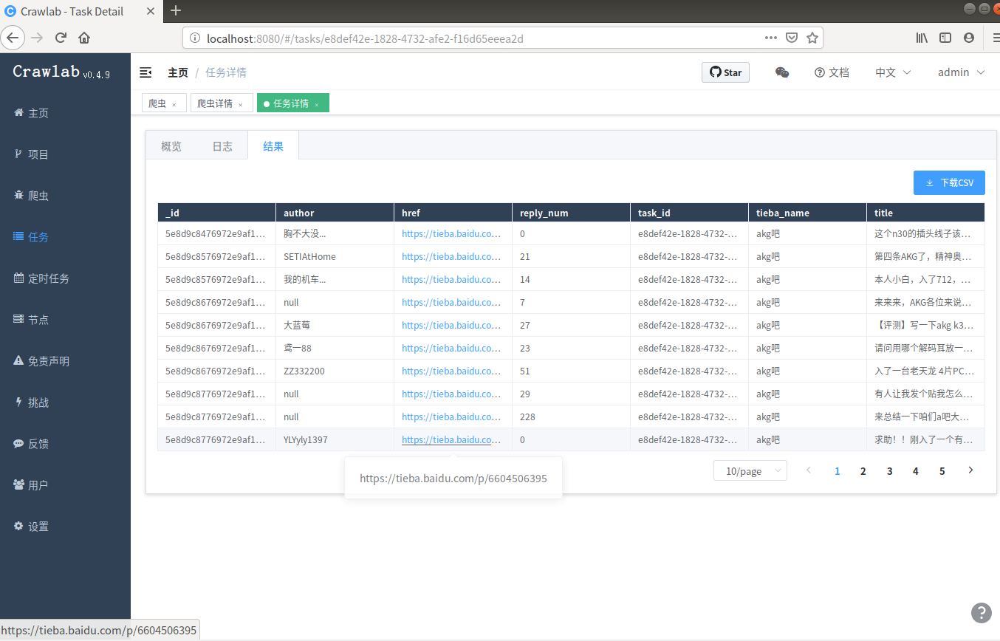


- 进入容器的 mongo 和 redis 数据库
    - mongo 和 redis 服务都是已经启动的，进入容器终端后只需执行客户端命令即可
    
    - 进入容器的 mongo 数据库：
        - 进入 docker-compose 下面的容器
        - docker-compose ps 查看多容器运行状态信息
        - docker ps  查看容器信息
        - docker exec -it container_id /bin/bash  进入某个容器的shell终端
        - 然后终端执行相关命令，比如终端执行 mongo 进入容器的数据库
        - MongoDB 用于存储数据，里面已经有了爬取的结果
        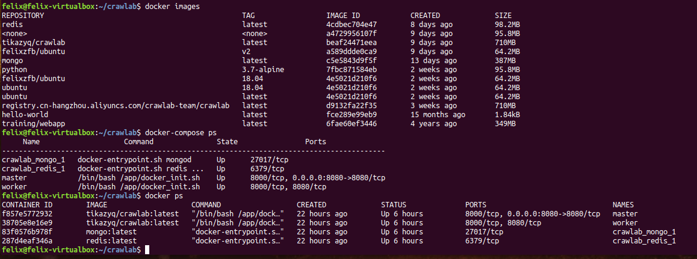
        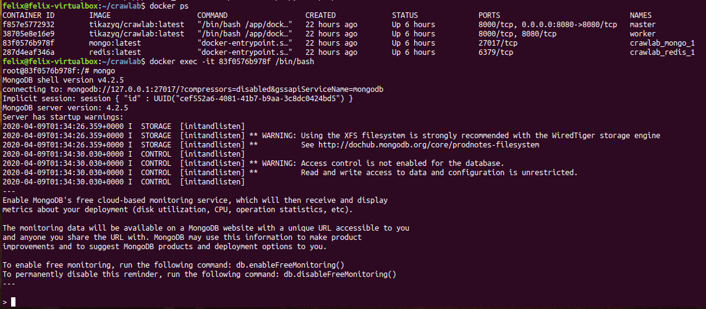
        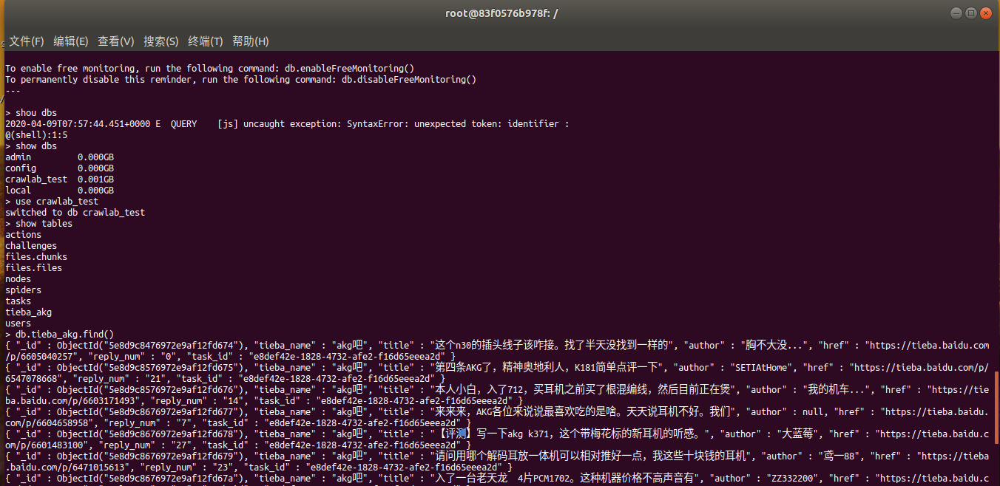
        - 退出容器和退出终端，直接使用 exit 命令
    
    - 进入容器的 redis 数据库：
        - 退出上面 mongo 终端，或者重新打开一个新的终端窗口
        - 上面步骤一样，进入 redis 容器的shell终端后执行 redis-cli 连接服务器即可
        - redis-server 是已经启动状态了
        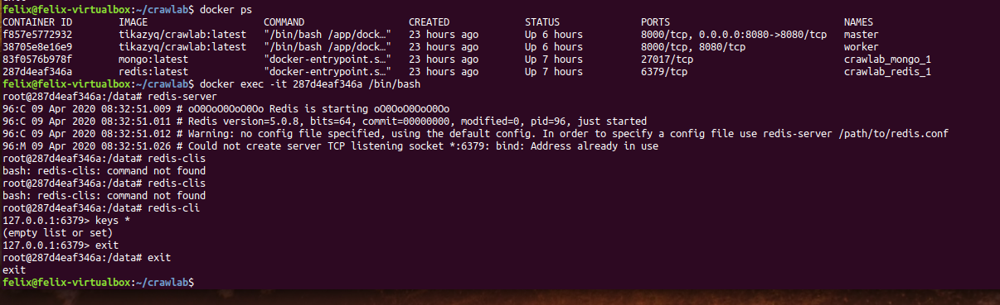
        - redis 数据库只是数据爬取时候作为缓存使用，负责通信，并没有进行数据持久化，里面没有爬虫相关的数据
 
## 4.3 安装第三方依赖包
- 尽量使用 scrapy 自带 CSS 选择器
- 如果需要使用第三方包，比如 pymysql, beautifulsoup4, requests, lxml 等
- 安装第三方包，直接在 crawlab 管理界面安装，安装后就是安装在容器镜像中
    - 进入节点列表---主节点---尾部查看放大镜符号---进入后安装需要安装的包
    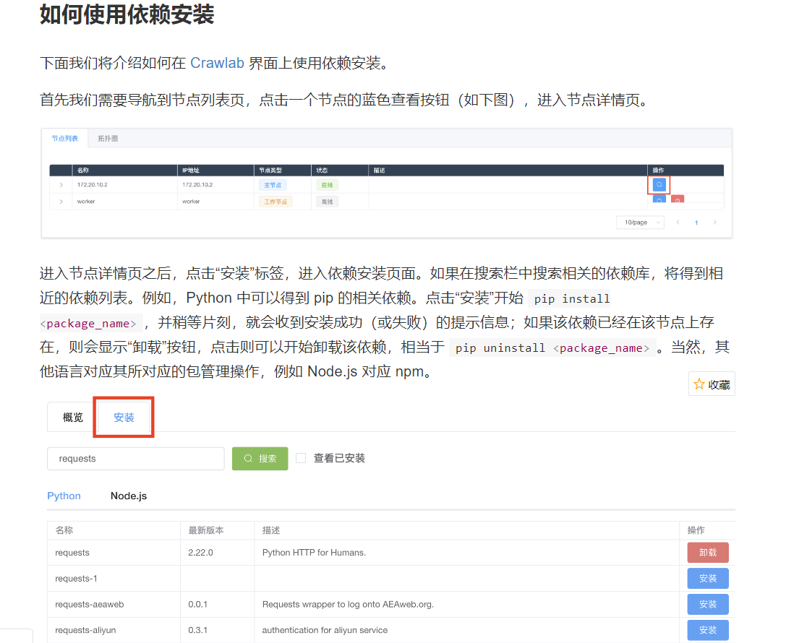
  
    
# 5 Crawlab 原理
## 5.1 整体架构
- Crawlab的架构包括了一个主节点（Master Node）和多个工作节点（Worker Node），
- 以及负责通信和数据储存的Redis和MongoDB数据库。 
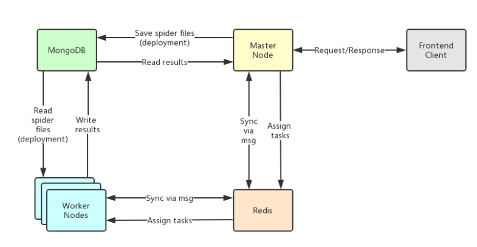
- 前端应用向主节点请求数据，主节点通过MongoDB和Redis来执行任务派发调度以及部署，
- 工作节点收到任务之后，开始执行爬虫任务，并将任务结果储存到MongoDB。
- 架构相对于v0.3.0之前的Celery版本有所精简，去除了不必要的节点监控模块Flower，节点监控主要由Redis完成。
 
- 主节点（Master Node）  
    - 主节点是整个Crawlab架构的核心，属于Crawlab的中控系统。
    - 主节点主要负责以下功能:
        - 爬虫任务调度
        - 工作节点管理和通信
        - 爬虫部署
        - 前端以及API服务
        - 执行任务（可以将主节点当成工作节点）
    - 主节点负责与前端应用进行通信，并通过Redis将爬虫任务派发给工作节点。
    - 同时，主节点会同步（部署）爬虫给工作节点，通过 Redis 和 MongoDB 的 GridFS 。     

- 工作节点（Worker Node）
    - 工作节点的主要功能是执行爬虫任务和储存抓取数据与日志，并且通过Redis的PubSub跟主节点通信。
    - 通过增加工作节点数量，Crawlab可以做到横向扩展，不同的爬虫任务可以分配到不同的节点上执行。
    
- MongoDB
    - MongoDB是Crawlab的运行数据库，储存有节点、爬虫、任务、定时任务等数据，
    - 另外GridFS文件储存方式是主节点储存爬虫文件并同步到工作节点的中间媒介。

- Redis
    - Redis是非常受欢迎的Key-Value数据库，在Crawlab中主要实现节点间数据通信的功能。
    - 例如，节点会将自己信息通过HSET储存在Redis的nodes哈希列表中，主节点根据哈希列表来判断在线节点。

- 前端
    - 前端是一个基于Vue-Element-Admin的单页应用。其中重用了很多Element-UI的控件来支持相应的展示。   
    
## 5.2 节点通信 
- 通信主要由 Redis 来完成 
- Redis PubSub
    - 这是Redis版发布／订阅消息模式的一种实现。其用法非常简单：
        - 订阅者利用SUBSCRIBE channel1 channel2 ...来订阅一个或多个频道；
        - 发布者利用PUBLISH channelx message来发布消息给该频道的订阅者。
        - Redis的PubSub可以用作广播模式，即一个发布者对应多个订阅者。
        - 而在Crawlab中，我们只有一个订阅者(工作节点)对应一个发布者(主节点)的情况（主节点->工作节点：nodes:<node_id>）
        - 或一个订阅者(主节点)对应多个发布者(工作节点)的情况（工作节点->主节点：nodes:master>）。这是为了方便双向通信。

- 各个节点会通过Redis的PubSub功能来做相互通信。
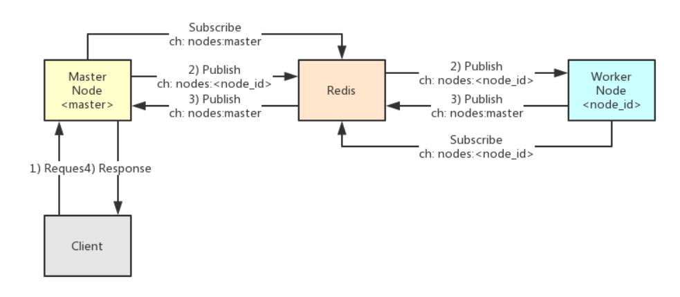    

- 所谓PubSub，简单来说是一个发布订阅模式。订阅者（Subscriber）会在Redis上订阅（Subscribe）一个通道，
- 其他任何一个节点都可以作为发布者（Publisher）在该通道上发布（Publish）消息。

- 在Crawlab中，主节点会订阅nodes:master通道，其他节点如果需要向主节点发送消息，只需要向nodes:master发布消息就可以了。
- 同理，各工作节点会各自订阅一个属于自己的通道nodes:<node_id>（node_id是MongoDB里的节点ID，是MongoDB ObjectId），如果需要给工作节点发送消息，只需要发布消息到该通道就可以了。

- 一个网络请求的简单过程如下:
    - 客户端（前端应用）发送请求给主节点（API）；
    - 主节点通过Redis PubSub的<nodes:<node_id>通道发布消息给相应的工作节点；
    - 工作节点收到消息之后，执行一些操作，并将相应的消息通过<nodes:master>通道发布给主节点；
    - 主节点收到消息之后，将消息返回给客户端。
    - 不是所有节点通信都是双向的，也就是说，主节点只会单方面对工作节点通信，工作节点并不会返回响应给主节点，所谓的单向通信。
    - 以下是Crawlab的通信类型。
        - 操作名称	通信类别
        - 获取日志	双向通信
        - 获取系统信息	双向通信
        - 取消任务	单向通信
        - 通知工作节点向GridFS获取爬虫文件单向通信
        
## 5.3 节点监控
- Crawlab的节点监控是通过Redis来完成的。原理如下图：
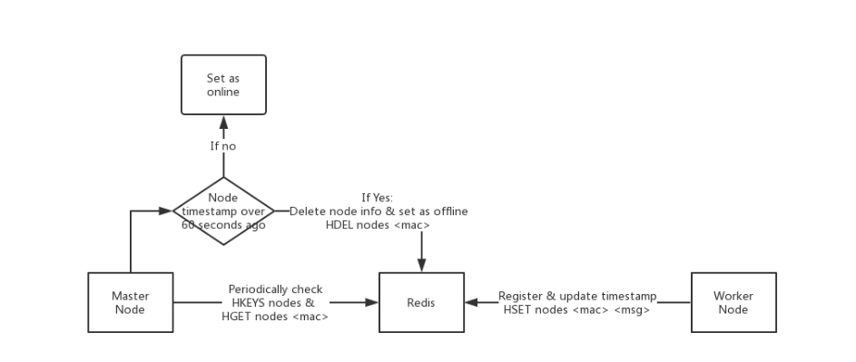   

- 工作节点会不断更新心跳信息在Redis上，利用HSET nodes <node_id> <msg>，心跳信息<msg>包含节点MAC地址，IP地址，当前时间戳，
- 主节点会周期性获取Redis上的工作节点心跳信息。
    - 如果有工作节点的时间戳在60秒之前，则考虑该节点为离线状态，会在Redis中删除该节点的信息，并在MongoDB中设置为"离线"；
    - 如果时间戳在过去60秒之内，则保留该节点信息，在MongoDB中设置为"在线"。

## 5.4 爬虫部署
- 爬虫是自动部署在工作节点上的。下面的示意图展示了Crawlab爬虫部署的架构。
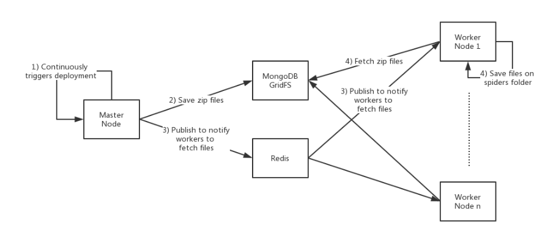 

- 如上图所示，整个爬虫自动部署的生命周期如下(源码在services/spider.go#InitSpiderService)：
    - 主节点每5秒，会从爬虫的目录获取爬虫信息，然后更新到数据库（这个过程不涉及文件上传）；
    - 主节点每60秒,从数据库获取所有的爬虫信息，然后将爬虫打包成zip文件，并上传到MongoDB GridFS，并且在MongoDB的spiders表里写入file_id文件ID；
    - 主节点通过Redis PubSub发布消息（file.upload事件，包含文件ID）给工作节点，通知工作节点获取爬虫文件；
    - 工作节点接收到获取爬虫文件的消息，从MongoDB GridFS获取zip文件，并解压储存在本地。
    - 这样，所有爬虫将被周期性的部署在工作节点上。

- MongoDB GridFS
    - GridFS是MongoDB储存大文件（大于16Mb）的文件系统。
    - Crawlab利用GridFS作为了爬虫文件储存的中间媒介，可以让工作节点主动去获取并部署在本地。
    - 这样绕开了其他传统传输方式，例如RPC、消息队列、HTTP，因为这几种都要求更复杂也更麻烦的配置和处理。

    - Crawlab在GridFS上储存文件，会生成两个collection集合，files.files和files.fs。
    - 前者储存文件的元信息，后者储存文件内容。spiders里的file_id是指向files.files的_id。

## 5.5 任务执行
- Crawlab的任务执行依赖于shell。执行一个爬虫任务相当于在shell中执行相应的命令，
- 因此在执行爬虫任务之前，要求使用者将执行命令存入数据库。执行命令存在spiders表中的cmd字段。
- 任务执行的架构示意图如下：
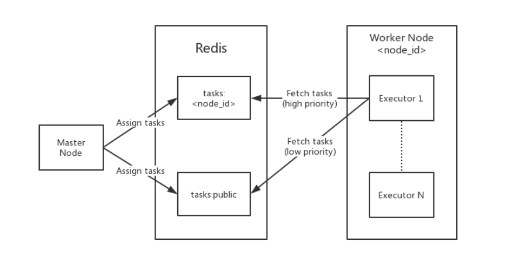 

- 当爬虫任务被派发时，主节点会在Redis中的tasks:<node_id>（指定工作节点）和tasks:public（任意工作节点）派发任务，也就是RPUSH命令。
    - 工作节点在启动时会起N个执行器（通过环境变量CRAWLAB_TASK_WORKERS配置，默认为4），
    - 每个执行器会轮训Redis的消息队列，优先获取指定节点消息队列tasks:<node_id>，
    - 如果指定队列中没有任务，才会获取任意节点消息队列中的任务tasks:public。